This article demonstrates how to create various Mermaid diagrams using the ` ```mermaid ` code block syntax. This approach is simpler and more intuitive than using components.

---

## 1. Flowchart

### 1.1 Basic Flowchart

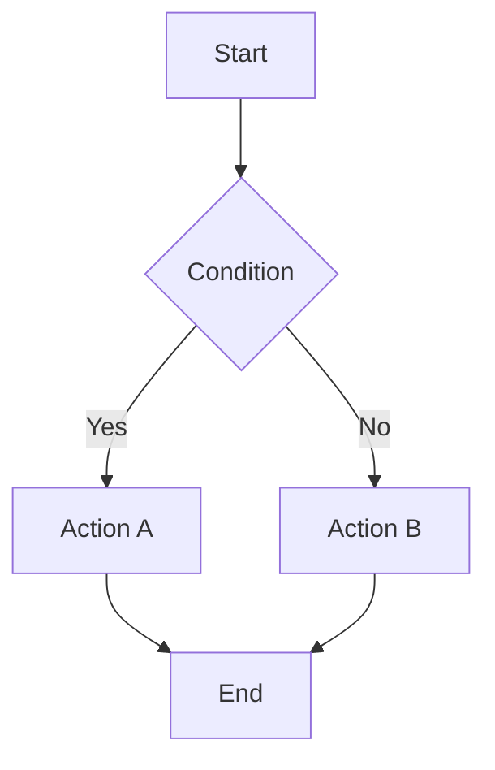

### 1.2 Horizontal Flowchart

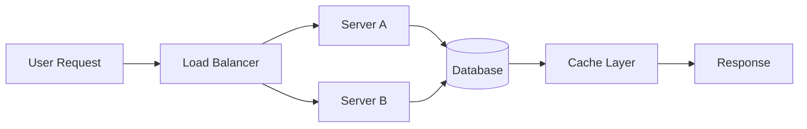

### 1.3 Flowchart with Subgraphs

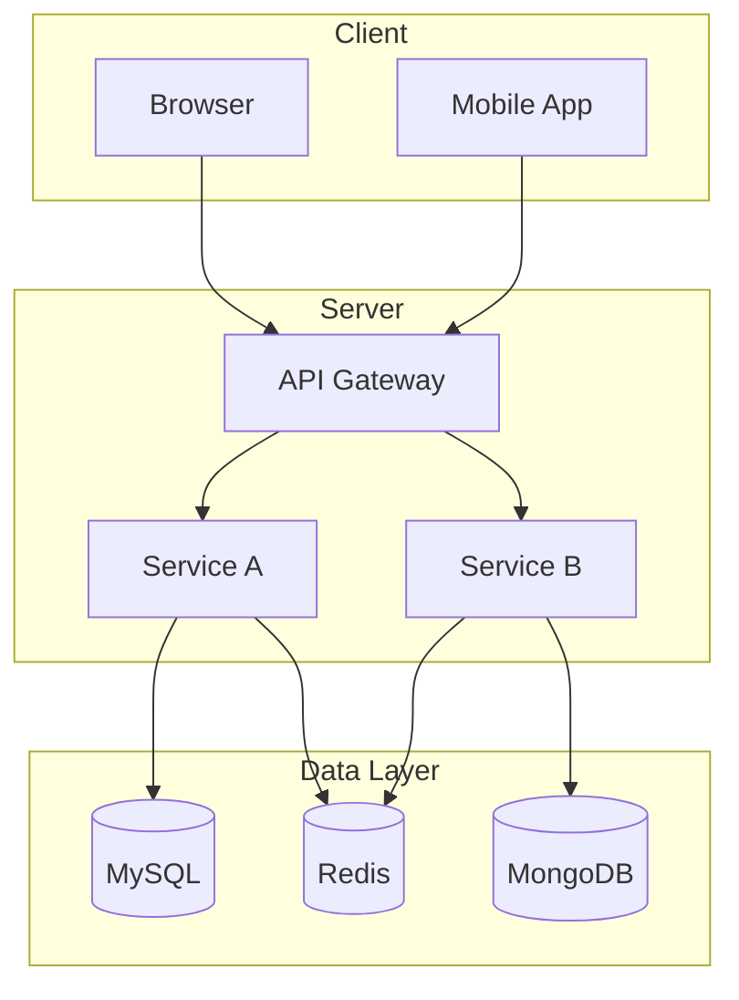

### 1.4 Different Node Shapes

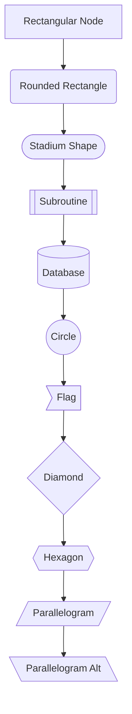

---

## 2. Sequence Diagram

### 2.1 Basic Sequence Diagram

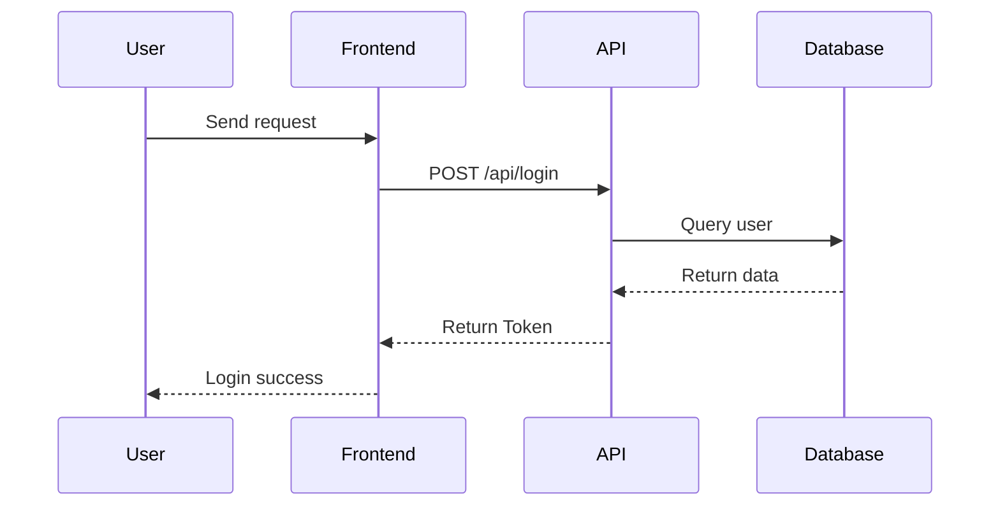

### 2.2 Sequence Diagram with Loops and Conditions

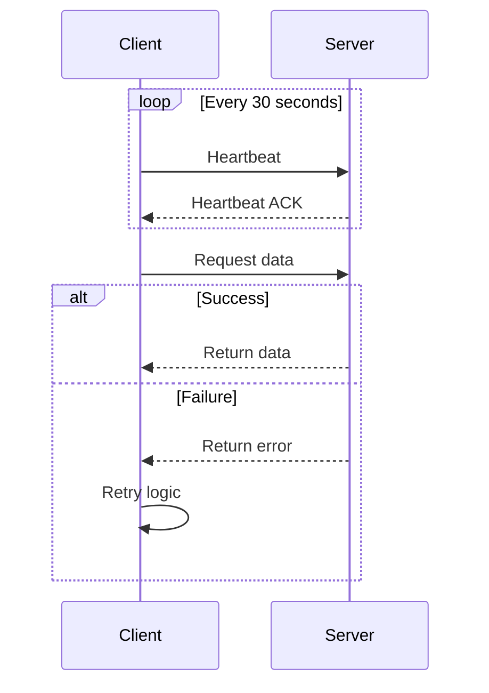

### 2.3 Sequence Diagram with Notes

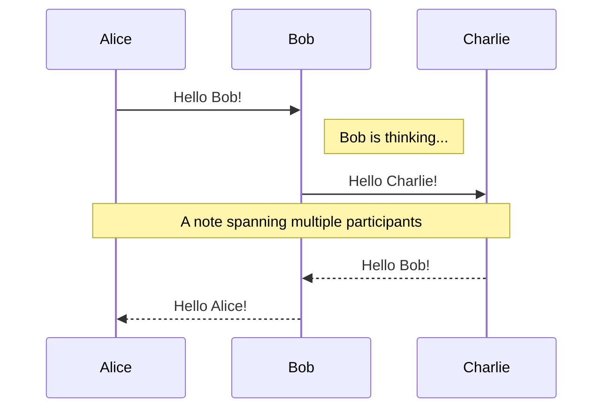

---

## 3. Class Diagram

### 3.1 Basic Class Diagram

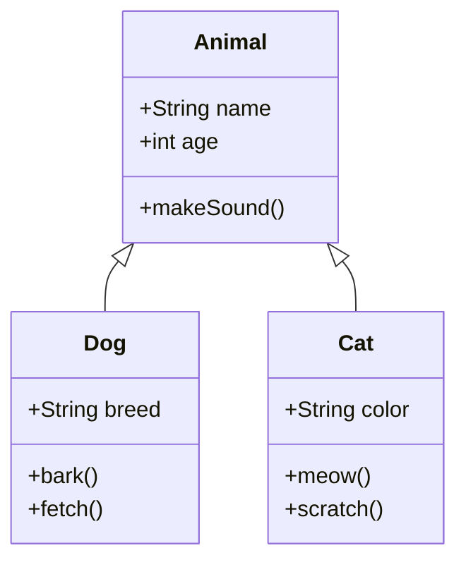

### 3.2 Class Relationships

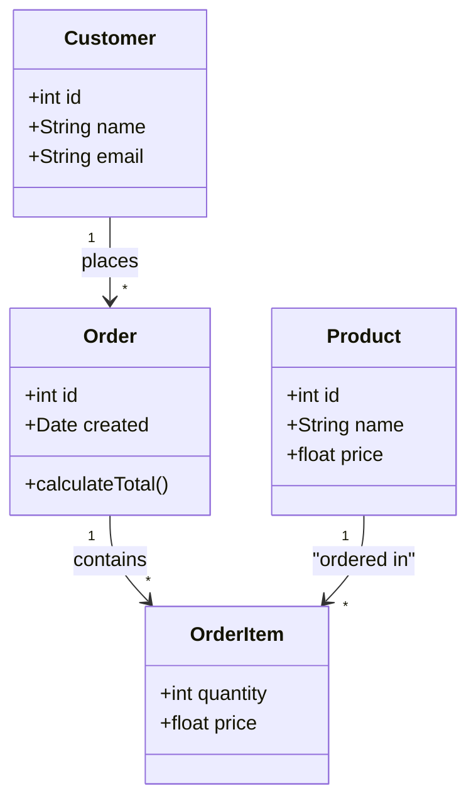

---

## 4. State Diagram

### 4.1 Basic State Diagram

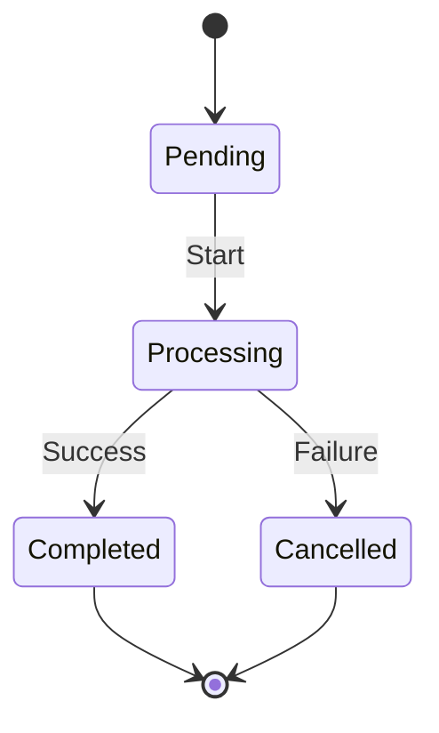

### 4.2 State Diagram with Nested States

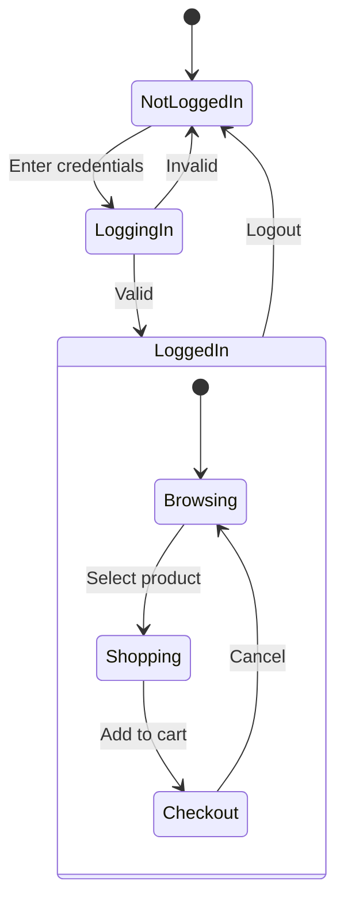

---

## 5. ER Diagram

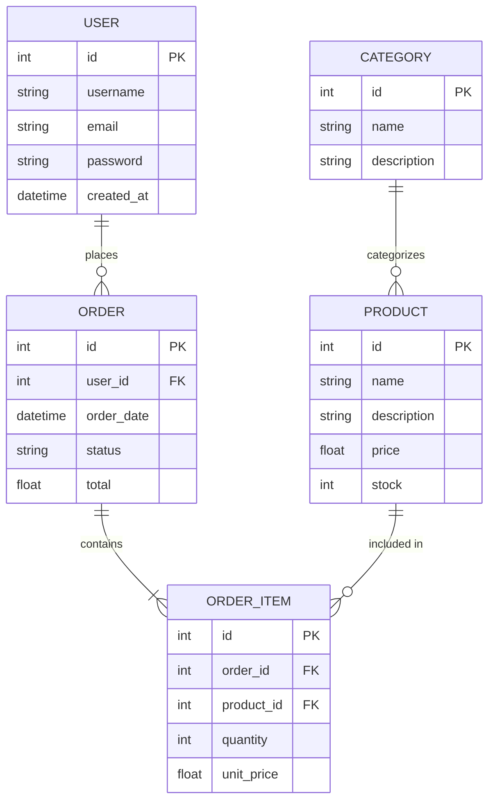

---

## 6. Gantt Chart

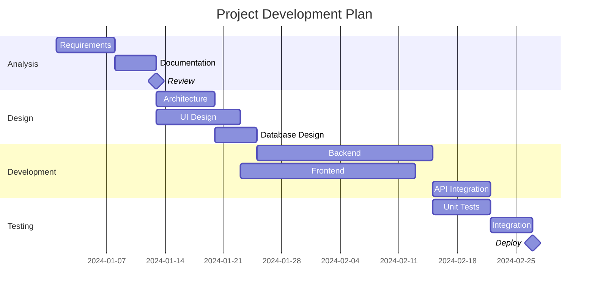

---

## 7. Pie Chart

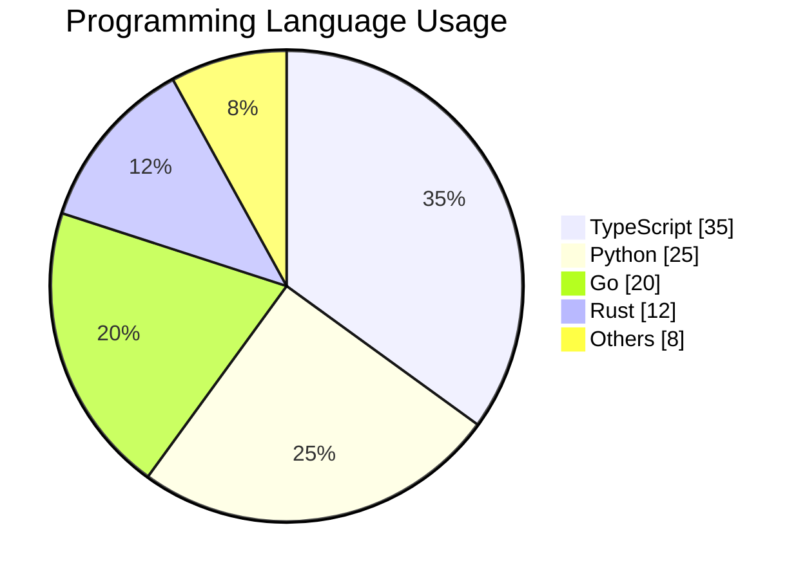

---

## 8. Git Graph

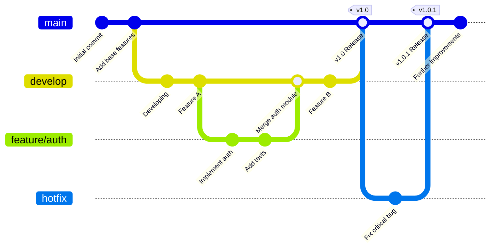

---

## 9. User Journey

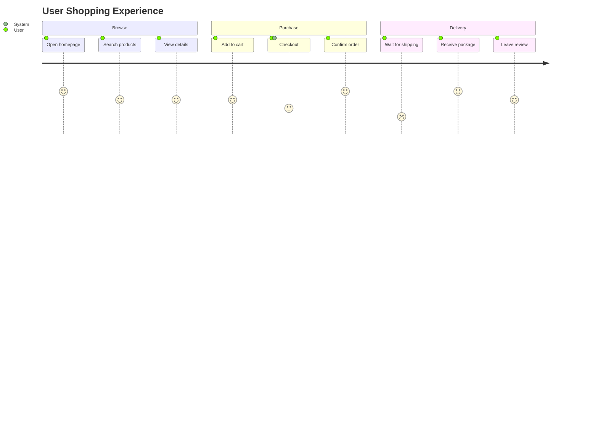

---

## 10. Mindmap

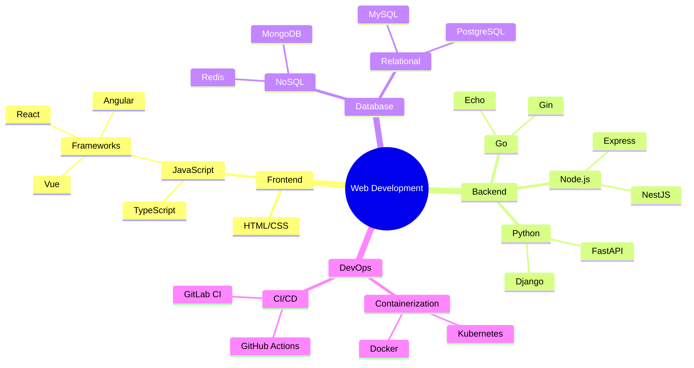

---

## 11. Additional Features

### 11.1 Style Customization

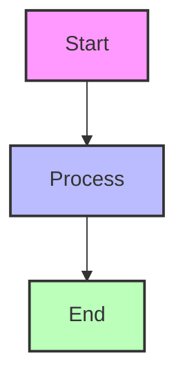

### 11.2 Links and Interactions

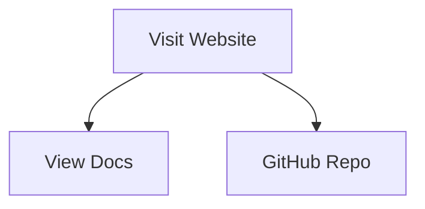

---

## References

- [Mermaid Official Documentation](https://mermaid.js.org/)
- [Mermaid GitHub](https://github.com/mermaid-js/mermaid)
- [Mermaid Live Editor](https://mermaid.live/)
