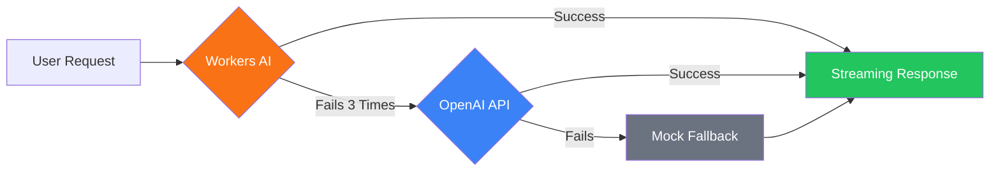

astro-minimax includes a built-in AI chat assistant with support for automatic failover across multiple providers, RAG-enhanced retrieval, streaming responses, and Mock fallback. This guide walks through the complete AI configuration process.

## Overview

The AI chat system consists of the following modules:

| Module | Description |
|------|------|
| `@astro-minimax/ai` | AI core package: RAG pipeline, Provider management, chat UI |
| `@astro-minimax/cli` | CLI tools: AI content processing, author profile building, quality evaluation |
| `@astro-minimax/notify` | Notification system: real-time AI conversation notifications to Telegram/Email/Webhook |

## Quick Start

### 1. Enable AI Features

In `src/config.ts`:

```typescript
ai: {
  enabled: true,
  mockMode: false,
  apiEndpoint: "/api/chat",
},
```

### 2. Configure a Provider

Configure your AI Provider in `.env`:

```bash
# OpenAI-compatible API (supports DeepSeek, Moonshot, Qwen, etc.)
AI_BASE_URL=https://api.openai.com/v1
AI_API_KEY=your-api-key
AI_MODEL=gpt-4o-mini

# Site information
SITE_AUTHOR=YourName
SITE_URL=https://your-blog.com
```

### 3. Build AI Data

```bash
astro-minimax ai process         # Generate article summaries and SEO data
astro-minimax ai profile build   # Build the author profile
```

### 4. Start the Development Server

```bash
pnpm run dev
```

The AI chat button will appear in the bottom-right corner of the page.

## Provider Configuration Details

### Cloudflare Workers AI

When deploying to Cloudflare Pages, you can use free Workers AI:

```toml
# wrangler.toml
[ai]
binding = "minimaxAI"
```

Workers AI has the highest provider priority and does not require an API key.

### OpenAI-Compatible API

Any OpenAI-compatible API service is supported:

```bash
AI_BASE_URL=https://api.openai.com/v1
AI_API_KEY=sk-xxx
AI_MODEL=gpt-4o-mini
```

You can also configure different models for different tasks:

```bash
AI_KEYWORD_MODEL=gpt-4o-mini    # Keyword extraction model
AI_EVIDENCE_MODEL=gpt-4o-mini   # Evidence analysis model
```

### Failover Mechanism



- Marked unhealthy after 3 consecutive failures
- Automatically attempts recovery after 60 seconds
- If all Providers fail, Mock ensures the user always receives a response

## AI Tool Calling and Actions

When a user expresses actions in natural language such as “switch to dark mode”, “open an article”, or “jump to a section”, the model can do more than explain the steps. Through **tool calling**, it can directly drive site behavior, reducing the gap between “telling” and “doing”.

### Available Tools at a Glance

The current chat pipeline registers 7 tools (names consistent with the codebase):

| Tool Name | Summary |
|--------|----------|
| `toggleTheme` | Switch the theme between light / dark / system |
| `navigateToArticle` | Navigate to an article page by slug (and optional language, section) |
| `scrollToSection` | Scroll to a specified section on the current page and optionally highlight it |
| `toggleImmersiveMode` | Enable or disable immersive mode, with adjustable font size and more |
| `highlightText` | Highlight content in the article by text or selector |
| `setPreference` | Write user preferences (aligned with the site's preference system key-value model) |
| `searchArticles` | Search articles and projects by keyword, returning titles, links, summaries, etc. |

### How It Works

- **Client-side tools**: `toggleTheme`, `navigateToArticle`, `scrollToSection`, `toggleImmersiveMode`, `highlightText`, and `setPreference` declare their schemas on the server, and the model generates tool calls; the **actual execution happens in the browser** (via the **ActionExecutor** in the `@astro-minimax/core` theme package, which maps calls to DOM / routing / preference updates).
- **Server-side tools**: `searchArticles` includes an `execute` implementation and runs **on the server during the RAG request handling process**. It directly calls the same `searchArticles` / `searchProjects` logic used by the main retrieval flow, returning structured results to the model for “search first, then answer” or navigation assistance.

### Action System and Cross-Page Chaining

Site behaviors are centrally handled in `packages/core/src/actions/`: **ActionExecutor** performs concrete actions, while modules such as **URLHandler** support continuing a sequence of actions **after navigation** via query parameters (such as `theme`, `section`, `ai_actions`, and queue tokens), enabling cross-page action chaining. When the chat UI receives a client-side tool call, it converts the parameters into the corresponding Action and executes it.

## Mock Mode

No real API is needed during development:

```typescript
ai: {
  enabled: true,
  mockMode: true,  // Development environment
},
```

Mock mode returns predefined article recommendations and external resource links to simulate real AI responses.

## AI Security Features

### Source Layering Protocol

AI responses follow L1–L5 source priority:

- **L1**: Original blog content (highest priority)
- **L2**: Author profile, project list
- **L3**: Structured factual data
- **L5**: Writing style (affects expression only)

### Privacy Protection

Automatically refuses to answer sensitive personal information:

- Address, income, family members, phone number, identity information, age

### Intent Classification

7 intent categories improve search relevance:

- setup, config, content, feature, deployment, troubleshooting, general

## Quality Evaluation

### Configure the Test Set

Edit `datas/eval/gold-set.json` to define test cases:

```json
{
  "cases": [
    {
      "id": "about-001",
      "category": "about",
      "question": "Introduce yourself",
      "answerMode": "fact",
      "expectedTopics": ["blog", "AI"],
      "forbiddenClaims": [],
      "lang": "zh"
    }
  ]
}
```

### Run the Evaluation

```bash
pnpm run ai:eval                              # Local test
pnpm run ai:eval -- --url=https://your.com   # Remote test
pnpm run ai:eval -- --category=no_answer     # Evaluate a specific category
pnpm run ai:eval -- --verbose                # Verbose output
```

The evaluation is based on the golden test set in `datas/eval/gold-set.json` and automatically checks:

- Non-empty response
- Topic coverage
- Absence of forbidden claims
- Markdown link existence
- Answer mode match

The evaluation report is saved to `datas/eval/report.json`.

## Extension System

The extension system allows you to inject custom data into the AI chat flow to enhance the AI’s response capabilities.

### Extension Types

| Type | Description | Use Case |
|------|------|------|
| `searchable` | Searchable documents | Add extra knowledge base content |
| `facts` | Structured facts | Add verified factual data |
| `context` | Context injection | Add custom prompt sections |
| `voice-style` | Writing style | Define AI response style modes |
| `semantic-fallback` | Semantic fallback | Query rewriting rules |

### Extension File Structure

Extension files are placed in the `datas/extensions/` directory:

```text
datas/extensions/
├── travel.json        # Travel-related extension
├── social.json        # Social network extension
└── custom-*.json      # Custom extensions
```

### Extension File Format

```json
{
  "$schema": "extension-v1",
  "version": 1,
  "extensions": [
    {
      "id": "blog-travel",
      "type": "voice-style",
      "name": "Travel Voice",
      "description": "Style mode for travel topics",
      "enabled": true,
      "priority": 80,
      "data": {
        "modes": [
          {
            "id": "travel",
            "name": "Travel Mode",
            "description": "Response style for travel-related answers",
            "matchKeywords": ["旅行", "旅游", "travel"],
            "traits": [
              "Narrates in chronological order",
              "Mentions specific place names and experiences",
              "Occasionally adds personal reflections"
            ]
          }
        ],
        "defaultMode": "travel",
        "overallTone": "Relaxed sharing"
      }
    },
    {
      "id": "travel-fallback",
      "type": "semantic-fallback",
      "name": "Travel Fallback",
      "enabled": true,
      "priority": 70,
      "data": {
        "rules": [
          {
            "id": "travel-countries",
            "patterns": ["去过.{0,6}(国家|城市)", "都去过"],
            "fallbackQuery": "旅行 游记 海外 目的地",
            "primaryQuery": "旅行",
            "complexity": "complex"
          }
        ]
      }
    }
  ]
}
```

### CLI Commands

```bash
# View extension status
astro-minimax ai extensions status

# Validate extension files
astro-minimax ai extensions validate

# Build extensions (validate and organize)
astro-minimax ai extensions build --verbose

# Test loading extensions
astro-minimax ai extensions load
```

### Extension Priority

Extensions use the `priority` field (0–100) to control priority. The higher the value, the higher the priority. When multiple extensions provide the same type of data, the higher-priority extension is used first.

### Data Lifecycle

```text
┌─────────────────────────────────────────────────────────────┐
│ BUILD TIME                                                  │
│  datas/extensions/*.json ──→ CLI validate ──→ Registry      │
└─────────────────────────────────────────────────────────────┘
                              ↓
┌─────────────────────────────────────────────────────────────┐
│ REQUEST TIME                                                │
│  loadExtensions() ──→ resolveVoiceStyleMode()               │
│     ├─ getSemanticFallback(query)                           │
│     └─ mergeSearchDocuments() / mergeFacts()                │
└─────────────────────────────────────────────────────────────┘
```

## Notification Integration

After an AI conversation completes, a notification is automatically sent (fire-and-forget):

```bash
# .env
NOTIFY_TELEGRAM_BOT_TOKEN=your-bot-token
NOTIFY_TELEGRAM_CHAT_ID=your-chat-id
```

Notification content includes: user question, AI answer summary, cited articles, token usage, and timing for each stage.

See [Notification System Configuration Guide](/en/posts/notification-guide) for details.

## Environment Variable Reference
| Variable | Description | Required |
|------|------|------|
| `AI_BASE_URL` | OpenAI-compatible API endpoint | Required when using OpenAI |
| `AI_API_KEY` | API key | Required when using OpenAI |
| `AI_MODEL` | Main chat model | No (default: `gpt-4o-mini`) |
| `AI_KEYWORD_MODEL` | Keyword extraction model | No (same as main model) |
| `AI_EVIDENCE_MODEL` | Evidence analysis model | No (same as keyword model) |
| `SITE_AUTHOR` | Author name | No |
| `SITE_URL` | Site URL | No |

## AI Tool Calling
The AI assistant has 7 built-in page interaction tools, cont can control the current page through conversation:
| Tool | Description |
|------|------|
| `toggleTheme` | Toggle light/dark theme |
| `navigateToArticle` | Navigate to a specific article |
| `scrollToSection` | Scroll to a page section |
| `toggleImmersiveMode` | Toggle immersive mode |
| `highlightText` | Highlight text on page |
| `setPreference` | Set user preference |
| `searchArticles` | Search articles (server-side) |

No additional configuration needed — tools are enabled automatically when AI chat is enabled. Supports `registerTool()` / `unregisterTool()` API for registering custom tools.

See [AI Tool Calling Guide](/en/posts/ai-tool-calling).
## Extensions System

The AI chat extension system (`packages/ai/src/extensions/`) provides custom context sections, semantic fallback rules, and more:
```bash
astro-minimax ai extensions build      # Build extensions
astro-minimax ai extensions validate  # Validate extensions
astro-minimax ai extensions status    # Check extension status
```
See [AI Module Architecture](/en/posts/ai-module-architecture).
## Fact Registry
AI extracts verified facts from blog content and injects them into prompts to reduce hallucinations:
```bash
astro-minimax ai facts build      # Build fact registry
astro-minimax ai facts validate  # Validate facts
astro-minimax ai facts status    # Check status
```
See [AI Module Architecture](/en/posts/ai-module-architecture).
## Hybrid Search
The AI search system uses a TF-IDF scoring + vector reranking (RRF fusion) for hybrid search:
- Paragraph-level indexing from blog content for RAG usage
- Session cache (10-minute TTL) for context reuse across follow-ups questions
- Extensible via `SearchStrategy` interface for custom implementations
## Structured Output
The `packages/ai/src/structured-output/` module supports Schema-validated structured generation for evidence analysis and other scenarios requiring precise JSON formats.
See [AI Module Architecture](/en/posts/ai-module-architecture).
## Next Steps

- [Feature Overview](/en/posts/feature-overview) — Learn about all AI features
- [CLI Tool Guide](/en/posts/cli-guide) — Detailed explanation of AI processing commands
- [Notification System](/en/posts/notification-guide) — Configure AI conversation notifications
- [Deployment Guide](/en/posts/deployment-guide) — Deploy with Cloudflare Workers AI
