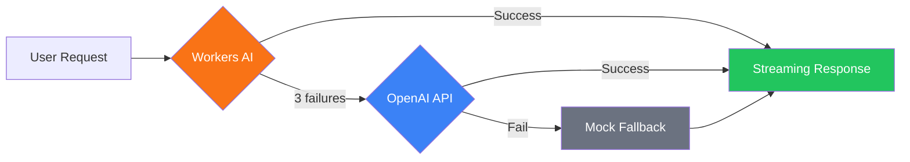

astro-minimax includes a built-in AI chat assistant with multi-provider failover, RAG retrieval, streaming responses, and Mock fallback. This guide covers the complete setup.

## Overview

The AI chat system consists of the following modules:

| Module | Description |
|--------|-------------|
| `@astro-minimax/ai` | AI core package: RAG pipeline, provider management, chat UI |
| `@astro-minimax/cli` | CLI tools: AI content processing, author profile building, quality evaluation |
| `@astro-minimax/notify` | Notification system: Real-time AI chat notifications to Telegram/Email/Webhook |

## Quick Setup

### 1. Enable AI Feature

In `src/config.ts`:

```typescript
features: {
  ai: true,
},
ai: {
  enabled: true,
  mockMode: false,
  apiEndpoint: "/api/chat",
},
```

### 2. Configure Provider

In `.env`:

```bash
# OpenAI-compatible API (supports DeepSeek, Moonshot, Qwen, etc.)
AI_BASE_URL=https://api.openai.com/v1
AI_API_KEY=your-api-key
AI_MODEL=gpt-4o-mini

# Site information
SITE_AUTHOR=YourName
SITE_URL=https://your-blog.com
```

### 3. Build AI Data

```bash
astro-minimax ai process       # Generate article summaries and SEO data
astro-minimax profile build     # Build author profile
```

### 4. Start Development Server

```bash
pnpm run dev
```

The AI chat button will appear in the bottom-right corner of the page.

## Provider Configuration Details

### Cloudflare Workers AI

When deploying on Cloudflare Pages, you can use free Workers AI:

```toml
# wrangler.toml
[ai]
binding = "AI"
```

Workers AI is the highest-priority provider and doesn't require an API key.

### OpenAI-Compatible API

Supports any OpenAI-compatible API service:

```bash
AI_BASE_URL=https://api.openai.com/v1
AI_API_KEY=sk-xxx
AI_MODEL=gpt-4o-mini
```

You can also configure different models for different tasks:

```bash
AI_KEYWORD_MODEL=gpt-4o-mini    # Keyword extraction model
AI_EVIDENCE_MODEL=gpt-4o-mini   # Evidence analysis model
```

### Failover Mechanism



- 3 consecutive failures marks a provider as unhealthy
- Automatic recovery attempt after 60 seconds
- When all providers fail, Mock ensures users always receive a response

## Mock Mode

No real API needed during development:

```typescript
ai: {
  enabled: true,
  mockMode: true,  // Development environment
},
```

Mock mode returns pre-defined article recommendations and external resource links, simulating real AI responses.

## AI Security Features

### Source Priority Protocol

AI responses follow L1-L5 source priority:

- **L1**: Blog original content (highest priority)
- **L2**: Author bio, project list
- **L3**: Structured factual data
- **L5**: Writing style (affects expression only)

### Privacy Protection

Automatically refuses to answer sensitive personal information:

- Address, income, family members, phone, identity info, age

### Intent Classification

7 intent categories for improved search relevance:

- setup, config, content, feature, deployment, troubleshooting, general

## Quality Evaluation

### Configure Test Set

Edit `datas/eval/gold-set.json` to define test cases:

```json
{
  "cases": [
    {
      "id": "about-001",
      "category": "about",
      "question": "Tell me about yourself",
      "answerMode": "fact",
      "expectedTopics": ["blog", "AI"],
      "forbiddenClaims": [],
      "lang": "en"
    }
  ]
}
```

### Run Evaluation

```bash
pnpm run ai:eval                             # Test local server
pnpm run ai:eval -- --url=https://your-blog.com     # Test production
pnpm run ai:eval -- --category=no_answer     # Evaluate specific category
pnpm run ai:eval -- --verbose                # Detailed output
```

Evaluation is based on the `datas/eval/gold-set.json` golden test set, automatically checking:
- Non-empty response
- Topic coverage
- Forbidden claims not present
- Markdown links exist
- Answer pattern matching

Evaluation report is saved to `datas/eval/report.json`.

## Notification Integration

AI chat completion automatically sends notifications (fire-and-forget):

```bash
# .env
NOTIFY_TELEGRAM_BOT_TOKEN=your-bot-token
NOTIFY_TELEGRAM_CHAT_ID=your-chat-id
```

Notification content includes: user question, AI response summary, referenced articles, token usage, and phase timing.

See [Notification System Configuration Guide](/en/posts/notification-guide) for details.

## Environment Variables Reference

| Variable | Description | Required |
|----------|-------------|----------|
| `AI_BASE_URL` | OpenAI-compatible API URL | Required when using OpenAI |
| `AI_API_KEY` | API key | Required when using OpenAI |
| `AI_MODEL` | Main chat model | No (default `gpt-4o-mini`) |
| `AI_KEYWORD_MODEL` | Keyword extraction model | No (same as main model) |
| `AI_EVIDENCE_MODEL` | Evidence analysis model | No (same as keyword model) |
| `SITE_AUTHOR` | Author name | No |
| `SITE_URL` | Site URL | No |

## Next Steps

- [Feature Overview](/en/posts/feature-overview) — Learn about all AI features
- [CLI Tool Guide](/en/posts/cli-guide) — AI processing commands in detail
- [Notification System](/en/posts/notification-guide) — Configure AI chat notifications
- [Deployment Guide](/en/posts/deployment-guide) — Cloudflare Workers AI deployment