When I originally designed `@astro-minimax/ai`, the goal was never to build an isolated chat widget. I wanted to turn the blog knowledge bundle, retrieval augmentation, prompt assembly, multi-provider model invocation, and frontend interaction into a real AI runtime. It needs to support both site-wide Q&A and article-level read-and-chat, while staying cacheable, degradable, and explainable in edge environments such as Cloudflare Pages.

After re-reading the current codebase, the strongest impression I have is not that a few functions were renamed, but that the runtime responsibilities are now much more explicit than they were in earlier versions. `initializeMetadata()` loads the knowledge bundle and chunk indexes into runtime state, `handleChatRequest()` / `runPipeline()` orchestrate the request lifecycle, `retrieveContext()` owns retrieval and cache decisions, `assemblePromptRuntime()` assembles facts, extensions, article context, and chunk injection into the final system prompt, and `ChatPanel.tsx` has evolved from a simple chat UI into a browser-side interaction terminal with tool execution.

## Architecture Overview

```markmap
# @astro-minimax/ai Module Architecture

## Real Logical Entry Points
- Server request entry
  - `packages/ai/src/server/chat-handler.ts`
  - `handleChatRequest()`
- Metadata bootstrap entry
  - `packages/ai/src/server/metadata-init.ts`
  - `initializeMetadata()`
- UI mount entry
  - `packages/ai/src/components/AIChatWidget.astro`
- Client interaction entry
  - `packages/ai/src/components/ChatPanel.tsx`
- Local dev entry
  - `packages/ai/src/server/dev-server.ts`

## Request Processing Layer
- `apps/blog/functions/api/chat.ts`
- `createAiFunctionEnv()`
- `initializeMetadata({ knowledgeBundle }, env)`
- `handleChatRequest()`
- rate limit / request validation / language and context extraction

## Retrieval Augmentation Layer
- `retrieveContext()`
- `buildLocalSearchQuery()`
- `resolveSearchInterpretation()`
- `extractSearchKeywords()`
- `searchArticles()` / `searchProjects()`
- `mergeSearchDocuments()` / `shapeArticlesForQuery()`

## Intelligence Layer
- request interpretation
- evidence analysis
- citation guard
- fact registry
- semantic fallback / voice style

## Prompt Building Layer
- `server/prompt-runtime.ts`
- `buildArticleContextPrompt()`
- `selectRelevantChunks()`
- `buildRuntimeSystemPrompt()`
- `prompt/*` static / semi-static / dynamic

## Model Invocation Layer
- `ProviderManager`
- Workers AI / OpenAI Compatible / Mock
- `streamAnswerWithFallback()`
- `getAllTools()`
- client actions + server tools

## Cache and Playback Layer
- session search context
- public question search cache
- public question response cache
- chunk injection cache
```

## 1. Project Overview and Design Philosophy

### 1.1 Project Background and Core Positioning

The package was always meant to serve two interaction modes with very different semantics.

The first is **Global Q&A Mode**. Users ask site-level questions such as “What tech stack does this blog use?”, “Recommend a few deployment articles”, or “What AI capabilities are available?” This mode depends on cross-article retrieval, blog overview context, author context, and public-question caching.

The second is **Reading Companion Mode**. Users are already on an article page and ask questions like “What is this section saying?”, “Why is this sentence written like this?”, or “Summarize this part of the current article.” In this mode, the system cannot rely on article summaries alone. It has to combine current-article context with local source chunks.

If I had to summarize its current position from the code as it stands today, I would put it this way: **it turns build-time AI assets into a reusable runtime AI request chain that combines retrieval, assembly, generation, caching, and interaction**. The architecture is not led by a single prompt builder or a single search module. It is a set of layered subsystems coordinated around the server runtime.

### 1.2 Design Principles and Architecture Philosophy

**Vendor agnosticism** remains the first principle. `ProviderManager` prevents upper-layer business logic from depending on one model vendor and coordinates Workers AI, OpenAI-compatible providers, and Mock fallback through provider configs, adapters, and health tracking.

**Build-time and runtime separation** is also explicit. Runtime does not scan Markdown directly. It depends on `datas/knowledge/runtime/knowledge-bundle.json`. `initializeMetadata()` turns bundle documents into searchable article indexes and bundle passages into article chunk indexes.

**Request interpretation before blind retrieval** is the clearest architectural shift in the current version. `resolveSearchInterpretation()` derives conversation reuse, topic, answer contract, safety, and complexity first, then uses that result to shape retrieval, budget, and prompt constraints.

**Graceful degradation instead of hard failure** appears throughout the pipeline: keyword extraction can fall back to a local query, evidence analysis can time out and be skipped, real providers can degrade to Mock, cached responses can be replayed, and article chat can continue with summaries and key points when chunk injection is limited.

### 1.3 Core Capability Matrix

| Capability Category | Current Capability | Code Location | Purpose |
|---------------------|-------------------|---------------|---------|
| Runtime bootstrap | knowledge bundle, article index, chunk index loading | `server/metadata-init.ts` | prepares runtime AI assets |
| Query understanding | follow-up reuse, intent, complexity, answer mode | `query/*`, `intelligence/request-interpretation.ts` | drives reuse and budget |
| RAG retrieval | article retrieval, project retrieval, vector rerank, chunk selection | `search/*` | supports article and paragraph granularity |
| Fact grounding | fact registry matching and injection | `fact-registry/*` | reduces drift in generated answers |
| Extension system | searchable / facts / context / voice-style / semantic-fallback | `extensions/*` | makes runtime knowledge and style extensible |
| Prompt assembly | evidence, facts, article context, chunks, guards | `server/prompt-runtime.ts` | real prompt assembly center |
| Multi-provider generation | Workers AI / OpenAI / Mock | `provider-manager/*` | health-aware failover |
| Tool calling | server tool + client actions | `tools/action-tools.ts`, `ChatPanel.tsx` | lets the model trigger search and UI actions |
| Multi-layer caching | session / global search / response playback / injection cache | `cache/*`, `search/session-cache.ts` | lowers cost and improves follow-ups |
| Frontend interaction | useChat, streamed status, tool output, mock mode | `components/ChatPanel.tsx` | makes the AI experience visible and interactive |

### 1.4 Technology Stack and Dependencies

The current implementation is built on AI SDK v6, Preact, Astro, and Cloudflare Pages. But AI SDK is no longer just the `streamText()` dependency. It also provides:

- the server-side UI Message Stream protocol
- the frontend `useChat()` runtime
- `DefaultChatTransport`
- tool calling transport
- tool output round-tripping

The app integration layer itself is intentionally thin. `apps/blog/functions/api/chat.ts` only does three things:

1. `createAiFunctionEnv(context.env)`
2. `initializeMetadata({ knowledgeBundle }, env)`
3. `handleChatRequest({ env, request, waitUntil })`

That is important: the real AI logic remains inside the package rather than leaking into the example app.

## 2. Directory Structure and Organization

### 2.1 Top-level Directory Architecture

```text
/packages/ai/src
├── cache/                 # memory / KV caches, public-question caches, response playback, chunk injection dedupe
├── components/            # Preact UI: AIChatWidget, AIChatContainer, ChatPanel
├── data/                  # knowledge bundle and author-context data access
├── extensions/            # extension registry, loader, injector
├── fact-registry/         # fact matching and prompt injection
├── intelligence/          # keyword / evidence / citation / request interpretation
├── middleware/            # rate limiting and client IP parsing
├── prompt/                # static / semi-static / dynamic prompt builder layers
├── provider-manager/      # provider config parsing, health tracking, failover
├── providers/             # mock response and provider-side helpers
├── query/                 # follow-up and intent primitives
├── search/                # document retrieval, chunk retrieval, vector rerank, session cache
├── server/                # chat-handler, prompt-runtime, metadata-init, stream-helpers, dev-server
├── structured-output/     # Zod-driven structured generation layer
├── tools/                 # AI SDK tool definitions and registration
├── types/                 # shared type definitions
├── utils/                 # i18n, logger, text, url and other utilities
└── index.ts               # package-level exports
```

Compared to older documentation, three corrections matter most.

First, `query/` is now an explicit base directory rather than an internal implementation detail of `intelligence/`. Second, `server/prompt-runtime.ts` is a real runtime layer and can no longer be treated as a simple alias of `prompt/*`. Third, `extensions/*`, `tools/*`, and `cache/injection-cache.ts` are now part of the main request path rather than peripheral features.

### 2.2 Core Directory Function Analysis

**`src/index.ts` is the public export surface, but not the only runtime entry.** It exports provider management, middleware, cache, search, intelligence, prompt, data, fact registry, server, structured output, extensions, and tools for package consumers.

**`src/server/` is the server-side coordination center.** `chat-handler.ts` runs the request pipeline, `prompt-runtime.ts` assembles prompt-time context, `metadata-init.ts` loads runtime AI assets, `stream-helpers.ts` wraps streamed model output and cached playback, and `dev-server.ts` provides a local runtime for development outside Pages Functions.

**`src/search/` owns both article-level and paragraph-level retrieval.** `search-api.ts` handles article/project retrieval, `hybrid-search.ts` handles chunk relevance, neighbor expansion, and injection formatting, `vector-reranker.ts` provides vector reranking, and `session-cache.ts` manages conversational search reuse.

**`src/extensions/` and `src/tools/` are now first-class runtime participants.** Extensions influence semantic fallback, merged search documents, merged facts, voice style, and dynamic prompt sections. Tools connect server-executed model actions with browser-executed UI actions.

## 3. System Architecture Design

### 3.1 Overall Architecture Layers

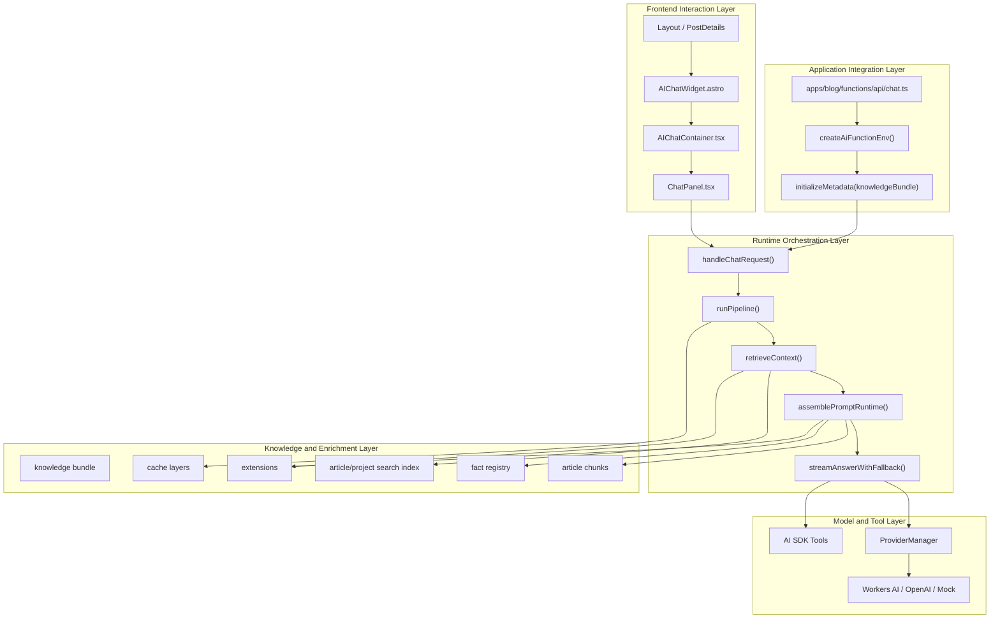

This diagram is closer to the real code than the older “presentation / service / core” abstraction because it makes three facts visible:

1. `initializeMetadata()` is an explicit prerequisite.
2. `prompt-runtime` is an independent runtime assembly layer.
3. Extensions, facts, chunk injection, caches, and tools are all part of the main request path.

### 3.2 Real Logical Entry Points and Responsibility Boundaries

If we classify the package by where real runtime work starts instead of by folder names, there are five kinds of logical entry points:

| Entry Type | File / Function | Role |
|------------|-----------------|------|
| Server request entry | `server/chat-handler.ts` → `handleChatRequest()` | handles `/api/chat` and starts the AI runtime |
| Metadata bootstrap entry | `server/metadata-init.ts` → `initializeMetadata()` | initializes runtime search indexes and chunks |
| UI mount entry | `components/AIChatWidget.astro` | mounts AI capability into the Astro page |
| Client interaction entry | `components/ChatPanel.tsx` → `ChatPanel()` | sends messages, handles tool calls, manages streamed state |
| Local dev entry | `server/dev-server.ts` | runs the AI handler outside Cloudflare Pages |

That means `src/index.ts` is better understood as the package API surface than as the place where runtime behavior begins.

## 4. Core Module Details

### 4.1 Provider Manager Module

`ProviderManager` is the center of the vendor-agnostic design I wanted for this package. Its job is not merely to “try one provider after another”, but to:

- parse provider configuration
- construct adapters
- sort them by weight
- track failures and recovery
- perform streaming failover
- switch to Mock when all real providers fail

#### Priority and Failover

| Provider | Default Weight | Source |
|----------|----------------|--------|
| Workers AI | 100 | `createWorkersAIConfigFromEnv()` |
| OpenAI Compatible | 90 | `createOpenAIConfigFromEnv()` |
| Mock fallback | not parsed, built in separately | `ProviderManager` |

There are now two configuration entry paths:

1. `AI_PROVIDERS` JSON
2. traditional environment variables such as `AI_BASE_URL`, `AI_API_KEY`, `AI_MODEL`, and `AI_BINDING_NAME`

So provider priority is not just model priority. It also includes configuration-source priority.

#### Health Tracking Mechanism

`ProviderManager.streamText()` effectively does this:

1. iterate through currently available providers
2. check `isAvailable()` first
3. call `recordSuccess()` on success
4. call `recordFailure()` on failure
5. fire health-change callbacks when a provider becomes unhealthy or recovers
6. fall back to Mock if every real provider fails and Mock is enabled

The key defaults remain:

- `unhealthyThreshold = 3`
- `healthRecoveryTTL = 60000`

### 4.2 Search Retrieval Module

The Search subsystem has evolved far beyond “find a few related articles”. It is now the combined system I use for index initialization, retrieval, result shaping, and chunk preparation for prompt injection.

#### Retrieval Architecture

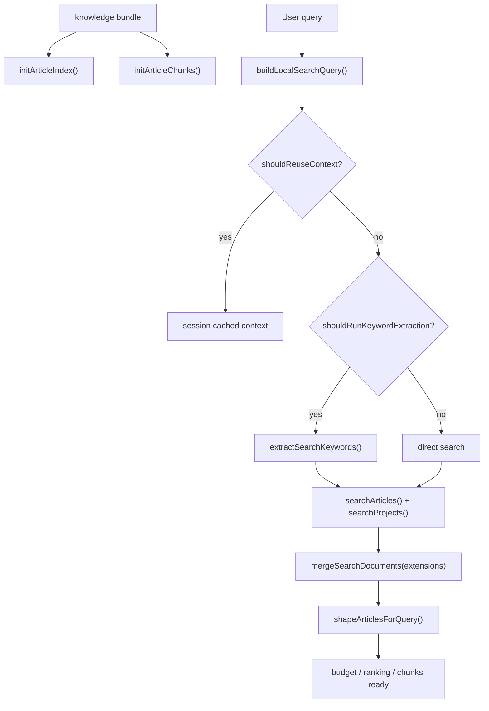

`searchArticles()` is still fundamentally lexical, but the post-processing is richer now:

1. `tokenize(query)`
2. `scoreDocument()` / `scoreDocs()`
3. `applyAnchorFilter()`
4. `filterLowRelevance()` and `applyPurityFilter()`
5. query-width-dependent article limit
6. optional deep content extraction
7. optional vector rerank / hybrid / RRF

#### TF-IDF Scoring

The most accurate summary today is: **field-weighted lexical relevance provides the base recall, then purity, anchor, category ranking, and vector reranking refine it.**

| Field | Role |
|-------|------|
| `title` | strongest relevance signal |
| `keyPoints` | summary-like supporting knowledge |
| `categories` | coarse topic correction |
| `tags` | terminology and tagging |
| `excerpt` | summary support |
| `content` | fallback support |

#### Deep Content Retrieval and Paragraph Retrieval

`metadata-init.ts` turns `knowledgeBundle.passages.passages` into `ArticleChunk[]`. In article mode, `prompt-runtime.ts` then tries to:

1. find chunk-bearing articles already present in retrieval results
2. explicitly load the current article’s chunks by slug if needed
3. use `selectRelevantChunks()`
4. expand nearby matches via `expandChunkMatchesWithNeighbors()` on short queries
5. dedupe previously injected chunks with `injectionCache.filterNewChunks()`
6. generate the prompt-side chunk block through `formatChunksForInjection()`

That is what makes modern read-and-chat work as paragraph-aware assistance rather than summary-only chat.

### 4.3 Intelligence Module

The real evolution in the Intelligence layer is not “more helper functions”, but the emergence of a proper interpretation layer.

#### Keyword Extraction

Keyword extraction still runs through `extractSearchKeywords()`, but it is no longer unconditional. `shouldRunKeywordExtraction()` only allows the extra model call when the query seems worth the additional cost. Otherwise the system stays with `buildLocalSearchQuery()`.

#### Intent Classification and `query/*` Re-exports

The underlying query-understanding logic now lives in `src/query/`:

- `query/followup.ts`
- `query/intent.ts`
- `query/types.ts`

But upper layers generally consume it through `intelligence/index.ts`. In other words, `query` is the implementation layer and `intelligence` is the semantic API boundary.

#### Request Interpretation Layer

`request-interpretation.ts` now returns a unified structure containing:

- `conversation.shouldReuseContext`
- `topic.primary`
- `answer.contract`
- `safety.decision`
- `reasoning.complexity`

Then `resolveInterpretationBudget()` derives the evidence budget from that interpretation. Budget is no longer an independent knob. It is an interpretation result.

#### Evidence Analysis

Evidence analysis still uses `analyzeRetrievedEvidence()`, but it is no longer a mandatory stage. In the current runtime it is an optional, timeout-bounded, high-value enhancement executed inside `prompt-runtime.ts` only when a real provider and adapter are available.

#### Citation Guard and Answer Mode

`resolvePromptGuards()` now combines:

1. `getCitationGuardPreflight()`
2. `interpretRequest()`
3. `buildUnknownRefusal()`

That means privacy-sensitive refusal is now a runtime branch, not just a prompt-level instruction.

### 4.4 Extensions Module

The extension system is now a first-class part of the runtime path rather than something I would still describe as experimental.

#### Extension Types

| Type | Runtime Role |
|------|--------------|
| `searchable` | merges external documents into retrieval results |
| `facts` | merges extra facts into fact-registry hits |
| `context` | injects custom sections into the dynamic prompt layer |
| `voice-style` | changes style selection by query/category |
| `semantic-fallback` | rewrites or rescues weak queries |

#### Extension Lifecycle

Extensions are loaded lazily on the first runtime request through `initializeExtensions()` and `loadExtensions("datas/extensions/*.json")`. The design rule is simple: if extensions exist, they enrich the system; if they do not, the main pipeline still runs.

#### Extension Injection Points

Extensions currently influence four main parts of the pipeline:

1. `getSemanticFallback()` for query fallback
2. `mergeSearchDocuments()` after retrieval
3. `mergeFacts()` in fact assembly
4. `buildDynamicLayer()` via extension-defined context sections

### 4.5 Structured Output

`structured-output/` is already an exported capability, but it is not a fixed stage in the chat pipeline. The most accurate description is that it is **a reusable Zod-based structured generation layer** that can support future AI subtasks such as evidence analysis or facts extraction.

### 4.6 Prompt Builder Module

The current prompt system is best understood as two stacked layers:

1. `prompt/*` builds the static, semi-static, and dynamic prompt sections
2. `server/prompt-runtime.ts` assembles facts, extensions, article context, chunk injection, and guards around those layers

#### Static Layer

The static layer carries identity, source-layer policy, language, and constraints. Today `buildSystemPrompt()` also receives `voiceStylePrompt` as part of the static input, which means style still originates from extensions but lands structurally in the static layer.

#### Semi-Static Layer

The semi-static layer comes from `getAuthorContext()`. It contains blog overview, recent articles, and author context: stable knowledge that should not be hardcoded but also should not be recomputed on every request.

## Blog Overview

The semi-static layer is not really about freezing one number such as “total article count”. Its real job is to teach the model what kind of blog this is, who the author is, and what kinds of topics the site usually covers.

## Latest Articles

The recent-articles list remains useful because it helps recommendation-style questions enter the right context quickly. The key point is not the exact count of listed articles, but that the list comes from author context rather than directory scanning on every request.

#### Dynamic Layer

The dynamic layer has changed the most. In addition to articles, projects, evidence, and facts, it now carries:

1. extension context sections
2. reading time
3. `chunksSection`
4. `preferInjectedChunks`

The real semantics of `buildDynamicLayer()` now are: **when chunks are fine-grained enough, avoid repeating the same content through summaries; when facts match, make them explicit; when extensions qualify, insert the right extra context; and then add answer-mode hints.**

### 4.7 Stream Processing Module

The stream layer now does more than “push text chunks to the frontend”. It is responsible for:

1. emitting `message-metadata`
2. emitting source articles
3. replaying cached thinking / response segments to simulate a real generation experience

So cached playback now feels much closer to live generation instead of appearing as an instant full answer.

## 5. Complete Data-Flow Examples

### 5.1 End-to-End Request Flow

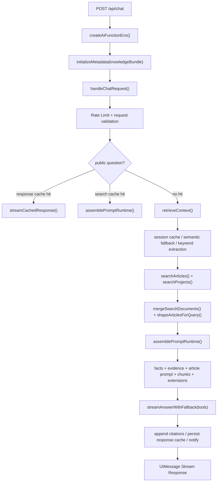

The three most important facts in this flow are:

1. knowledge-bundle initialization happens at the API entry, not inside `chat-handler.ts`
2. public-question caching has both search-cache and response-cache short-circuit branches
3. `prompt-runtime` is now an explicit assembly node rather than a casual “build prompt after search” step

### 5.2 Scenario 1: Technical Query

**User input**: `"How do I deploy to Cloudflare Pages?"`

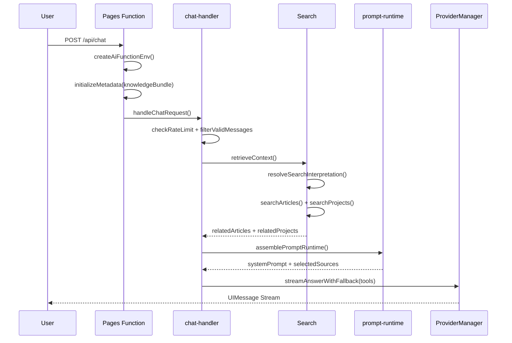

Deployment-like queries are shaped through `rankArticlesByCategory()` early in the pipeline instead of relying on prompt-side rescue later.

### 5.3 Scenario 2: Follow-up Reuse

**User input**: `"Where is the config file?"` while the previous turn was about deployment.

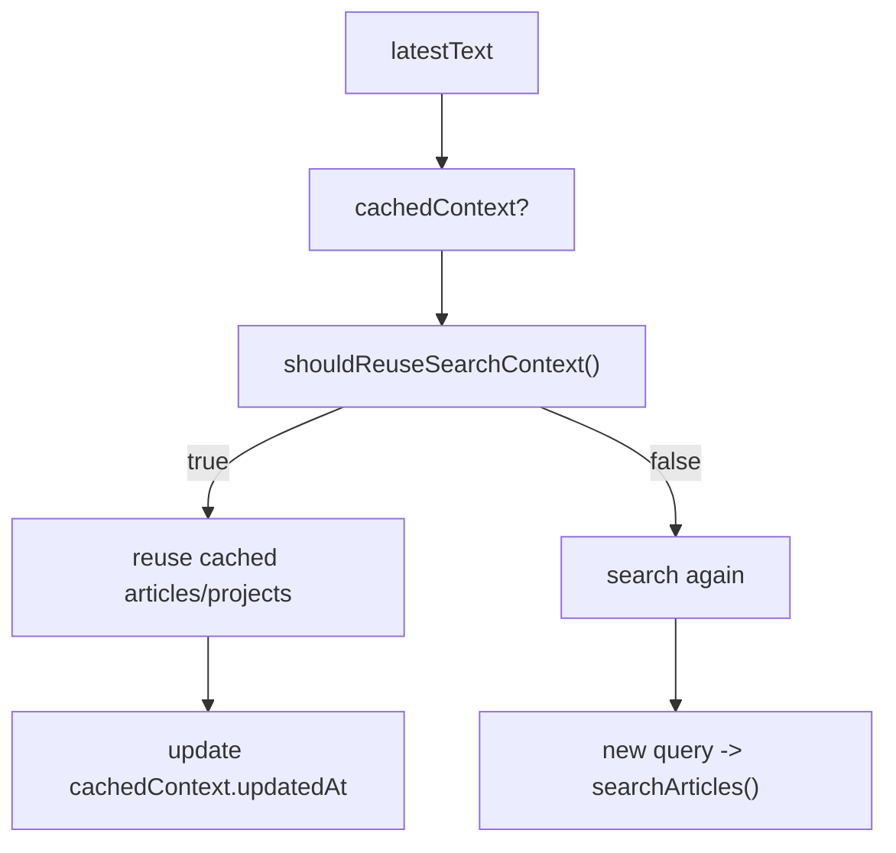

The current reuse logic checks cache existence, TTL, user-turn count, follow-up shape, query overlap, and whether significant new tokens have appeared. It is not just a “short follow-up” heuristic.

### 5.4 Scenario 3: Privacy Refusal

**User input**: `"How much do you earn?"`

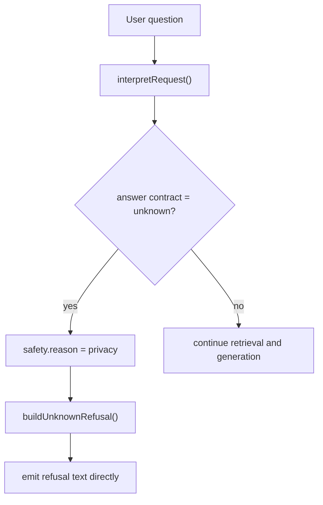

Privacy-sensitive refusal is now a runtime branch, not merely a prompt warning.

### 5.5 Scenario 4: Provider Failover

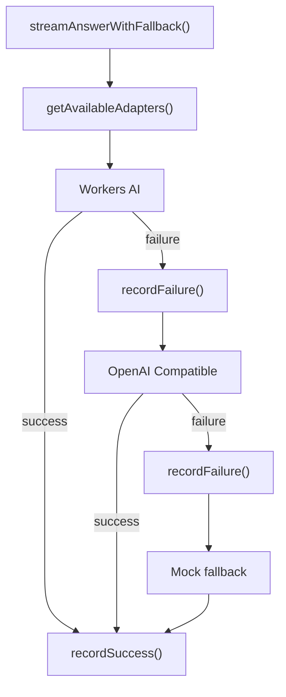

The current runtime can complete failover within the same request path rather than only at the retry level.

### 5.6 TF-IDF Scoring Breakdown

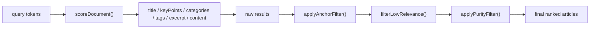

In one sentence, the current strategy is: **first recall with field-weighted lexical relevance, then clean up the results with anchor and purity filtering, and finally shape ranking by query topic.**

### 5.7 Three-Layer Prompt Construction Flow

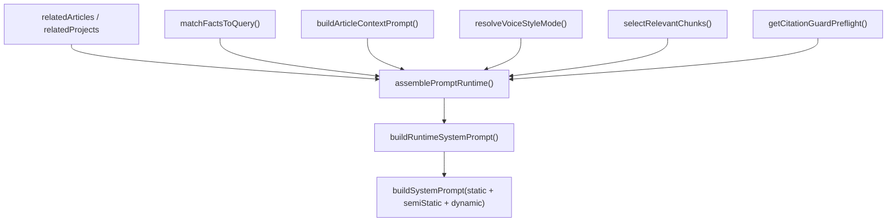

The dynamic layer should now be understood as a combination of at least the following:

- related articles
- related projects
- facts section
- evidence section
- extension context sections
- current article chunk injection
- answer mode hint

```markmap
# Source Layers

- L1: Original Blog Content
  - article titles
  - summary / keyPoints
  - current article passage chunks
  - retrieved related articles

- L2: Semi-static Author and Blog Context
  - author context
  - blog overview
  - latest articles

- L3: Structured Facts
  - fact registry
  - extension facts

- L4: External or Extension Knowledge
  - searchable extensions
  - project context

- L5: Expression Style
  - voice-style extensions
  - affects tone, not factual priority
```

## 6. Usage Scenario Details

### 6.1 Scenario 1: Global Q&A Flow

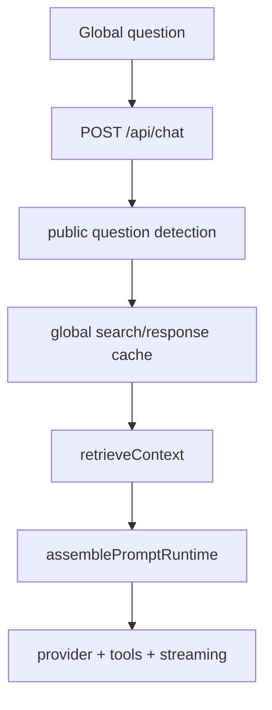

Global Q&A relies more on public-question caches, site overview, cross-article retrieval, and fact grounding. It emphasizes site-wide knowledge rather than current reading position.

### 6.2 Scenario 2: Read & Chat Feature

The key evolution in read-and-chat is that it no longer just forwards article metadata. It now combines article context with prompt-side source chunk injection.

**Context-aware mechanism:**

```typescript
export interface ArticleChatContext {
  slug: string;
  title: string;
  categories?: string[];
  summary?: string;
  abstract?: string;
  keyPoints?: string[];
  relatedSlugs?: string[];
}
```

In article mode, runtime now does three things together:

1. the frontend sends `context: { scope: 'article', article: articleContext }`
2. `buildArticleContextPrompt()` injects a current-reading hint block
3. `prompt-runtime.ts` prioritizes current-article source chunks for injection

That is much closer to a real reading companion than the older “title + summary + key points” behavior.

## 7. Component Design Details

### 7.1 AIChatWidget Component

`AIChatWidget.astro` is still the Astro-side entry component, but two points matter now:

1. it reads `SITE.ai` from `virtual:astro-minimax/config`
2. it does not own chat logic; it only passes `lang` and optional `articleContext` into the Preact container

### 7.2 AIChatContainer Component

`AIChatContainer.tsx` is a state shell. It owns open / close state and exposes `window.__aiChatToggle`. Its value is keeping the floating trigger and the chat panel loosely coupled rather than mixing transport or tool-call logic into the wrapper layer.

### 7.3 ChatPanel Component

`ChatPanel.tsx` is the heaviest frontend module. It is responsible for:

- generating a session id from article context
- constructing `DefaultChatTransport`
- switching between article and global context
- handling welcome messages and quick prompts
- processing tool calls and returning tool output
- supporting mock-mode streaming

#### useChat Configuration

```typescript
const transport = new DefaultChatTransport({
  api: config.apiEndpoint ?? '/api/chat',
  prepareSendMessagesRequest: ({ id, messages: msgs }) => ({
    headers: { 'x-session-id': sessionId },
    body: {
      id,
      messages: msgs,
      lang,
      context: articleContext
        ? { scope: 'article', article: articleContext }
        : { scope: 'global' },
    },
  }),
});
```

The `x-session-id` header is especially important because both search-context reuse and chunk-injection dedupe depend on the session dimension.

#### Frontend Tool Execution

`ChatPanel.tsx` is no longer just a text renderer. It is also a browser action runtime:

1. the server exposes tools to the model
2. the model emits a tool call
3. the frontend `onToolCall` receives `toolName` and `input`
4. `TOOL_ACTION_MAP` converts the call into a browser action
5. `window.__actionExecutor.execute(action)` runs the action
6. `addToolOutput()` sends the result back to the model

### 7.4 Streaming Text Display Optimization

Current frontend experience optimization now rests on three pillars:

1. `message-metadata` makes search and generation progress visible
2. source articles make evidence visible
3. `shouldAutoContinueAfterToolCalls` lets query tools continue generation automatically

So “streaming optimization” now means more than a typewriter effect. It makes the system’s search, citation, action, and reasoning stages visible to the user.

## 8. Interface Contracts and Data Types

### 8.1 Chat API Request Format

```typescript
interface ChatRequestBody {
  context?: {
    scope: 'global' | 'article';
    article?: {
      slug: string;
      title: string;
      categories?: string[];
      summary?: string;
      abstract?: string;
      keyPoints?: string[];
      relatedSlugs?: string[];
    };
  };
  id?: string;
  messages: UIMessage[];
  lang?: string;
}
```

### 8.2 Chat API Response Format

The server returns a UI Message Stream via `createUIMessageStream()` and `createUIMessageStreamResponse()` rather than raw handwritten SSE lines. The main observable event categories are:

- `message-metadata`
- source articles
- text chunks
- finish

When a cached response is replayed, the stream can also simulate separate `thinking` and `response` phases.

### 8.3 Error Code Definitions

Keeping an error-code section is still useful, but documentation should no longer hardcode the input limit as a single literal value. The more accurate statement is that input length is constrained by `CHAT_HANDLER.MAX_INPUT_LENGTH`, and errors are created centrally by `server/errors.ts` with language-aware messaging.

## 9. Configuration and Environment Variables

### 9.1 Provider Configuration

Current provider configuration should be documented in two layers.

**Layer 1: traditional environment variables**

| Variable | Purpose |
|----------|---------|
| `AI_BASE_URL` | OpenAI-compatible endpoint |
| `AI_API_KEY` | OpenAI-compatible API key |
| `AI_MODEL` | primary model |
| `AI_KEYWORD_MODEL` | keyword extraction model (optional) |
| `AI_EVIDENCE_MODEL` | evidence analysis model (optional) |
| `AI_BINDING_NAME` | Workers AI binding name |
| `AI_WORKERS_MODEL` | Workers AI model |

**Layer 2: unified provider JSON**

`AI_PROVIDERS` supports a JSON array for multi-provider configuration. This is the biggest provider-config improvement over older documentation.

### 9.2 Response Cache Configuration

The currently effective response-cache variables are:

| Variable | Default | Purpose |
|----------|---------|---------|
| `AI_CACHE_ENABLED` | `false` | enable response caching |
| `AI_CACHE_TTL` | `3600` | default TTL |
| `AI_CACHE_PLAYBACK_DELAY` | `20` | playback delay |
| `AI_CACHE_CHUNK_SIZE` | `15` | playback chunk size |
| `AI_CACHE_THINKING_DELAY` | `5` | thinking playback delay |

### 9.3 Rate Limit Configuration

Current runtime behavior is still the same three IP-level tiers:

- Burst: 3 requests / 10s
- Sustained: 20 requests / 60s
- Daily: 100 requests / 24h

### 9.4 Multi-Environment Configuration Flow

The app integration flow is best understood like this:

1. `apps/blog/src/config.ts` defines `SITE.ai`
2. `createAiFunctionEnv()` applies `applyAiConfigDefaults({ ...env }, SITE.ai)`
3. `AIChatWidget.astro` reads `SITE.ai` and produces frontend config
4. `functions/api/chat.ts` initializes the server runtime with both environment variables and the knowledge bundle

In other words, site config and runtime environment variables are two input channels that converge in the app integration layer.

## 10. Deployment and Operations

### 10.1 Deployment Architecture

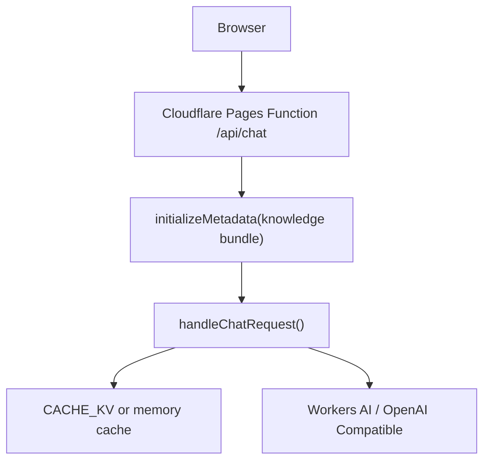

One deployment fact needs to be explicit in current documentation: runtime depends not only on environment variables, but also on `datas/knowledge/runtime/knowledge-bundle.json`. If the runtime bundle is missing, the system may still run, but retrieval quality drops sharply.

### 10.2 Performance Benchmarks

Rather than hardcoding literal benchmark numbers, the more stable characterization is:

- retrieval and prompt assembly are usually much faster than model generation
- keyword extraction and evidence analysis each have independent timeout budgets
- generation latency mainly depends on provider behavior and output length
- response-cache hits can eliminate the real model call entirely

### 10.3 Monitoring Signals

The most observable signal sources in the current code are:

1. logger output: retrieval counts, top articles, chunk selection, cache hits
2. provider health state: failures, recovery, provider switching
3. notification payloads: phase timing, model, usage, referenced articles

### 10.4 Troubleshooting Guide

**Problem: article-page AI answers feel off-topic**

Check these first:

1. whether `articleContext.slug` reaches the API correctly
2. whether `knowledge-bundle.json` contains the article’s passages
3. whether `initArticleChunks()` has actually run
4. whether chunk-selection logs show matches from the current article

**Problem: public questions always trigger fresh model calls**

Check these first:

1. whether `detectPublicQuestion()` matches the query class
2. whether `AI_CACHE_ENABLED` is enabled
3. whether `shouldPersistResponseCacheEntry()` is rejecting writes because source reasons are not authoritative enough

**Problem: configured providers still fall back to Mock**

Check these first:

1. whether `AI_PROVIDERS` JSON parses correctly
2. whether provider config passes `validateProviderConfig()`
3. whether providers have already been marked unhealthy

## 11. Timeout Budget Management

Current timeout control comes from `getTimeoutConfig()` and can be overridden through environment variables:

| Variable | Meaning |
|----------|---------|
| `AI_TIMEOUT_REQUEST` | total request timeout |
| `AI_TIMEOUT_KEYWORD` | keyword extraction timeout |
| `AI_TIMEOUT_EVIDENCE` | evidence analysis timeout |
| `AI_TIMEOUT_LLM` | LLM streaming timeout |

The design principle remains: independent budgets per stage, plus one overall request ceiling.

## 12. Tool Calling Architecture

Tool calling has become a complete dual-ended pipeline rather than the kind of experimental add-on I used to think of it as.

### 12.1 Tool Definitions

`packages/ai/src/tools/action-tools.ts` currently defines these built-in tools:

| Tool | Type | Execution Side |
|------|------|----------------|
| `toggleTheme` | client tool | browser |
| `navigateToArticle` | client tool | browser |
| `scrollToSection` | client tool | browser |
| `toggleReadingMode` | client tool | browser |
| `highlightText` | client tool | browser |
| `setPreference` | client tool | browser |
| `searchArticles` | server tool | AI server |

And the tool registry is no longer just a static constant. It now supports:

- `registerTool()`
- `unregisterTool()`
- `getAllTools()`
- `getClientSideTools()`
- `getServerSideTools()`

### 12.2 Execution Flow

The current runtime flow is:

1. the server exposes the active tools to the model through `getAllTools()`
2. the model can call a server tool such as `searchArticles`
3. it can also emit a client tool call for the frontend
4. the frontend returns the result through `addToolOutput()`
5. `shouldAutoContinueAfterToolCalls` decides whether the next step continues automatically

### 12.3 Action Executor (`packages/core/src/actions`)

Although the runtime action executor lives in the core package, the AI architecture must still account for it. The AI package understands and dispatches tool calls, while the core package performs browser-visible actions. That is a cooperative architecture rather than a self-contained AI-only loop.

## 13. Rate Limiting

Rate limiting lives in the middleware layer and executes early in `handleChatRequest()`, so it protects all interaction modes equally rather than differentiating between global and article chat.

## 14. CLI Toolchain

### 13.1 Fact Registry Build and Validation Context

The more accurate current framing is not a standalone validation command, but that the CLI is responsible for generating and managing runtime AI assets such as facts, author profile data, and extension status.

### 13.2 Related Commands

Relevant commands in the current repository include:

```bash
pnpm run ai:process
pnpm run ai:profile:build
astro-minimax ai facts build
astro-minimax ai extensions status
```

Their shared purpose is to generate the runtime knowledge assets that `initializeMetadata()` and the data-loading layer consume later.

## 15. Summary

At this point, the current `@astro-minimax/ai` package is no longer a simple “RAG + multi-provider” combination. It is a full blog AI runtime built around knowledge-bundle bootstrap, retrieval augmentation, prompt-runtime assembly, multi-layer caching, tool calling, and frontend interaction. The most important conclusions are these:

1. there are at least five real logical entry types: server request, metadata bootstrap, UI mount, client interaction, and local dev entry
2. `initializeMetadata()` is the prerequisite that turns build-time AI assets into runtime indexes and chunks
3. `chat-handler.ts` is the main orchestrator, but retrieval, prompt assembly, provider failover, and stream handling are now delegated to dedicated modules
4. `prompt-runtime.ts` is the real prompt assembly center, responsible for facts, extensions, article context, chunk injection, and safety guards
5. retrieval now includes a paragraph-level chunk path rather than stopping at summary-level article context
6. caching has grown into a multi-layer system: session search cache, public search cache, public response cache, and chunk injection dedupe
7. provider management supports both `AI_PROVIDERS` JSON and traditional environment variables, with streaming failover built in
8. tool calling is now a full closed loop across server tools, frontend action execution, and automatic continuation
9. from an architectural standpoint, the package is already quite coherent and engineering-focused, but `chat-handler.ts` remains the main concentration point of complexity

If only one sentence should remain as my own summary of the package today, it is this: `@astro-minimax/ai` is fundamentally **a blog AI runtime built on a knowledge bundle, assembled through prompt-runtime, driven by ProviderManager, and accelerated by layered caches and tool calling**.
