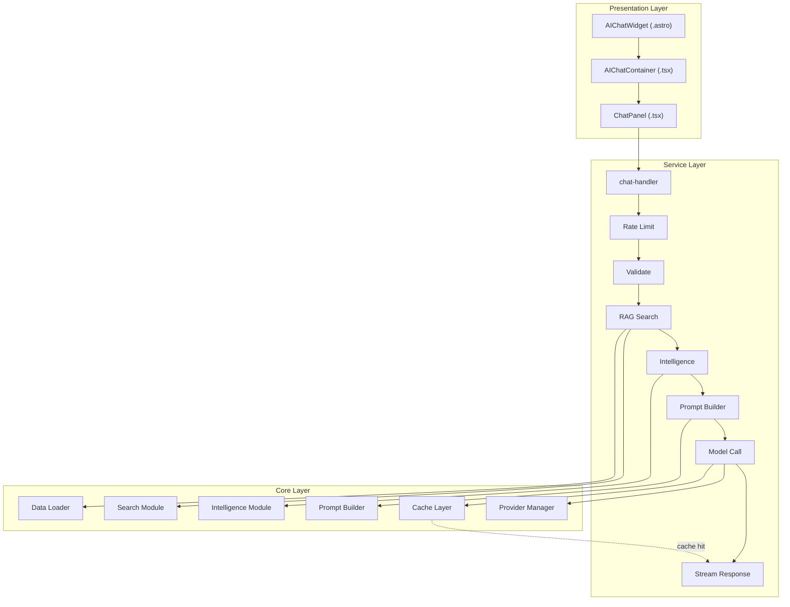
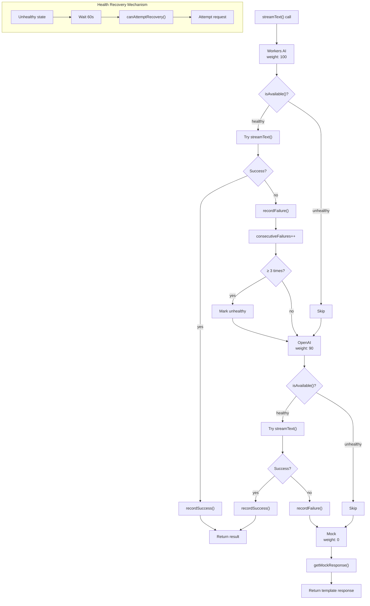
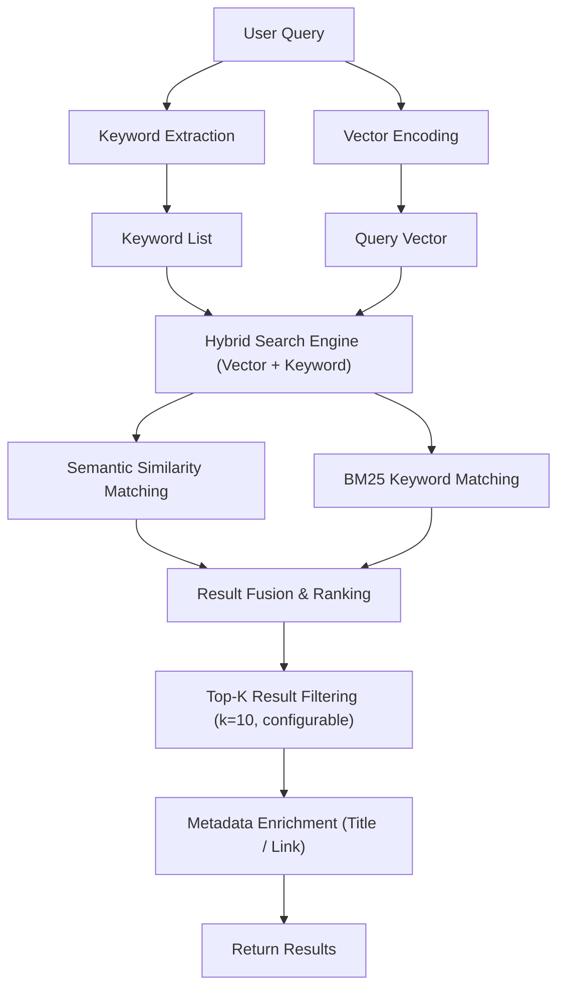
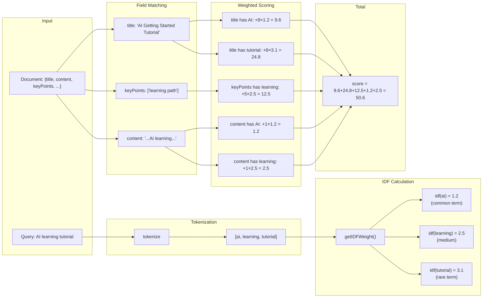
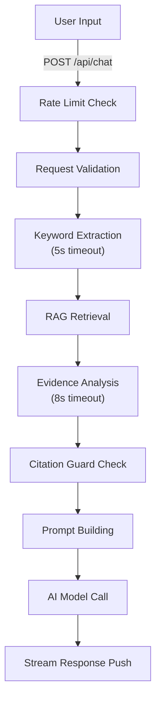
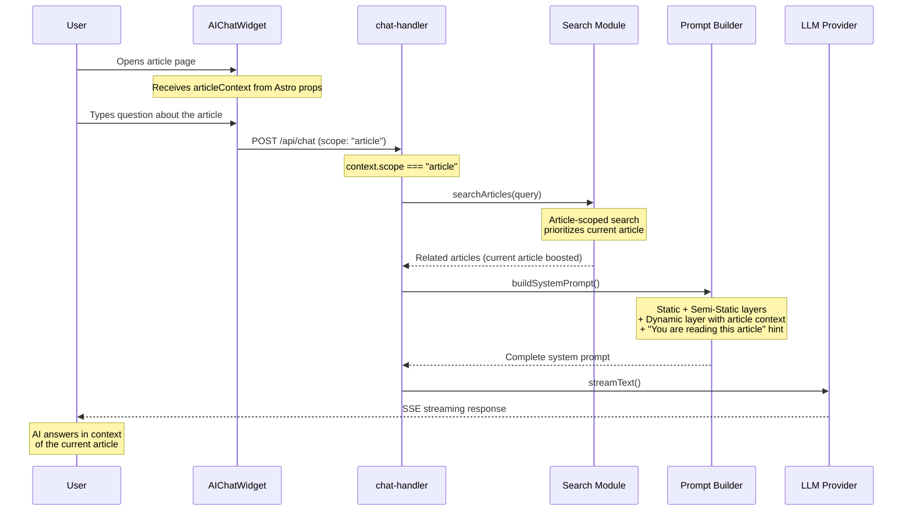
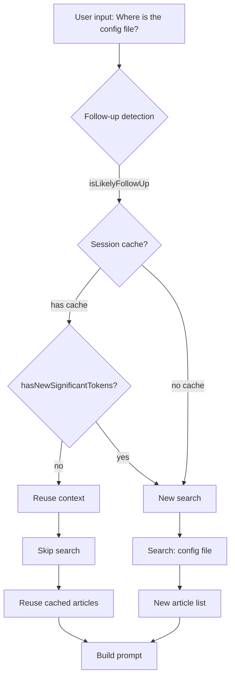
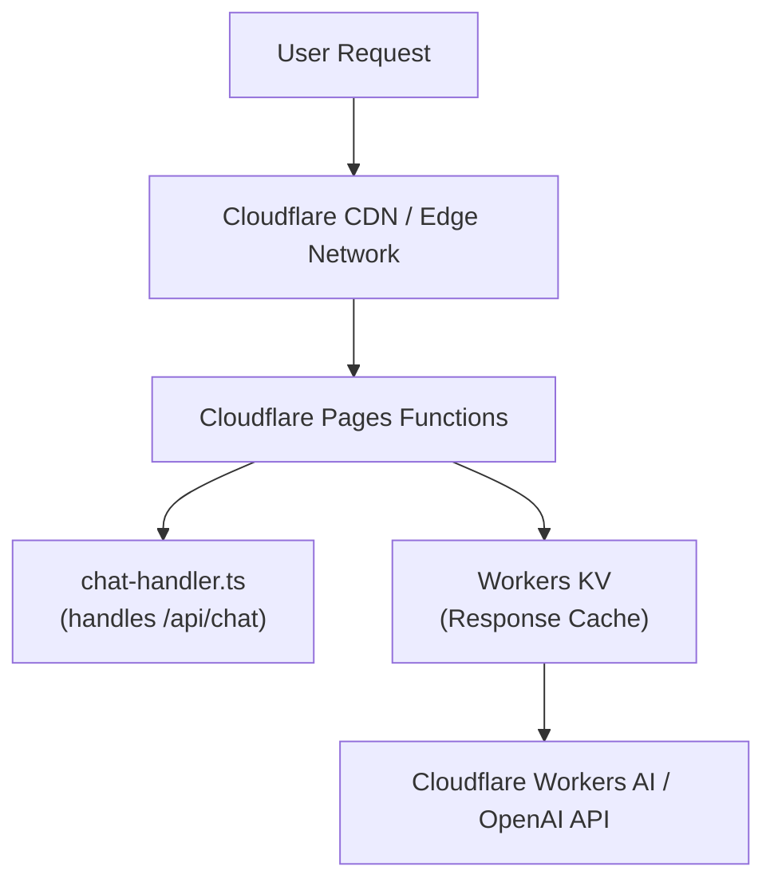
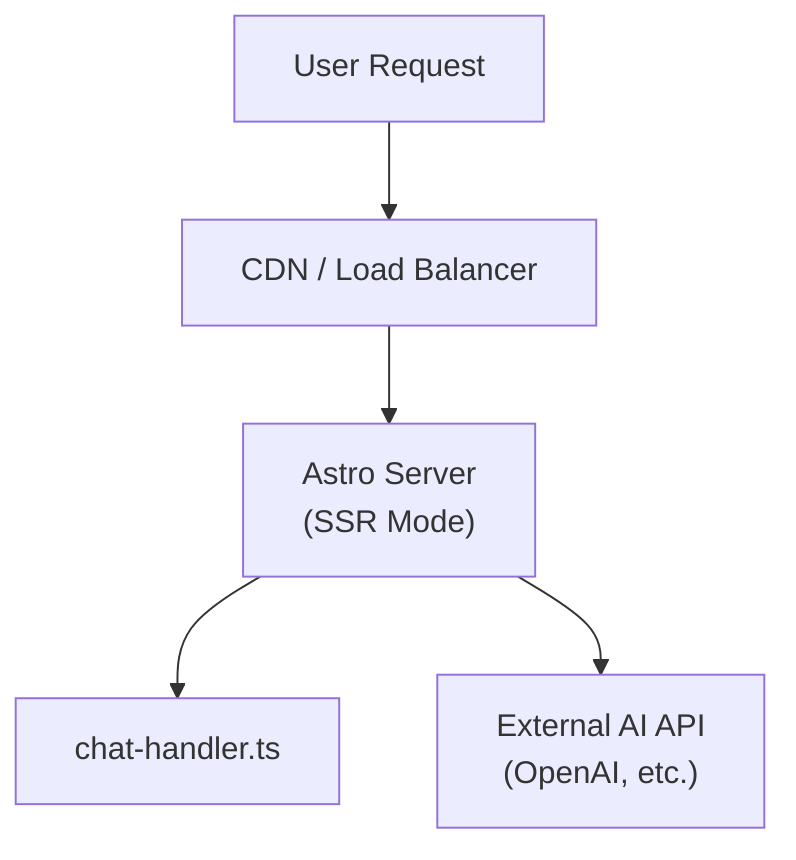

@astro-minimax/ai is the intelligent enhancement module for the astro-minimax blog theme, designed as a vendor-agnostic AI integration solution. The module's core objective is to provide a complete RAG (Retrieval-Augmented Generation) pipeline for one-stop blog platforms while supporting seamless switching and failover across multiple AI service providers, ensuring high availability and consistent user experience.

## Architecture Overview

```markmap
# @astro-minimax/ai Module Architecture

## Request Processing Layer
- Rate Limiting
  - Burst: 10s/3 requests
  - Sustained: 60s/20 requests
  - Daily: 24h/100 requests
- Request Validation
  - Message length check
  - Format validation
- Cache Detection
  - Response cache (public Q)
  - Search cache (public Q)
  - Session cache (follow-up)

## Retrieval Augmentation Layer
- Search Pipeline
  - Text normalization
  - TF-IDF scoring
  - Relevance filtering (35%)
  - Vector reranking (optional)
- Intent Detection
  - 7 intent categories
  - Article reranking
- Evidence Budget
  - simple/moderate/complex
  - Adjusted by answer mode

## Intelligence Layer
- Keyword Extraction
  - Timeout: 5s
  - Fallback: local tokenization
- Evidence Analysis
  - Timeout: 8s
  - Fallback: skip
- Citation Guard
  - Privacy protection
  - URL validation
- Answer Mode
  - fact/list/count
  - opinion/recommendation

## Prompt Building Layer
- Static Layer
  - Identity definition
  - Constraints
  - Source layers (L1-L5)
- Semi-Static Layer
  - Blog overview
  - Latest articles
- Dynamic Layer
  - Related articles
  - Evidence analysis
  - Answer mode hints

## Model Invocation Layer
- Provider Manager
  - Workers AI (100)
  - OpenAI Compatible (90)
  - Mock (0)
- Health Tracking
  - Failure threshold: 3
  - Recovery TTL: 60s
- Failover
  - Automatic switching
  - Transparent degradation
```

## 1. Project Overview and Design Philosophy

### 1.1 Project Background and Core Positioning

From a business scenario perspective, the module serves two core user interaction modes: the first is **Global Conversation Mode**, where users can initiate general inquiries about blog content from any page; the second is **Reading Companion Mode (Read & Chat)**, where users can engage in deep conversations directly related to specific article content while reading. Both modes share a highly reusable underlying architecture but achieve differentiated intelligent services through context isolation.

From a technology selection perspective, the module adopts the current mainstream AI application architecture—**Streaming Response + Server-Sent Events (SSE) + RAG Enhancement**. This combination satisfies users' expectations for instant feedback while ensuring AI response accuracy and timeliness. The module was designed from the outset with deep integration with Cloudflare Workers, naturally supporting low-latency responses in edge computing scenarios.

### 1.2 Design Principles and Architecture Philosophy

**Vendor Agnosticism** is the primary principle of module design. By abstracting the AI Provider interface, the module can simultaneously support OpenAI-compatible APIs, Cloudflare Workers AI, and other providers, with upper-layer business logic completely unaware of underlying provider differences. This design allows developers to flexibly switch AI providers based on cost, performance, regional availability, and other factors without modifying business code. The Provider Manager component bears the main responsibility for this abstraction layer, implementing automatic health tracking, priority scheduling, and transparent failover.

**Layered Decoupling** is reflected in the module's clear layered architecture. From a data flow perspective, requests pass through rate limiting, validation, retrieval, intelligent analysis, prompt building, model invocation, and streaming response processing in sequence, with each stage being an independently replaceable module. This design ensures that optimizing one stage (such as replacing with a faster embedding model) does not affect the stability of other stages.

**Build-time vs Runtime Separation** is an important architectural feature of this module. Blog metadata (article summaries, author information, voice profiles) is preprocessed during the build phase and serialized as JSON files for runtime loading. This design strips expensive computational tasks (such as document vectorization, summary generation) from the user request path, significantly reducing response latency.

**Graceful Degradation** permeates every layer of the system. When an AI provider is unavailable, the system automatically switches to a backup provider; when all providers fail, the Mock response mechanism ensures users always receive meaningful responses; when RAG retrieval times out or returns no results, the system degrades to local keyword-based search rather than directly returning failure.

### 1.3 Core Capability Matrix

| Capability Category | Specific Function | Technical Implementation | Performance Metrics |
|---------------------|-------------------|-------------------------|---------------------|
| Conversational Interaction | Streaming Text Generation | SSE + streamText | First Token latency < 500ms |
| Context Awareness | Article-level RAG Retrieval | In-memory vector search + hybrid retrieval | Retrieval latency < 200ms |
| Intelligent Analysis | Keyword Extraction | Dedicated model call | 5s timeout, auto-fallback |
| Source Tracing | Evidence Analysis & Citation | Secondary LLM call | 8s timeout, skippable |
| Multi-Provider | Automatic Failover | Provider Manager | Priority 100→90→0 |
| Degradation Strategy | Mock Fallback Response | Local string templates | Zero-latency return |
| Privacy Protection | Sensitive Information Filtering | Citation Guard | Real-time detection & blocking |
| Session Caching | Response Cache Playback | Cache layer + streaming simulation | 100% API call reduction |

### 1.4 Technology Stack and Dependencies

- **AI SDK** is the core dependency, version 6.x providing the Provider abstraction layer and streaming response processing capabilities. The module uses the `streamText` function for seamless integration with different AI providers, while the `useChat` Hook provides convenient state management for React/Preact components.

- **Runtime Environment** supports two main modes: Cloudflare Pages Functions mode and traditional Node.js mode. In Cloudflare mode, the module utilizes Workers KV for response caching; in Node.js mode, caching functionality may be limited or unavailable. The module implements runtime self-adaptation through environment detection.

- **UI Framework** uses Preact instead of React, driven by bundle size considerations. Preact's compatibility layer ensures `@ai-sdk/react` Hooks work properly in Preact environments.

## 2. Directory Structure and Organization

### 2.1 Top-level Directory Architecture

```
/packages/ai
├── src/                          # Source code directory
│   ├── components/                # UI components (Preact)
│   │   ├── ChatPanel.tsx         # Core chat interface (865 lines)
│   │   ├── AIChatContainer.tsx   # Container component
│   │   └── AIChatWidget.astro    # Astro entry point
│   ├── server/                   # Server-side processing logic
│   │   ├── chat-handler.ts       # Main request handler
│   │   ├── stream-helpers.ts     # Streaming response helpers
│   │   ├── errors.ts             # Error response factory
│   │   └── types.ts              # Type definitions
│   ├── tools/                    # AI SDK tool() definitions (actions + search)
│   │   ├── action-tools.ts       # Client/server tool schemas and searchArticles execute
│   │   └── index.ts              # Public exports
│   ├── provider-manager/         # AI provider management
│   │   ├── manager.ts            # Provider Manager core
│   │   ├── openai.ts             # OpenAI adapter
│   │   ├── workers.ts            # Workers AI adapter
│   │   └── mock.ts               # Mock provider implementation
│   ├── search/                   # RAG retrieval module
│   │   ├── search-api.ts         # Search API entry
│   │   ├── search-index.ts       # Index building
│   │   ├── search-utils.ts       # Scoring utilities
│   │   ├── vector-reranker.ts    # Vector reranking
│   │   └── session-cache.ts      # Session caching
│   ├── intelligence/             # Intelligent analysis module
│   │   ├── keyword-extract.ts    # Keyword extraction
│   │   ├── evidence-analysis.ts  # Evidence analysis
│   │   ├── citation-guard.ts     # Citation guard
│   │   ├── intent-detect.ts      # Intent detection
│   │   └── citation-appender.ts  # Citation appender
│   ├── prompt/                   # Prompt engineering
│   │   ├── prompt-builder.ts     # Three-layer prompt builder
│   │   ├── static-layer.ts       # Static layer
│   │   ├── semi-static-layer.ts  # Semi-static layer
│   │   └── dynamic-layer.ts      # Dynamic layer
│   ├── extensions/               # Extensions system (NEW)
│   │   ├── types.ts              # Extension interface definitions
│   │   ├── registry.ts           # Extension registry
│   │   ├── loader.ts             # Extension loader
│   │   └── injector.ts           # Extension injector
│   ├── structured-output/        # Structured output (NEW)
│   │   ├── types.ts              # Structured output interfaces
│   │   ├── generator.ts          # generateStructured<T>()
│   │   └── schemas/              # Zod schema definitions
│   │       └── evidence.ts       # EvidenceAnalysis schema
│   ├── cache/                    # Cache module
│   │   ├── response-cache.ts     # Response cache
│   │   ├── global-cache.ts       # Global cache
│   │   ├── memory-adapter.ts     # Memory adapter
│   │   └── kv-adapter.ts         # KV adapter
│   ├── data/                     # Data loading
│   │   └── metadata-loader.ts    # Metadata loader
│   └── utils/                    # Utility functions
│       └── i18n.ts               # Internationalization
├── package.json                  # Package configuration
├── tsconfig.json                 # TypeScript configuration
└── README.md                     # English documentation
```

### 2.2 Core Directory Function Analysis

**src/components/** directory adopts atomic design philosophy for organizing UI components. At the lowest level is `ChatPanel.tsx`, the visual core of the entire chat functionality, built on `@ai-sdk/react`'s `useChat` Hook. It is responsible for message rendering (supporting text, source citations, and other parts), error state display (with retry buttons), and status indicator presentation. `AIChatContainer.tsx` acts as the state container, managing chat bubble open/close state and exposing the `window.__aiChatToggle` interface for external invocation (e.g., floating buttons) to toggle state.

**src/tools/** uses the AI SDK `tool()` helper function to define all tools callable by the model. `allTools` aggregates 7 tools: `toggleTheme`, `navigateToArticle`, `scrollToSection`, `toggleReadingMode`, `highlightText`, `setPreference`, and `searchArticles`. Among these, `searchArticles` executes on the server (with an `execute` function), while the other 6 are client-executed tools (schema-only definitions, handled by the browser-side `ActionExecutor`). `getClientSideTools()` and `getServerSideTools()` provide the programmatic API for this classification.

**src/server/** directory contains all request processing logic. `chat-handler.ts` is the hub of the entire server-side processing pipeline, orchestrating rate limiting, input validation, RAG search, intelligence analysis, prompt building, AI invocation, and streaming response stages. In v0.9.1, the `streamText` call added `tools: allTools`, `toolChoice: 'auto'`, and `stopWhen: stepCountIs(5)` parameters, enabling the model to invoke tools during responses.

**src/provider-manager/** is the core directory for implementing vendor agnosticism. It exports a Provider Manager instance supporting dynamic add/remove of providers, priority weights, automatic health tracking, and transparent failover. `mock.ts` provides local Mock response capability — when all real providers are unavailable, the system switches to Mock mode and returns predefined templated responses.

**src/search/** implements core RAG retrieval capabilities. Retrieval uses session-level caching (`session-cache.ts`) to avoid repeated retrieval within the same conversation session. The retrieval strategy employs a hybrid approach: combining semantic vector similarity with keyword matching to ensure results are both relevant and comprehensive.

**src/intelligence/** provides intelligent enhancement capabilities beyond basic retrieval. `keyword-extract.ts` extracts key entities and intent words from user queries, used to enhance retrieval effectiveness. `evidence-analysis.ts` performs secondary analysis on retrieved document fragments, evaluating their support for the current query. `citation-guard.ts` is the privacy protection component, responsible for detecting and filtering queries that might leak personal information.

**src/prompt/** implements the three-layer prompt construction system. The first layer is the static layer, containing system role definitions and universal instructions; the second is the semi-static layer, containing blog-specific information (tech stack, feature list); the third is the dynamic layer, built dynamically based on current conversation context and RAG retrieval results. This layered design enables most prompt content to be cached and reused, with only the dynamic layer requiring real-time generation.

## 3. System Architecture Design

### 3.1 Overall Architecture Layers



## 4. Core Module Details

### 4.1 Provider Manager Module

#### Priority and Failover

| Provider | Weight | Description |
|----------|--------|-------------|
| Workers AI | 100 | Highest priority, free on Cloudflare deployment |
| OpenAI Compatible | 90 | Fallback, supports any OpenAI-compatible API |
| Mock | 0 | Final fallback, guarantees users always receive a response |

#### Failover Logic

```typescript
async streamText(options: StreamTextOptions): Promise<StreamTextResult> {
  for (const provider of this.providers) {
    const isAvailable = await provider.isAvailable();
    if (!isAvailable) continue;

    try {
      const result = await provider.streamText(options);
      provider.recordSuccess();
      return result;
    } catch (error) {
      provider.recordFailure(error);
      // Continue to next provider
    }
  }

  // All providers failed, enable Mock fallback
  return this.mockAdapter.streamText(options);
}
```

#### Health Tracking Mechanism

Each Provider maintains independent health state:

```typescript
interface ProviderHealth {
  healthy: boolean;
  consecutiveFailures: number;
  totalRequests: number;
  successfulRequests: number;
  lastError?: string;
  lastErrorTime?: number;
  lastSuccessTime?: number;
}
```

**Key configurations:**
- `unhealthyThreshold: 3` — Mark as unhealthy after 3 consecutive failures
- `healthRecoveryTTL: 60000` — Auto-retry after 60 seconds



### 4.2 Search Retrieval Module

#### Retrieval Architecture



#### TF-IDF Scoring Field Weights

```typescript
const FIELD_WEIGHTS = {
  title: 8,      // Title matches are most important
  keyPoints: 5,
  categories: 4,
  tags: 3,
  excerpt: 3,
  content: 1,
} as const;
```

#### TF-IDF Scoring Details



**IDF Formula:**

```
IDF(term) = log(N / (df + 1)) + 1

Where:
- N = total number of documents
- df = number of documents containing the term
- +1 smoothing ensures all term weights are positive
```

#### Deep Content Retrieval

When the top result score significantly exceeds the second, deep content extraction is automatically enabled:

```typescript
const DEEP_CONTENT_SCORE_THRESHOLD = 8;
const DEEP_CONTENT_MAX_LENGTH = 1500;

const isDeepHit =
  options.enableDeepContent &&
  topScore >= DEEP_CONTENT_SCORE_THRESHOLD &&
  topScore > secondScore * 1.5;  // Top result significantly leads
```

#### Session-Level Caching

Retrieval results are cached at the session level to avoid repeated retrieval (TTL: 10 minutes):

```typescript
export function shouldReuseSearchContext(params: {
  latestText: string;
  cachedContext: CachedSearchContext | undefined;
  userTurnCount: number;
  now: number;
}): boolean {
  if (!cachedContext) return false;
  if (userTurnCount <= 1) return false;
  if (now - cachedContext.updatedAt > SESSION_CACHE_TTL_MS) return false;
  if (!isLikelyFollowUp(latestText)) return false;
  if (!hasQueryOverlap(latestText, cachedContext.query)) return false;
  if (hasNewSignificantTokens(latestText, cachedContext.query)) return false;
  return true;
}
```

#### RRF hybrid fusion (optional)

When `searchArticles` is called with `enableRRF: true`, a vector index is available, and there is more than one candidate article, the pipeline can fuse **BM25/TF-IDF ranking** and **vector ranking** using **Reciprocal Rank Fusion (RRF)** (`packages/ai/src/search/hybrid-search.ts`). Each list contributes terms of the form `1 / (k + rank)` (default `k = 60`), summed per document URL. Results carry `rrfScore`, `bm25Rank`, and `vectorRank` for debugging and tuning. If RRF is not enabled but vectors exist, the code falls back to the existing vector reranker.

#### Paragraph-level retrieval and prompt injection

Article bodies can be split into **chunks** at build/runtime and attached to `ArticleContext`. In the **dynamic prompt layer** (`dynamic-layer.ts`), `selectRelevantChunks` scores chunks against the user query (token overlap on headings and body, with heading-level boosts), keeps a bounded number per article, sorts globally, and formats matches via `formatChunksForInjection`. A session-scoped cache avoids re-injecting the same chunk text across follow-up turns. This sits alongside article-level summaries and optional `fullContent` deep extraction, giving the model **paragraph-level** evidence without loading entire posts every time.

### 4.3 Intelligence Module

#### Intent Classification

Classifies user queries into 7 intent categories to optimize retrieval and response:

| Intent | Example | Search Impact |
|--------|---------|---------------|
| `setup` | "How to install?" | Prioritize getting-started articles |
| `config` | "How to configure AI?" | Prioritize config/settings articles |
| `content` | "Explain this concept" | Standard content search |
| `feature` | "What can the theme do?" | Prioritize feature documentation |
| `deployment` | "Deploy to Cloudflare" | Prioritize deployment guides |
| `troubleshooting` | "Build fails with error" | Prioritize FAQ and issue-related content |
| `general` | "Tell me about the blog" | Broad search across all content |

Intent detection uses lightweight heuristics (keyword matching + pattern analysis) to avoid adding latency. Results feed into article reranking and answer mode selection.

#### Answer Mode Detection

```typescript
type AnswerMode = 'fact' | 'count' | 'list' | 'opinion' | 'recommendation' | 'unknown' | 'general';
```

The system detects what type of answer the user expects:
- **fact**: "What version of Astro?" → concise factual answer
- **list**: "What features are available?" → bullet-point enumeration
- **count**: "How many articles?" → numeric answer
- **opinion**: "Is Astro better than Next.js?" → balanced perspective with evidence
- **recommendation**: "Which theme should I use?" → guided suggestion
- **unknown**: Query outside blog scope → polite refusal with redirect

#### Evidence Budget

Based on query complexity and answer mode, the system allocates a budget for how many articles to analyze and how deeply:

| Budget | Articles | Analysis Depth | Use Case |
|--------|----------|---------------|----------|
| `simple` | 1-3 | Summary only | Direct factual queries |
| `moderate` | 3-5 | Summary + key points | Most general queries |
| `complex` | 5-8 | Full analysis + evidence | Multi-faceted discussions |

#### Citation Guard

Automatically refuses 6 categories of sensitive personal information queries: address, income, family, phone, ID, age. Also validates that referenced URLs are from the blog domain to prevent hallucinated external links.

### 4.4 Prompt Builder Module

The Prompt Builder implements a three-layer prompt construction system, a key component of the system's intelligent behavior.

#### Static Layer

Near-immutable system instructions containing identity definition, response format, and constraints:

```typescript
const PROMPTS = {
  en: {
    identity: (authorName) => `You are ${authorName}'s blog AI assistant...`,
    responsibilities: [
      'Answer questions based on blog content, **proactively recommend related articles**',
      'When topics involve specific technologies, also recommend high-quality external resources',
      'Respond in English',
    ],
    constraints: [
      'Only cite articles that actually exist in the retrieval results, never fabricate links',
      'All links must use Markdown format [display text](URL)',
      'Do not answer private questions completely unrelated to the blog',
    ],
    sourceLayers: [
      'L1 Original blog content (highest priority)',
      'L2 Curated data: author bio, project list',
      'L3 Structured facts: tag statistics, category aggregation',
      'L4 External verified sources (must annotate citations)',
      'L5 Voice style (only affects expression)',
    ],
    answerModes: [
      'fact: Give the conclusion first, then supporting evidence; if there is a directly relevant article, mention its title or provide a link',
      'list: Directly list 2-6 items of the same dimension',
      'count: First sentence must state the number or "at least X", no false precision',
      'opinion: Start with "I think/In my view", then expand with 2-3 viewpoints',
      'recommendation: Give 2-4 recommendations first, then explain the reasoning',
      'unknown (privacy): First sentence must include "not publicly disclosed" or "not provided", wrap up in 1-2 sentences',
    ],
    preOutputChecks: [
      'About to output a link → check if the URL is in the "related articles" list',
      'About to output a number → check if it explicitly appears in visible text',
      'About to cite an article → ensure Markdown link format [title](URL)',
      'Acknowledging missing info → mention briefly in one sentence, don\'t over-emphasize',
    ],
  },
};
```

#### Semi-Static Layer

Blog-specific information, preprocessable at build time:

```typescript
export function buildSemiStaticLayer(config: SemiStaticLayerConfig): string {
  const { posts } = config.authorContext;

  return `
## Blog Overview
- ${posts.length} total articles
- Main categories: ${getCategories(posts).join(', ')}

## Latest Articles
${getRecentPosts(posts).map(p =>
  `- [${p.title}](${p.url}) (${p.date}) — ${p.summary.slice(0, 60)}`
).join('\n')}
`;
}
```

#### Dynamic Layer

Generated in real-time based on current query and retrieval results:

```typescript
export function buildDynamicLayer(config: DynamicLayerConfig): string {
  const { userQuery, articles, projects, evidenceSection, answerMode } = config;

  const lines = ['## Content Related to the Current Question'];

  if (articles.length) {
    lines.push('### Related Articles');
    for (const article of articles.slice(0, 8)) {
      lines.push(`**[${article.title}](${article.url})**`);
      if (article.readingTime) lines.push(`Reading time: ~${article.readingTime} min`);
      if (article.summary) lines.push(`Summary: ${article.summary.slice(0, 120)}`);
      if (article.keyPoints.length) {
        lines.push(`Key points: ${article.keyPoints.slice(0, 3).join('; ')}`);
      }
    }
  }

  lines.push(`---`);
  lines.push(`Based on the above content, answer the user's question about "${userQuery}".`);

  if (answerMode && answerMode !== 'general') {
    lines.push(getAnswerModeHint(answerMode));
  }

  return lines.join('\n');
}
```

#### Three-Layer Assembly Flow

```mermaid
flowchart TB
    subgraph Static["Static Layer (fixed at build time)"]
        S1["Identity definition"]
        S2["Responsibilities"]
        S3["Format requirements"]
        S4["Constraints"]
        S5["Source layers L1-L5"]
        S6["Privacy protection"]
        S7["Answer mode guidance"]
        S8["Pre-output checks"]
    end

    subgraph SemiStatic["Semi-Static Layer (fixed at build time)"]
        SS1["author-context.json"]
        SS2["Total article count"]
        SS3["Main categories"]
        SS4["Latest 10 articles"]
    end

    subgraph Dynamic["Dynamic Layer (generated per request)"]
        D1["User query"]
        D2["Related articles (≤8)"]
        D3["Related projects (≤4)"]
        D4["Evidence analysis results"]
        D5["Fact matching results"]
        D6["Answer mode hint"]
        D7["Extension context"]
    end

    subgraph Assembly
        C["buildSystemPrompt()"]
        C --> OUT["Complete system prompt<br/>(~2000-4000 tokens)"]
    end

    S1 --> C
    S2 --> C
    S3 --> C
    S4 --> C
    S5 --> C
    S6 --> C
    S7 --> C
    S8 --> C

    SS1 --> SS2
    SS1 --> SS3
    SS1 --> SS4
    SS2 --> C
    SS3 --> C
    SS4 --> C

    D1 --> C
    D2 --> C
    D3 --> C
    D4 --> C
    D5 --> C
    D6 --> C
    D7 --> C
```



#### Source Layer Priority

| Layer | Content | Priority |
|-------|---------|----------|
| L1 | Original blog content (title, summary, key points, excerpts) | Highest — must come from "related articles" |
| L2 | Curated data: author bio, project list, blog overview | High |
| L3 | Structured facts: tag statistics, category aggregation, derived data | Medium |
| L4 | External verified sources (official docs, GitHub repos) | Lower — must annotate citations |
| L5 | Voice style (only affects expression, not factual basis) | Lowest |

**Priority rule**: L1 > L2 > L3 > L4 > L5. When sources conflict, higher priority takes precedence.

### 4.5 Stream Processing Module

Supports streaming response processing with cache playback simulating real streaming output.

### 4.6 Tool Calling Architecture

Tools are declared in `packages/ai/src/tools/action-tools.ts` using the AI SDK `tool()` helper and Zod `inputSchema` for structured arguments. `allTools` aggregates seven tools: `toggleTheme`, `navigateToArticle`, `scrollToSection`, `toggleReadingMode`, `highlightText`, `setPreference`, and `searchArticles`.

`chat-handler.ts` imports `allTools` and passes it into `streamText` with `toolChoice: 'auto'`, so the active provider may emit tool calls in the same streaming turn as natural language. **Server-side execution** applies only to `searchArticles`, whose `execute` function calls `searchArticles` / `searchProjects` from the search module and returns JSON for the model. The other six tools are **client-executed**: the stream carries tool-call parts to the Preact chat UI, which maps names and payloads to the core **Action** format and runs them in the browser (see below). `getClientSideTools()` and `getServerSideTools()` document this split for tests and integrations.

### 4.7 Action Executor (`packages/core/src/actions`)

The `@astro-minimax/core` package owns **runtime execution** of user-visible actions. `ActionExecutor` implements handlers for `scroll-to-section`, `highlight-text`, `toggle-theme`, `toggle-reading-mode`, `set-preference`, and `navigate`, updating the DOM, theme, reading mode, and persisted preferences consistently with the rest of the theme.

**Cross-page chaining** is handled by `URLHandler`: simple actions such as theme and section scroll can be encoded as `theme` and `section` query parameters; longer sequences are **enqueued** and referenced by an `ai_actions` token so that after `navigateToArticle` loads the target page, pending actions are dequeued and executed on load. This keeps tool-driven navigation aligned with normal user navigation and avoids losing context across a full page transition.

## 5. Usage Scenario Details

### 5.1 Scenario 1: Global Q&A Flow



### 5.2 Scenario 2: Read & Chat Feature

This is an enhanced feature for article reading scenarios, where users can initiate conversations about the specific article they are currently reading.

**Context-Aware Mechanism:**

```typescript
const articleContext = {
  scope: "article",
  article: {
    slug: "how-to-configure-astro-minimax-theme",
    title: "How to Configure astro-minimax Theme",
    summary: "This article covers the configuration methods for the astro-minimax theme...",
    keyPoints: ["Basic configuration", "Environment variables", "Theme customization"],
    categories: ["Tutorial", "Configuration"],
  },
};

// Article context prompt injection
const articlePrompt = `
[Current Reading Article]
User is reading: "${articleContext.title}"
Summary: ${articleContext.summary}
Key points: ${articleContext.keyPoints.join('; ')}
Categories: ${articleContext.categories.join(', ')}

You are accompanying the user as they read this article. Prioritize answering questions based on this article's content.
`;
```

**Read & Chat Sequence Flow:**



### 5.3 Scenario 3: Follow-up Context Reuse

**User input**: `"Where is the config file?"` (previous turn discussed deployment)



**Follow-up Detection Algorithm:**

```typescript
function isLikelyFollowUp(message: string): boolean {
  const text = message.trim();
  if (!text || text.length > 48) return false;

  const hasTerminalPunctuation = /[?？!！。.…]$/.test(text);
  const wordCount = text.split(/\s+/).filter(Boolean).length;

  if (text.length <= 16) return true;           // Very short, likely a follow-up
  if (!/\s/.test(text) && text.length <= 24) return true;  // Single-word phrase
  return hasTerminalPunctuation && wordCount <= 6 && text.length <= 36;
}
```

## 6. Component Design Details

### 6.1 AIChatWidget Component

AIChatWidget.astro is the module's Astro entry point, responsible for initializing the chat UI and mounting it to the page.

```astro
---
import { SITE } from "virtual:astro-minimax/config";
import AIChatContainer from "./AIChatContainer.js";
import type { ArticleChatContext } from "../server/types.js";

interface Props {
  lang?: string;
  articleContext?: ArticleChatContext;
}

const { lang = SITE.lang ?? "zh", articleContext } = Astro.props;
const aiEnabled = SITE.ai?.enabled ?? false;

const aiConfig = {
  enabled: aiEnabled,
  mockMode: SITE.ai?.mockMode ?? true,
  apiEndpoint: SITE.ai?.apiEndpoint || "/api/chat",
  welcomeMessage: SITE.ai?.welcomeMessage,
  placeholder: SITE.ai?.placeholder,
  lang,
};
---

{aiEnabled && (
  <AIChatContainer
    client:only="preact"
    config={aiConfig}
    articleContext={articleContext}
  />
)}
```

**Client loading strategy:** The `client:only="preact"` directive means the component loads only after the page's main content and interactions are ready. This ensures the chat component does not block initial page load, minimizing performance impact.

### 6.2 AIChatContainer Component

AIChatContainer is the state container component, managing chat bubble open/close state and exposing a global control interface.

```typescript
export default function AIChatContainer({ config, articleContext }: Props) {
  const [open, setOpen] = useState(false);

  const handleToggle = useCallback(() => setOpen(prev => !prev), []);
  const handleClose = useCallback(() => setOpen(false), []);

  if (typeof window !== 'undefined') {
    (window as any).__aiChatToggle = handleToggle;
  }

  return (
    <ChatPanel
      open={open}
      onClose={handleClose}
      config={config}
      articleContext={articleContext}
    />
  );
}
```

### 6.3 ChatPanel Component

ChatPanel is the core chat UI component, built on `@ai-sdk/react`'s `useChat` Hook.

#### useChat Configuration

```typescript
const transport = useMemo(() => new DefaultChatTransport({
  api: config.apiEndpoint ?? '/api/chat',
  prepareSendMessagesRequest: ({ id, messages: msgs }) => ({
    headers: { 'x-session-id': sessionId },
    body: {
      id,
      messages: msgs,
      lang,
      context: articleContext
        ? { scope: 'article' as const, article: articleContext }
        : { scope: 'global' as const },
    },
  }),
}), [config.apiEndpoint, sessionId, articleContext, lang]);

const {
  messages,
  sendMessage,
  setMessages,
  regenerate,
  status,
  error,
} = useChat({
  transport,
  onError: (err) => console.error('[ChatPanel] Chat error:', err.message),
});
```

#### Typewriter Effect

```typescript
function useTypewriter(fullText: string, isStreaming: boolean): string {
  const [displayedLength, setDisplayedLength] = useState(0);

  useEffect(() => {
    if (!isStreaming) return;

    const animate = () => {
      setDisplayedLength(prev => {
        const targetLength = fullText.length;
        const behind = targetLength - prev;
        // The further behind, the faster the catch-up
        const speed = behind > 20 ? Math.min(behind, 5) : 1;
        return Math.min(prev + speed, targetLength);
      });
      animationRef.current = requestAnimationFrame(animate);
    };

    animationRef.current = requestAnimationFrame(animate);
    return () => cancelAnimationFrame(animationRef.current!);
  }, [isStreaming, fullText]);

  return fullText.slice(0, displayedLength);
}
```

### 6.4 Streaming Text Display Optimization

**Auto-scroll strategy:** The message list automatically scrolls to the bottom (keeping the latest message visible), but if the user manually scrolls up, auto-scrolling is paused.

**Markdown rendering:** Supports rich Markdown syntax:
- Inline elements: links, bold, inline code
- Block elements: paragraphs, code blocks, blockquotes, lists

## 7. Interface Contracts and Data Types

### 7.1 Chat API Request Format

**Endpoint:** `POST /api/chat`

```typescript
interface ChatRequest {
  context?: {
    scope: "global" | "article";
    article?: {
      slug: string;
      title: string;
      summary?: string;
      keyPoints?: string[];
      categories?: string[];
    };
  };
  id?: string;       // Session ID
  messages: Array<{
    role: "user" | "assistant" | "system";
    content: string;
  }>;
}
```

### 7.2 Chat API Response Format

**Success response:** Uses Server-Sent Events (SSE) protocol

```typescript
interface TextStartMessage { type: "text-start"; }
interface TextDeltaMessage { type: "text-delta"; data: string; }
interface TextEndMessage { type: "text-end"; }
interface ThinkingStartMessage { type: "reasoning-start"; }
interface ThinkingDeltaMessage { type: "reasoning-delta"; data: string; }
interface SourceMessage { type: "source-url"; url: string; title: string; }
interface MetadataMessage { type: "message-metadata"; messageMetadata: ChatStatusData; }
interface FinishMessage { type: "finish"; finishReason: string; }

// Error response
interface ChatErrorResponse {
  error: string;
  code: string;
  retryable: boolean;
  retryAfter?: number;
}
```

### 7.3 Error Code Definitions

| Error Code | HTTP Status | Description | Retryable |
|------------|-------------|-------------|-----------|
| `METHOD_NOT_ALLOWED` | 405 | Invalid HTTP method | No |
| `INVALID_REQUEST` | 400 | Request format error | No |
| `INPUT_TOO_LONG` | 400 | Input exceeds 500 characters | No |
| `RATE_LIMITED` | 429 | Rate limit triggered | Yes |
| `TIMEOUT` | 504 | Request timeout | Yes |
| `PROVIDER_UNAVAILABLE` | 503 | All providers unavailable | Yes |
| `INTERNAL_ERROR` | 500 | Internal error | Yes |

## 8. Configuration and Environment Variables

### 8.1 Provider Configuration

| Variable | Required | Description |
|----------|----------|-------------|
| `AI_BASE_URL` | For OpenAI | API endpoint URL |
| `AI_API_KEY` | For OpenAI | API key |
| `AI_MODEL` | No | Primary model (default: `gpt-4o-mini`) |
| `AI_BINDING_NAME` | For Workers | AI binding name (default: `minimaxAI`) |
| `AI_WORKERS_MODEL` | No | Workers model (default: `@cf/zai-org/glm-4.7-flash`) |

### 8.2 Response Cache Configuration

| Variable | Default | Description |
|----------|---------|-------------|
| `AI_RESPONSE_CACHE_ENABLED` | `false` | Enable caching |
| `AI_RESPONSE_CACHE_TTL` | `3600` | Cache TTL (seconds) |
| `AI_RESPONSE_CACHE_PLAYBACK_DELAY` | `20` | Playback delay (ms) |

### 8.3 Rate Limit Configuration

Three-tier limits: Burst (10s/3), Sustained (60s/20), Daily (24h/100).

## 9. Deployment and Operations

### 9.1 Deployment Architecture

**Cloudflare Pages Mode (Recommended):**



This architecture benefits from low latency through edge computing, with AI requests originating from the edge node closest to the user.

**Traditional Node.js Mode:**



### 9.2 Performance Benchmarks

| Stage | Avg Latency | P99 Latency |
|-------|-------------|-------------|
| Rate limit check | < 1ms | < 5ms |
| RAG retrieval | 50-150ms | 300ms |
| Keyword extraction | 200-800ms | 5000ms |
| Evidence analysis | 300-1000ms | 8000ms |
| AI streaming response | 500-3000ms | 30000ms |
| End-to-end | 600-4000ms | 35000ms |

### 9.3 Troubleshooting Guide

Detailed troubleshooting steps for common issues: no response, poor quality, slow response, intermittent Mock responses.

## 10. Timeout Budget Management

The total timeout for a single request is 45 seconds, allocated across stages as follows:

| Stage | Timeout | Failure Behavior |
|-------|---------|-----------------|
| Keyword extraction | 5s | Degrade to local tokenization |
| Evidence analysis | 8s | Skip this stage |
| LLM streaming | 30s | Switch to next Provider, ultimately Mock |
| Other overhead | 2s | — |

```typescript
const REQUEST_TIMEOUT_MS = 45_000;
const requestAbort = new AbortController();
const requestTimer = setTimeout(() => requestAbort.abort(), REQUEST_TIMEOUT_MS);

try {
  return await runPipeline({ ...params, requestAbort });
} catch (err) {
  if (requestAbort.signal.aborted) return errors.timeout(lang);
  return errors.internal(undefined, lang);
} finally {
  clearTimeout(requestTimer);
}
```

Each stage uses independent `AbortSignal` instances derived from the master controller, ensuring that a timeout in one stage does not immediately abort the entire pipeline — instead, the system degrades gracefully and continues to the next stage.

## 11. Rate Limiting

Three-tier IP-level rate limiting:

| Tier | Time Window | Max Requests | Purpose |
|------|------------|-------------|---------|
| Burst | 10 seconds | 3 | Prevent short-term flooding |
| Sustained | 60 seconds | 20 | Normal usage ceiling |
| Daily | 24 hours | 100 | Daily total limit |

All thresholds are configurable via environment variables:

| Variable | Default | Description |
|----------|---------|-------------|
| `CHAT_RATE_LIMIT_BURST_MAX` | `3` | Burst limit max requests |
| `CHAT_RATE_LIMIT_BURST_WINDOW_MS` | `10000` | Burst limit time window |
| `CHAT_RATE_LIMIT_SUSTAINED_MAX` | `20` | Sustained limit max requests |
| `CHAT_RATE_LIMIT_SUSTAINED_WINDOW_MS` | `60000` | Sustained limit time window |
| `CHAT_RATE_LIMIT_DAILY_MAX` | `100` | Daily limit max requests |
| `CHAT_RATE_LIMIT_DAILY_WINDOW_MS` | `86400000` | Daily limit time window |

When any tier is exceeded, the API returns HTTP 429 with a `retryAfter` value indicating when the client may retry.

## 12. Extension System

The AI module supports runtime extensions for customizing search, facts, voice style, and semantic fallback behavior without modifying core code.

### Extension Types

| Type | Purpose | Example |
|------|---------|---------|
| `searchable` | Add custom searchable documents | Product catalog, external knowledge base |
| `facts` | Inject verified facts for grounding | "Author has 10 years experience" |
| `context` | Add background context to prompts | Company info, project status |
| `voice-style` | Customize AI response tone | Professional, casual, technical |
| `semantic-fallback` | Map ambiguous queries to specific content | "homepage" → main landing page |

### Extension File Format

Extensions are JSON files in `datas/extensions/`:

```json
{
  "$schema": "astro-minimax-extension",
  "version": 1,
  "extensions": [
    {
      "id": "company-facts",
      "type": "facts",
      "name": "Company Facts",
      "enabled": true,
      "priority": 10,
      "data": { /* type-specific data */ }
    }
  ]
}
```

### Extension Registry

The `ExtensionRegistry` manages loaded extensions with priority-based ordering. Extensions are loaded at server startup via `initializeExtensions()` and merged into the RAG pipeline at specific injection points:

- **Search phase**: `mergeSearchDocuments()` adds searchable extensions
- **Facts phase**: `mergeFacts()` adds verified facts
- **Prompt phase**: `buildVoiceStylePrompt()` applies voice customization
- **Query phase**: `getSemanticFallback()` handles ambiguous queries

### Tool Registry

The `registerTool()` / `unregisterTool()` API allows consumers to inject custom AI SDK tools at runtime:

```typescript
import { registerTool, getAllTools } from '@astro-minimax/ai';

registerTool('customSearch', myCustomSearchTool);
const tools = getAllTools(); // includes custom tools
```

## 13. Architecture Improvements (v0.9.2)

### Component Splitting

Large UI components have been split into focused modules:

| Original | Lines | After Split |
|----------|-------|-------------|
| `ChatPanel.tsx` | 1020 | 580 (+ RichText, MessageBubble, ChatInput, ReasoningBlock) |
| `CodeBlock.tsx` | 785 | 256 (+ MermaidBlock, MarkmapBlock, VizShared) |
| CLI `ai.ts` | 1167 | 122 (+ types, run-tool, profile, facts, extensions) |

### Single Source Constants

All configuration constants are now centralized in `constants.ts`:

```typescript
export const TIMEOUTS = {
  REQUEST: 45_000,
  KEYWORD_EXTRACTION: 5_000,
  EVIDENCE_ANALYSIS: 8_000,
  LLM_STREAMING: 30_000,
  PROVIDER_DEFAULT: 30_000,
} as const;

export const SEARCH = {
  ARTICLE_LIMIT: 10,
  DEEP_CONTENT_SCORE_THRESHOLD: 8,
  DEEP_CONTENT_MAX_LENGTH: 1500,
} as const;
```

Individual modules import from this single source rather than defining local duplicates.

### Security Hardening

- URL protocol validation (`sanitizeUrl`) prevents XSS from model-generated links
- Mermaid `securityLevel: 'strict'` prevents SVG injection
- HTML escaping in client-rendered templates
- CLI path traversal protection
- Webhook log redaction (credentials stripped from URLs)
- Configurable CORS origin (`env.CORS_ORIGIN`)

### Domain Error Types

Typed error hierarchy for better error handling across the pipeline:

```typescript
class ProviderError extends Error { providerId: string; recoverable: boolean; }
class SearchError extends Error { query: string; }
class PipelineStageError extends Error { stage: 'cache' | 'search' | 'analysis' | 'prompt' | 'generation'; }
class ConfigurationError extends Error { key: string; expected?: string; }
```

## 14. Summary

The @astro-minimax/ai module achieves high-availability, high-quality AI chat experience through:

1. **Vendor Agnostic** — Multi-provider support with automatic failover
2. **Intelligence Enhancement** — Keyword extraction, intent classification, evidence analysis
3. **Hallucination Prevention** — Citation guard, privacy protection, source layering
4. **Performance Optimization** — Three-layer prompts, session caching, response caching
5. **User Experience** — Streaming responses, typewriter effect, read & chat
6. **Robustness & Fault Tolerance** — Automatic failover, timeout budget management
7. **Modularity & Extensibility** — Clear layered architecture and module boundaries
8. **Tool calling & actions** — Model-driven UI and navigation via AI SDK tools plus core `ActionExecutor`
9. **Retrieval depth** — Optional RRF fusion over lexical and vector ranks; paragraph-level chunk injection in prompts

For complete API documentation and more examples, see the [API Reference](/en/posts/ai-api-reference).