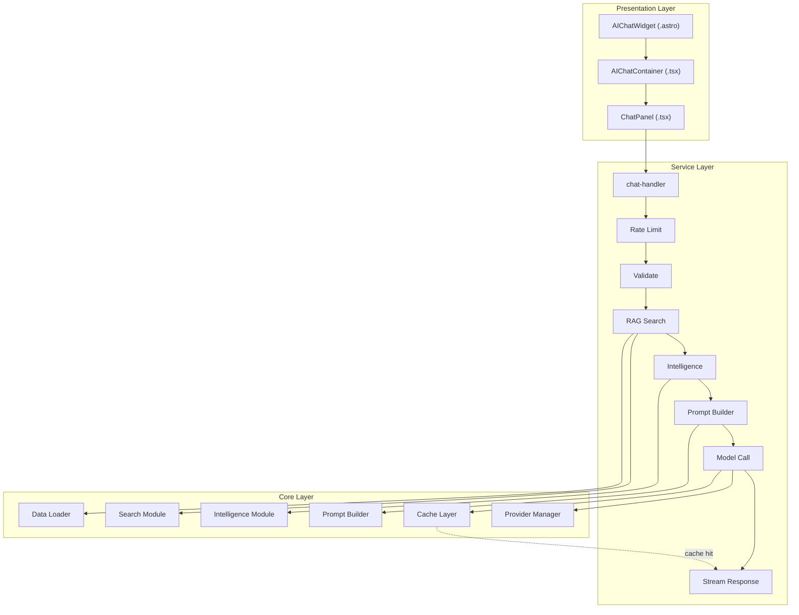
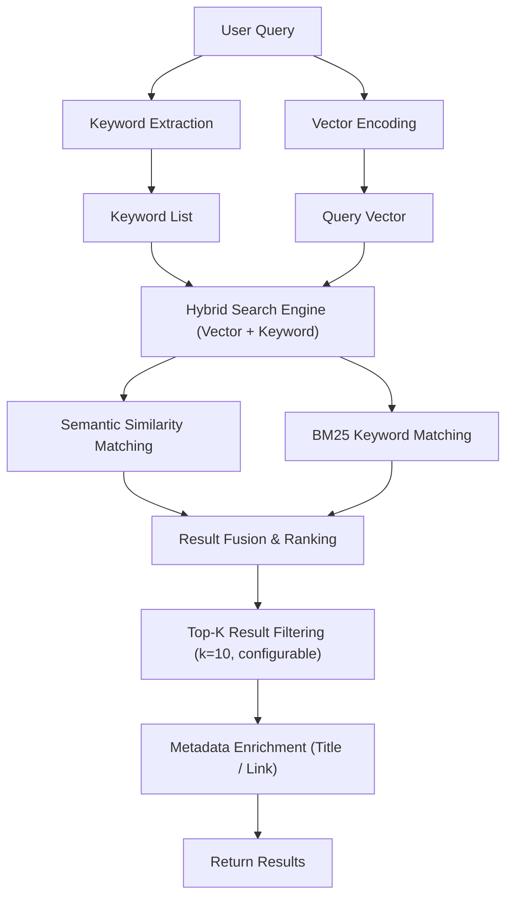
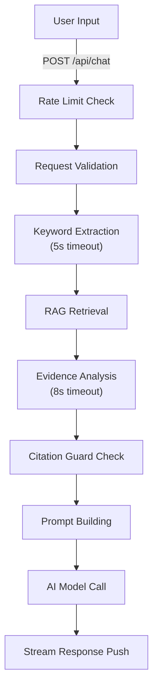
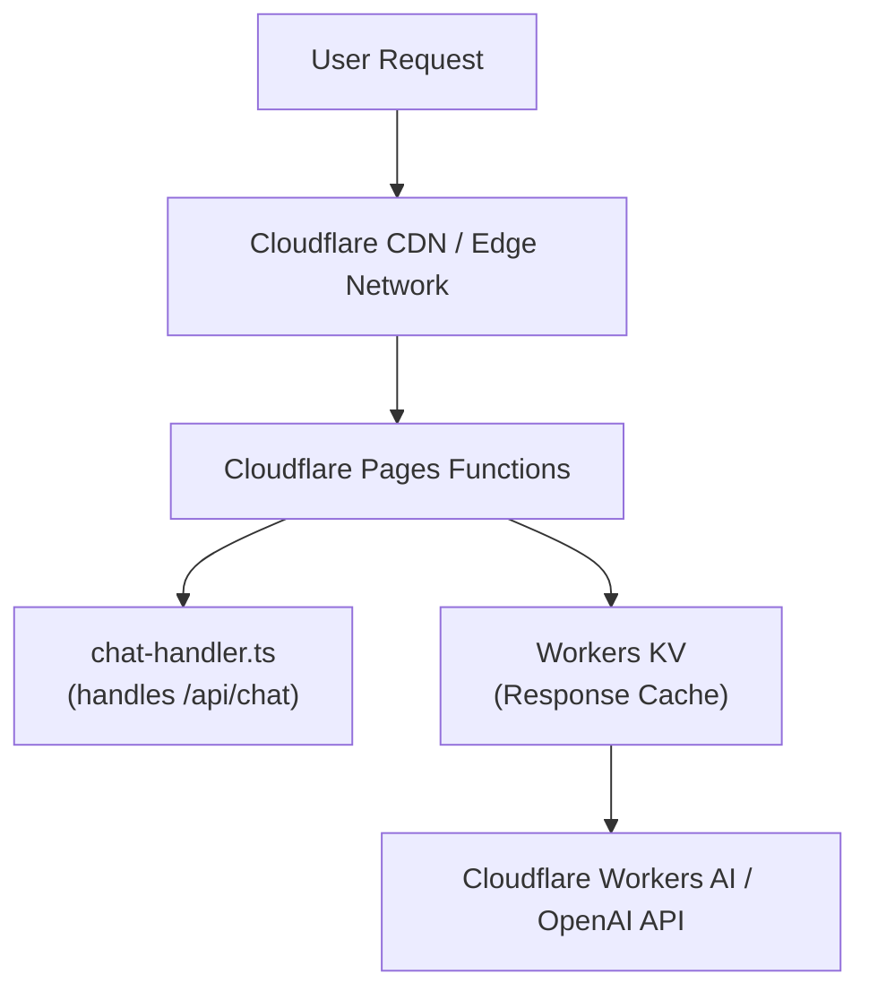
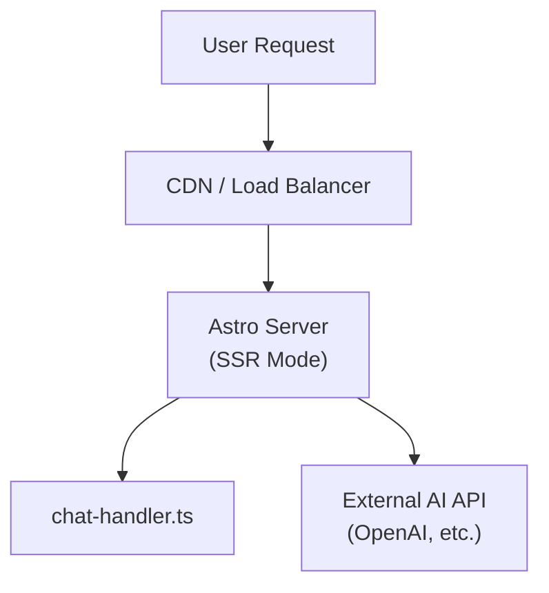

@astro-minimax/ai is the intelligent enhancement module for the astro-minimax blog theme, designed as a vendor-agnostic AI integration solution. The module's core objective is to provide a complete RAG (Retrieval-Augmented Generation) pipeline for one-stop blog platforms while supporting seamless switching and failover across multiple AI service providers, ensuring high availability and consistent user experience.

## 1. Project Overview and Design Philosophy

### 1.1 Project Background and Core Positioning

From a business scenario perspective, the module serves two core user interaction modes: the first is **Global Conversation Mode**, where users can initiate general inquiries about blog content from any page; the second is **Reading Companion Mode (Read & Chat)**, where users can engage in deep conversations directly related to specific article content while reading. Both modes share a highly reusable underlying architecture but achieve differentiated intelligent services through context isolation.

From a technology selection perspective, the module adopts the current mainstream AI application architecture—**Streaming Response + Server-Sent Events (SSE) + RAG Enhancement**. This combination satisfies users' expectations for instant feedback while ensuring AI response accuracy and timeliness. The module was designed from the outset with deep integration with Cloudflare Workers, naturally supporting low-latency responses in edge computing scenarios.

### 1.2 Design Principles and Architecture Philosophy

**Vendor Agnosticism** is the primary principle of module design. By abstracting the AI Provider interface, the module can simultaneously support OpenAI-compatible APIs, Cloudflare Workers AI, and other providers, with upper-layer business logic completely unaware of underlying provider differences. This design allows developers to flexibly switch AI providers based on cost, performance, regional availability, and other factors without modifying business code. The Provider Manager component bears the main responsibility for this abstraction layer, implementing automatic health tracking, priority scheduling, and transparent failover.

**Layered Decoupling** is reflected in the module's clear layered architecture. From a data flow perspective, requests pass through rate limiting, validation, retrieval, intelligent analysis, prompt building, model invocation, and streaming response processing in sequence, with each stage being an independently replaceable module. This design ensures that optimizing one stage (such as replacing with a faster embedding model) does not affect the stability of other stages.

**Build-time vs Runtime Separation** is an important architectural feature of this module. Blog metadata (article summaries, author information, voice profiles) is preprocessed during the build phase and serialized as JSON files for runtime loading. This design strips expensive computational tasks (such as document vectorization, summary generation) from the user request path, significantly reducing response latency.

**Graceful Degradation** permeates every layer of the system. When an AI provider is unavailable, the system automatically switches to a backup provider; when all providers fail, the Mock response mechanism ensures users always receive meaningful responses; when RAG retrieval times out or returns no results, the system degrades to local keyword-based search rather than directly returning failure.

### 1.3 Core Capability Matrix

| Capability Category | Specific Function | Technical Implementation | Performance Metrics |
|---------------------|-------------------|-------------------------|---------------------|
| Conversational Interaction | Streaming Text Generation | SSE + streamText | First Token latency < 500ms |
| Context Awareness | Article-level RAG Retrieval | In-memory vector search + hybrid retrieval | Retrieval latency < 200ms |
| Intelligent Analysis | Keyword Extraction | Dedicated model call | 5s timeout, auto-fallback |
| Source Tracing | Evidence Analysis & Citation | Secondary LLM call | 8s timeout, skippable |
| Multi-Provider | Automatic Failover | Provider Manager | Priority 100→90→0 |
| Degradation Strategy | Mock Fallback Response | Local string templates | Zero-latency return |
| Privacy Protection | Sensitive Information Filtering | Citation Guard | Real-time detection & blocking |
| Session Caching | Response Cache Playback | Cache layer + streaming simulation | 100% API call reduction |

### 1.4 Technology Stack and Dependencies

- **AI SDK** is the core dependency, version 6.x providing the Provider abstraction layer and streaming response processing capabilities. The module uses the `streamText` function for seamless integration with different AI providers, while the `useChat` Hook provides convenient state management for React/Preact components.

- **Runtime Environment** supports two main modes: Cloudflare Pages Functions mode and traditional Node.js mode. In Cloudflare mode, the module utilizes Workers KV for response caching; in Node.js mode, caching functionality may be limited or unavailable. The module implements runtime self-adaptation through environment detection.

- **UI Framework** uses Preact instead of React, driven by bundle size considerations. Preact's compatibility layer ensures `@ai-sdk/react` Hooks work properly in Preact environments.

## 2. Directory Structure and Organization

### 2.1 Top-level Directory Architecture

```
/packages/ai
├── src/                          # Source code directory
│   ├── components/                # UI components (Preact)
│   │   ├── ChatPanel.tsx         # Core chat interface (865 lines)
│   │   ├── AIChatContainer.tsx   # Container component
│   │   └── AIChatWidget.astro    # Astro entry point
│   ├── server/                   # Server-side processing logic
│   │   ├── chat-handler.ts       # Main request handler
│   │   ├── stream-helpers.ts     # Streaming response helpers
│   │   ├── errors.ts             # Error response factory
│   │   └── types.ts              # Type definitions
│   ├── provider-manager/         # AI provider management
│   │   ├── manager.ts            # Provider Manager core
│   │   ├── openai.ts             # OpenAI adapter
│   │   ├── workers.ts            # Workers AI adapter
│   │   └── mock.ts               # Mock provider implementation
│   ├── search/                   # RAG retrieval module
│   │   ├── search-api.ts         # Search API entry
│   │   ├── search-index.ts       # Index building
│   │   ├── search-utils.ts       # Scoring utilities
│   │   ├── vector-reranker.ts    # Vector reranking
│   │   └── session-cache.ts      # Session caching
│   ├── intelligence/             # Intelligent analysis module
│   │   ├── keyword-extract.ts    # Keyword extraction
│   │   ├── evidence-analysis.ts  # Evidence analysis
│   │   ├── citation-guard.ts     # Citation guard
│   │   ├── intent-detect.ts      # Intent detection
│   │   └── citation-appender.ts  # Citation appender
│   ├── prompt/                   # Prompt engineering
│   │   ├── prompt-builder.ts     # Three-layer prompt builder
│   │   ├── static-layer.ts       # Static layer
│   │   ├── semi-static-layer.ts  # Semi-static layer
│   │   └── dynamic-layer.ts      # Dynamic layer
│   ├── extensions/               # Extensions system (NEW)
│   │   ├── types.ts              # Extension interface definitions
│   │   ├── registry.ts           # Extension registry
│   │   ├── loader.ts             # Extension loader
│   │   └── injector.ts           # Extension injector
│   ├── structured-output/        # Structured output (NEW)
│   │   ├── types.ts              # Structured output interfaces
│   │   ├── generator.ts          # generateStructured<T>()
│   │   └── schemas/              # Zod schema definitions
│   │       └── evidence.ts       # EvidenceAnalysis schema
│   ├── cache/                    # Cache module
│   │   ├── response-cache.ts     # Response cache
│   │   ├── global-cache.ts       # Global cache
│   │   ├── memory-adapter.ts     # Memory adapter
│   │   └── kv-adapter.ts         # KV adapter
│   ├── data/                     # Data loading
│   │   └── metadata-loader.ts    # Metadata loader
│   └── utils/                    # Utility functions
│       └── i18n.ts               # Internationalization
├── package.json                  # Package configuration
├── tsconfig.json                 # TypeScript configuration
└── README.md                     # English documentation
```

### 2.2 Core Directory Function Analysis

**src/components/** directory adopts atomic design philosophy for organizing UI components. At the lowest level is `ChatPanel.tsx`, the visual core of the entire chat functionality, built on `@ai-sdk/react`'s `useChat` Hook. `AIChatContainer.tsx` acts as the state container, managing chat bubble open/close state and exposing the `window.__aiChatToggle` interface for external invocation.

**src/server/** directory contains all request processing logic. `chat-handler.ts` is the hub of the entire server-side processing pipeline, orchestrating all stages.

**src/provider-manager/** is the core directory for implementing vendor agnosticism. It exports a Provider Manager instance supporting dynamic add/remove of providers, priority weights, automatic health tracking, and transparent failover.

**src/search/** implements core RAG retrieval capabilities using session-level caching to avoid repeated retrieval.

**src/intelligence/** provides intelligent enhancement capabilities beyond basic retrieval including keyword extraction, evidence analysis, and privacy protection.

**src/prompt/** implements the three-layer prompt construction system enabling most prompt content to be cached and reused.

## 3. System Architecture Design

### 3.1 Overall Architecture Layers



## 4. Core Module Details

### 4.1 Provider Manager Module

#### Priority and Failover

| Provider | Weight | Description |
|----------|--------|-------------|
| Workers AI | 100 | Highest priority, free on Cloudflare deployment |
| OpenAI Compatible | 90 | Fallback, supports any OpenAI-compatible API |
| Mock | 0 | Final fallback, guarantees users always receive a response |

#### Health Tracking Mechanism

**Key configurations:**
- `unhealthyThreshold: 3` — Mark as unhealthy after 3 consecutive failures
- `healthRecoveryTTL: 60000` — Auto-retry after 60 seconds

### 4.2 Search Retrieval Module

#### Retrieval Architecture



#### TF-IDF Scoring Field Weights

```typescript
const FIELD_WEIGHTS = {
  title: 8,      // Title matches are most important
  keyPoints: 5,
  categories: 4,
  tags: 3,
  excerpt: 3,
  content: 1,
} as const;
```

#### Deep Content Retrieval

When the top result score significantly exceeds the second, deep content extraction is automatically enabled (threshold: 8, max length: 1500 chars).

#### Session-Level Caching

TTL: 10 minutes, with intelligent follow-up detection for cache reuse.

### 4.3 Intelligence Module

#### Intent Classification

Classifies user queries into 7 intent categories: `setup`, `config`, `content`, `feature`, `deployment`, `troubleshooting`, `general`.

#### Citation Guard

Automatically refuses 6 categories of sensitive personal information queries: address, income, family, phone, ID, age.

### 4.4 Prompt Builder Module

Three-layer architecture:
- **Static Layer**: Identity, responsibilities, constraints, source layers (L1-L5)
- **Semi-Static Layer**: Blog overview, latest articles
- **Dynamic Layer**: Related articles, evidence analysis, user instruction

### 4.5 Stream Processing Module

Supports streaming response processing with cache playback simulating real streaming output.

## 5. Usage Scenario Details

### 5.1 Scenario 1: Global Q&A Flow



### 5.2 Scenario 2: Read & Chat Feature

Article context injection for reading companion mode with article-specific prompts.

## 6. Component Design Details

### 6.1 AIChatWidget Component

Astro entry point with `client:only="preact"` for optimal loading performance.

### 6.2 ChatPanel Component

Core chat UI built on `useChat` Hook with typewriter effect using `requestAnimationFrame`.

## 7. Interface Contracts and Data Types

### 7.1 Chat API Request Format

**Endpoint:** `POST /api/chat`

Supports `global` and `article` scope contexts.

### 7.2 Error Code Definitions

| Error Code | HTTP Status | Description | Retryable |
|------------|-------------|-------------|-----------|
| `METHOD_NOT_ALLOWED` | 405 | Invalid HTTP method | No |
| `INVALID_REQUEST` | 400 | Request format error | No |
| `INPUT_TOO_LONG` | 400 | Input exceeds 500 characters | No |
| `RATE_LIMITED` | 429 | Rate limit triggered | Yes |
| `TIMEOUT` | 504 | Request timeout | Yes |
| `PROVIDER_UNAVAILABLE` | 503 | All providers unavailable | Yes |
| `INTERNAL_ERROR` | 500 | Internal error | Yes |

## 8. Configuration and Environment Variables

### 8.1 Provider Configuration

| Variable | Required | Description |
|----------|----------|-------------|
| `AI_BASE_URL` | For OpenAI | API endpoint URL |
| `AI_API_KEY` | For OpenAI | API key |
| `AI_MODEL` | No | Primary model (default: `gpt-4o-mini`) |
| `AI_BINDING_NAME` | For Workers | AI binding name (default: `minimaxAI`) |
| `AI_WORKERS_MODEL` | No | Workers model (default: `@cf/zai-org/glm-4.7-flash`) |

### 8.2 Response Cache Configuration

| Variable | Default | Description |
|----------|---------|-------------|
| `AI_RESPONSE_CACHE_ENABLED` | `false` | Enable caching |
| `AI_RESPONSE_CACHE_TTL` | `3600` | Cache TTL (seconds) |
| `AI_RESPONSE_CACHE_PLAYBACK_DELAY` | `20` | Playback delay (ms) |

### 8.3 Rate Limit Configuration

Three-tier limits: Burst (10s/3), Sustained (60s/20), Daily (24h/100).

## 9. Deployment and Operations

### 9.1 Deployment Architecture

**Cloudflare Pages Mode (Recommended):**



This architecture benefits from low latency through edge computing, with AI requests originating from the edge node closest to the user.

**Traditional Node.js Mode:**



### 9.2 Performance Benchmarks

| Stage | Avg Latency | P99 Latency |
|-------|-------------|-------------|
| Rate limit check | < 1ms | < 5ms |
| RAG retrieval | 50-150ms | 300ms |
| Keyword extraction | 200-800ms | 5000ms |
| Evidence analysis | 300-1000ms | 8000ms |
| AI streaming response | 500-3000ms | 30000ms |
| End-to-end | 600-4000ms | 35000ms |

### 9.3 Troubleshooting Guide

Detailed troubleshooting steps for common issues: no response, poor quality, slow response, intermittent Mock responses.

## 10. Timeout Budget Management

Total: 45 seconds allocated: Keyword extraction (5s), Evidence analysis (8s), LLM streaming (30s), Overhead (2s).

## 11. Rate Limiting

Three-tier IP-level rate limiting with configurable thresholds.

## 12. Summary

The @astro-minimax/ai module achieves high-availability, high-quality AI chat experience through:

1. **Vendor Agnostic** — Multi-provider support with automatic failover
2. **Intelligence Enhancement** — Keyword extraction, intent classification, evidence analysis
3. **Hallucination Prevention** — Citation guard, privacy protection, source layering
4. **Performance Optimization** — Three-layer prompts, session caching, response caching
5. **User Experience** — Streaming responses, typewriter effect, read & chat
6. **Robustness & Fault Tolerance** — Automatic failover, timeout budget management
7. **Modularity & Extensibility** — Clear layered architecture and module boundaries

For complete API documentation and more examples, see the [API Reference](/en/posts/ai-api-reference).