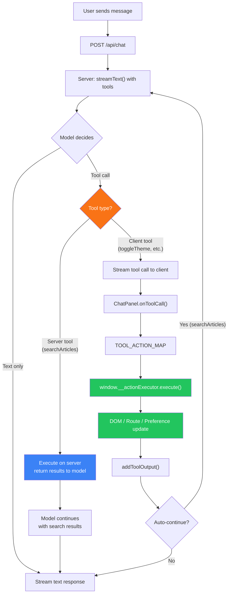

astro-minimax's AI chat is more than text conversation. When you say "switch to dark mode" or "open the architecture article", the model doesn't just give you instructions. It performs the action directly. The core of this capability is Tool Calling combined with a client-side Action system.

## What is Tool Calling

Tool Calling lets AI models invoke predefined tool functions during a conversation instead of just generating text. In astro-minimax, this means the AI can interact with the page: toggle themes, navigate articles, highlight text, and adjust preferences.

Traditional chatbots can only "talk". A chat assistant with Tool Calling can "act". Users don't need to manually find settings panels or search boxes. Just use natural language.

## 7 Built-in Tools

`@astro-minimax/ai` registers 7 tools via `packages/ai/src/tools/action-tools.ts`, split into two categories:

### Client-side Tools (6)

These tools declare their schemas on the server. The model generates call instructions, but actual execution happens in the browser.

| Tool Name | Purpose | Key Parameters |
|-----------|---------|----------------|
| `toggleTheme` | Switch between light / dark / system theme modes | `theme`: "light" / "dark" / "system" |
| `navigateToArticle` | Navigate to an article by slug, optionally scrolling to a section | `slug`, `sectionId`(optional), `lang`(optional) |
| `scrollToSection` | Scroll to a specific section on the current page and highlight it | `sectionId`, `highlight`(default: true), `behavior` |
| `toggleImmersiveMode` | Toggle immersive mode on/off, with font size and family options | `enabled`, `fontSize`, `fontFamily` |
| `highlightText` | Highlight page elements by text content or CSS selector | `text` / `selector`, `style`, `duration`(default: 3000ms) |
| `setPreference` | Write a preference value aligned with the site preferences system | `key`, `value` |

### Server-side Tool (1)

| Tool Name | Purpose | Key Parameters |
|-----------|---------|----------------|
| `searchArticles` | Search articles and projects by keyword. Runs server-side with its own `execute` implementation | `query`, `limit`(default: 5), `includeProjects`(default: true) |

`searchArticles` reuses the same `searchArticles()` / `searchProjects()` logic as the main RAG retrieval pipeline. It returns structured results (titles, URLs, excerpts) directly to the model, enabling "search then answer" workflows.

## Client-side Action System

Tool Calling happens on the server, but actual page interactions happen in the browser. The bridge between these two worlds is the Action system in `@astro-minimax/core`.

Three core modules work together:

### ActionExecutor

Defined in `packages/core/src/actions/executor.ts`. Maps 6 action types to real DOM/routing/preference operations:

- `scroll-to-section`: Finds the target element by ID or heading match, smooth-scrolls with offset, applies highlight CSS class with auto-removal
- `highlight-text`: Uses TreeWalker to find text nodes, wraps matches in highlighted spans with configurable style (accent/warning/info/success)
- `toggle-theme`: Updates `<html>` classes, calls `updatePreferences()`, triggers theme transition animation
- `toggle-immersive-mode`: Toggles `immersive-mode` class on `<html>`, applies font size and family settings
- `set-preference`: Parses dot-notation keys (e.g., `reading.fontSize`) and calls `updatePreferences()`
- `navigate`: Constructs target URL, queues follow-up actions via ActionQueue, uses View Transitions API if available

Registered globally as `window.__actionExecutor` for access from ChatPanel.

### ActionQueue

Defined in `packages/core/src/actions/queue.ts`. Stores action sequences in `sessionStorage` with TTL-based expiration (default 60 seconds):

1. `enqueue(actions)`: Generates unique token, stores actions with expiry timestamp
2. `dequeue(token)`: Retrieves and removes actions if not expired, returns `null` otherwise
3. `cleanup()`: Removes all expired entries

This is what makes cross-page action chaining work. When AI navigates to a new article and needs to scroll to a section there, the scroll action is queued with a token, the token is appended to the URL as `?ai_actions=<token>`, and the new page picks it up after loading.

### URLHandler

Defined in `packages/core/src/actions/url-handler.ts`. Parses three types of URL parameters into actions:

- `?theme=light|dark|system` maps to a theme toggle action
- `?section=<id>` maps to a scroll-to-section action
- `?ai_actions=<token>` dequeues stored actions from ActionQueue

On page load, `URLHandler.executeOnLoad()` reads parameters, executes all resolved actions, then cleans the URL via `history.replaceState`. This also hooks into `astro:page-load` for View Transitions support.

## Architecture: Request to Action

The complete flow from user message to page interaction:



Key points about this flow:

1. Server and client tools diverge at the "Tool type?" decision point
2. Server tools execute and return results inline, the model can incorporate them in its answer
3. Client tools stream the call instruction to the browser, where ActionExecutor runs it
4. Results flow back to the model via `addToolOutput()`
5. Only `searchArticles` triggers auto-continue

## Auto-continue Mechanism

Not all tool calls require the model to keep talking. The system uses `shouldAutoContinueAfterToolCalls()` (defined in `packages/ai/src/components/tool-auto-continue.ts`) to decide:

```typescript
const AUTO_CONTINUE_TOOL_NAMES = new Set(["searchArticles"]);
```

When `searchArticles` completes, `ChatPanel` uses `sendAutomaticallyWhen` to automatically send the next message to the model. This lets the model incorporate search results into its response without waiting for the user to say "go ahead".

Client-side tools (theme toggle, navigation, etc.) do not trigger auto-continue. Their execution results are already visible on the page, so there is no need for the model to generate additional text.

## Tool Registry API

`@astro-minimax/ai` provides `registerTool()` / `unregisterTool()` for registering custom tools:

```typescript
import { registerTool, unregisterTool } from "@astro-minimax/ai/tools";
import { tool } from "ai";
import { z } from "zod";

// Register a custom tool
registerTool("myCustomAction", tool({
  description: "Do something custom",
  inputSchema: z.object({
    param: z.string().describe("Some parameter"),
  }),
}));

// Unregister
unregisterTool("myCustomAction");
```

After registration, `getAllTools()` merges built-in and custom tools. `getClientSideTools()` identifies custom tools without an `execute` implementation as client-side tools. `getServerSideTools()` identifies tools with `execute` as server-side tools.

Custom client-side tools need a corresponding entry in `ChatPanel.tsx`'s `TOOL_ACTION_MAP` to execute correctly in the browser.

## Conversation Examples

A few real-world scenarios showing how tools get triggered:

**Scenario 1: Theme Toggle**

> User: It's too bright, switch to dark mode
>
> AI: (calls `toggleTheme`, page switches to dark theme) Switched to dark mode for you.

**Scenario 2: Navigate and Scroll**

> User: Show me the retrieval layer section in the architecture article
>
> AI: (calls `navigateToArticle` with slug "ai-module-architecture" and sectionId for the retrieval layer) Opening the architecture article and scrolling to the retrieval layer.

**Scenario 3: Search + Auto-continue**

> User: Are there any articles about deployment?
>
> AI: (calls `searchArticles`, auto-continues) Found a few related articles: [Deployment Guide](...), [Cloudflare Workers AI Deployment](...).

**Scenario 4: Highlight Text**

> User: Highlight the security parts in this article
>
> AI: (calls `highlightText` with text "security") Highlighted the security-related content in the article.

## Related Documentation

- [AI Chat Configuration Guide](/en/posts/ai-guide): Full AI setup walkthrough, including Provider configuration and Mock mode
- [@astro-minimax/ai Module Architecture](/en/posts/ai-module-architecture): Deep dive into the AI module internals, including the RAG pipeline and caching
- [Feature Overview](/en/posts/feature-overview): Complete list of AI features
