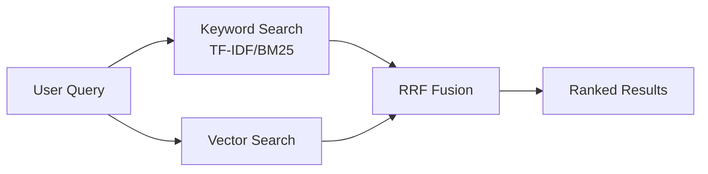

astro-minimax ships with two search providers covering different use cases. [Pagefind](https://pagefind.app/) is the default static search engine that works out of the box with zero configuration. [Algolia DocSearch](https://docsearch.algolia.com/) provides cloud-based search for sites that need millisecond responses and search analytics.

This guide covers the features of each provider, how to configure them, and how they relate to the AI search system.

## Provider Comparison

| Feature | Pagefind | Algolia DocSearch |
|---------|----------|-------------------|
| Search type | Static full-text | Cloud-based |
| Index generation | Automatic at build time | Maintained by Algolia |
| External service | None required | Algolia account required |
| Chinese segmentation | Yes | Yes |
| Response speed | Milliseconds (local) | Milliseconds (cloud) |
| Search analytics | No | Yes |
| Setup difficulty | Zero config | Apply + configure |
| Index storage | `dist/pagefind/` | Algolia servers |

## Pagefind (Default)

Pagefind is the default search engine in astro-minimax. It's a fully static search solution that generates index files for all blog posts at build time. Searches run entirely in the browser with no backend required.

### Key Features

- **Zero configuration**: No search config needed in `config.ts`. It just works.
- **Build-time indexing**: Search indexes are generated automatically every time you run `pnpm run build`
- **Chinese word segmentation**: Native support for Chinese tokenization
- **Result highlighting**: Matching keywords are highlighted in search results
- **Advanced filtering**: Filter results by category, language, and tags
- **No external dependencies**: Index files are stored in `dist/pagefind/` and deployed alongside your site

### Usage

Make sure `features.search` is not disabled in `config.ts`:

```js file=src/config.ts
features: {
  search: true,  // Enabled by default, can be omitted
},
```

After building, the search button in the Header automatically loads the Pagefind search interface.

## Algolia DocSearch

If your site needs more advanced search capabilities like analytics, suggestions, and autocomplete, switch to Algolia DocSearch.

### Prerequisites

You need Algolia credentials before configuring DocSearch:

1. Open-source documentation sites can [apply for free DocSearch](https://docsearch.algolia.com/apply/)
2. Other sites can self-host an Algolia index

### Configuration

Add a `search` section to the `SITE` object in `src/config.ts`:

```typescript file=src/config.ts
export const SITE = {
  // ...other config

  search: {
    provider: 'docsearch',
    docsearch: {
      appId: 'YOUR_APP_ID',
      apiKey: 'YOUR_SEARCH_API_KEY',
      indexName: 'YOUR_INDEX_NAME',
      placeholder: 'Search docs...',
    },
  },
};
```

### DocSearch Features

- **Keyboard shortcut**: Press `Ctrl+K` (or `Cmd+K` on macOS) to open search instantly
- **Search suggestions**: Real-time matching results as you type
- **Autocomplete**: Suggestions based on search history and popular content
- **Search analytics**: View search statistics in the Algolia Dashboard

Once configured, the Pagefind search button in the Header is replaced by the DocSearch component. The component lives at `packages/core/src/components/search/DocSearch.astro` and automatically loads Algolia's CSS and JS resources. It adapts its color scheme to match your site's light/dark theme.

## Switching Providers

Switching providers is a single config change in `config.ts`:

```typescript file=src/config.ts
// Use Pagefind (default, can omit the entire search config)
search: {
  provider: 'pagefind',
}

// Or use DocSearch
search: {
  provider: 'docsearch',
  docsearch: {
    appId: 'YOUR_APP_ID',
    apiKey: 'YOUR_SEARCH_API_KEY',
    indexName: 'YOUR_INDEX_NAME',
    placeholder: 'Search docs...',
  },
}
```

If you don't configure the `search` field at all, Pagefind is used by default.

## Search Config Reference

| Option | Description |
|--------|-------------|
| `search.provider` | Search provider: `'pagefind'` (default) or `'docsearch'` |
| `search.docsearch.appId` | Algolia Application ID |
| `search.docsearch.apiKey` | Algolia Search-Only API Key |
| `search.docsearch.indexName` | Algolia index name |
| `search.docsearch.placeholder` | Search box placeholder text |

See `SearchConfig` and `DocSearchConfig` interfaces in `packages/core/src/types.ts` for the full type definitions.

## AI Search System (Advanced)

Beyond the user-facing UI search (Pagefind / DocSearch), astro-minimax's AI chat feature includes a separate search system for RAG (Retrieval-Augmented Generation). This system lives in `packages/ai/src/search/` and operates independently from the UI search.

### Hybrid Search Architecture

The AI search uses a hybrid retrieval strategy combining two approaches:

- **TF-IDF / BM25 keyword retrieval**: Text matching based on term frequency statistics, ideal for exact keyword queries
- **Vector reranking**: Semantic vectors re-rank initial results for better relevance

The two result sets are merged using Reciprocal Rank Fusion (RRF):



### Session Cache

Search results are cached in memory with a 10-minute TTL (600 seconds). Consecutive messages within the same chat session can reuse previous search context, avoiding redundant retrieval and speeding up responses.

The cache is keyed by the `x-session-id` request header, with a maximum of 400 entries per cache instance.

### UI Search vs. AI Search

| Aspect | UI Search (Pagefind/DocSearch) | AI Search (RAG) |
|--------|-------------------------------|-----------------|
| Purpose | User-initiated article search | Knowledge retrieval for AI chat |
| Trigger | Click search bar / shortcut | Send a chat message |
| Index location | Static files / Algolia cloud | Runtime memory |
| Retrieval granularity | Article level | Chunk level (paragraphs) |
| Configuration | `SITE.search` | Auto-loaded, no config needed |

## FAQ

### Pagefind returns no results?

Make sure you've run `pnpm run build`. Pagefind generates its index at build time, so search may be incomplete in dev mode.

### DocSearch styles don't match my theme?

The DocSearch component is already adapted to astro-minimax's light and dark themes. If styles look off, check whether custom CSS is overriding DocSearch CSS variables.

### Can I use both providers at the same time?

No. `search.provider` accepts either `'pagefind'` or `'docsearch'`, not both.

### Can AI search replace UI search?

They serve different purposes. UI search is for quickly finding specific articles. AI search is for conversational Q&A. Keep UI search enabled and pair it with AI chat for the best experience.

## Next Steps

- Explore all features: [Feature Overview](/en/posts/feature-overview/)
- Full configuration reference: [How to Configure astro-minimax Theme](/en/posts/how-to-configure-astro-minimax-theme/)
