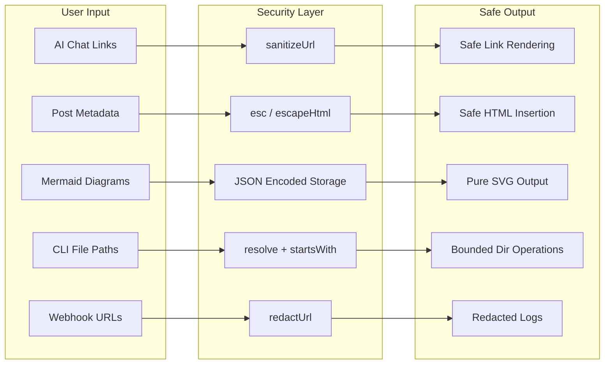

astro-minimax has been continuously hardening its security since v0.9.2. There is no single security module. Instead, a series of defensive measures are spread across packages, covering front-end rendering, AI chat, CLI tools, and the notification system.

This article organizes these measures clearly: what is protected where, how to configure them, and what you need to watch out for.



## URL Sanitization

Links generated by AI models are untrusted. A model might output `javascript:alert(1)` or `data:text/html,<script>...</script>` in its response. `sanitizeUrl()` filters out these dangerous protocols.

`@astro-minimax/notify` provides a unified sanitization function in `packages/notify/src/utils.ts`:

```typescript
const SAFE_URL_RE = /^https?:\/\//i;

export function sanitizeUrl(url: string): string {
  return SAFE_URL_RE.test(url) ? url : '#';
}
```

Only URLs starting with `http://` or `https://` are preserved. All other protocols, including `javascript:`, `data:`, and `vbscript:`, are replaced with `#`.

### Sanitization in AI Chat

The RichText component in `@astro-minimax/ai` (`packages/ai/src/components/RichText.tsx`) has its own version tailored for the chat scenario:

```typescript
const SAFE_URL_RE = /^(?:https?|mailto):/i;

function sanitizeUrl(url: string): string {
  if (SAFE_URL_RE.test(url) || url.startsWith('/') || url.startsWith('#')) return url;
  return '#';
}
```

The chat context additionally allows `mailto:` protocol, relative paths (starting with `/`), and in-page anchors (starting with `#`). Every link output by the AI model passes through this filter before rendering.

### Sanitization in Notification Templates

All external links in comment notifications and AI chat notifications (article URLs, site links) pass through `sanitizeUrl()`. In notification templates, URL sanitization and HTML escaping work together:

```typescript
// Referenced article links in ai-chat.ts
lines.push(`  · <a href="${sanitizeUrl(article.url)}">${escapeHtml(article.title)}</a>`);
```

URLs are sanitized, display text is escaped. Double protection.

## Mermaid Security Configuration

Mermaid diagrams are rendered in `packages/core/src/components/viz/Mermaid.astro`. The current configuration uses `securityLevel: "loose"`:

```typescript
mermaid.initialize({
  startOnLoad: false,
  securityLevel: "loose",
  theme: "base",
  themeVariables: getMermaidConfig(isDark),
});
```

The choice of `loose` over `strict` is deliberate. The blog needs interactive diagrams with click events and external link navigation. Mermaid's `strict` mode disables these capabilities. Security is handled at other layers instead:

- Diagram code is stored in `<script type="application/json">` tags via JSON encoding, so browsers never execute it as a script
- Rendering uses the `mermaid.render()` API, which outputs pure SVG
- Lazy loading via IntersectionObserver means off-screen diagrams are not rendered

If you accept user-submitted Mermaid code (e.g., diagrams in comments), you need additional review. astro-minimax's comment system uses a third-party service (Waline), which is not affected by this.

## XSS Prevention

### HTML Escaping in PostsContainer

`packages/core/src/components/ui/PostsContainer.astro` renders article lists on the client side. Post metadata (titles, descriptions, categories, tags) is user-controllable content. If someone writes `<script>alert(1)</script>` in a post's frontmatter title field, it would trigger XSS without escaping.

The `esc()` function handles this:

```typescript
const esc = (s) => String(s)
  .replace(/&/g, '&amp;')
  .replace(/</g, '&lt;')
  .replace(/>/g, '&gt;')
  .replace(/"/g, '&quot;');
```

Titles, descriptions, category names, and tags are all wrapped with `esc()` when generating card HTML, preventing HTML or script injection through article metadata.

### ID Sanitization in ActionExecutor

`packages/core/src/actions/executor.ts` sanitizes section IDs when handling `scrollToSection`:

```typescript
const sanitizedId = CSS.escape
  ? CSS.escape(sectionId)
  : sectionId.replace(/[^\w\u4e00-\u9fff-]/g, "");
```

Using `CSS.escape` (with a fallback regex) ensures that injected section IDs cannot be used for CSS selector injection. Element lookup uses `getElementById` and `data-section-id` attribute matching rather than concatenating selector strings.

### URL Parameter Validation in URLHandler

`packages/core/src/actions/url-handler.ts` validates URL parameters against allowlists:

```typescript
// theme only accepts three valid values
if (theme && ['light', 'dark', 'system'].includes(theme)) { ... }

// section only allows safe characters
if (section && /^[\w\u4e00-\u9fff-]+$/.test(section)) { ... }
```

The theme parameter must be one of the specified values. The section parameter only allows alphanumeric characters, underscores, Chinese characters, and hyphens. This prevents injection via URL parameters.

## CLI Path Traversal Protection

The `extensions validate` command in `@astro-minimax/cli` processes user-specified file paths and needs to ensure those paths don't escape the project directory. A malicious user could try `../../etc/passwd` to read system files.

The protection is in `packages/cli/src/commands/ai/extensions.ts`:

```typescript
const resolved = resolve(extensionsDir, specificFile);
if (!resolved.startsWith(resolve(extensionsDir))) {
  console.log("\n" + EMOJI.error + " Invalid file path: must be within extensions directory\n");
  process.exit(1);
}
```

`resolve()` eliminates `..` segments and symlinks, returning an absolute path. The code then checks whether the normalized path starts with the extensions directory. If it doesn't, the request is rejected immediately.

Other CLI file operations also use `resolve()` for path normalization. All read and write operations are based on the normalized absolute paths. The CLI also checks whether the current directory is a valid blog directory and skips internal directories starting with `_`.

## Webhook Log Redaction

Webhook notification URLs can contain sensitive query parameters like `?key=your-api-key-here`. If these parameters are written to logs in full, they could leak credentials.

The Webhook provider in `@astro-minimax/notify` (`packages/notify/src/providers/webhook.ts`) redacts URLs in all log output:

```typescript
function redactUrl(rawUrl: string): string {
  try {
    const u = new URL(rawUrl);
    return `${u.origin}${u.pathname}`;
  } catch {
    return "<invalid-url>";
  }
}
```

`redactUrl()` keeps only the origin and pathname, stripping all query parameters. Whether the request succeeds or fails, the logged URL is always redacted:

```typescript
// Success
logger?.info("Webhook notification sent", {
  url: redactUrl(url),
  duration,
});

// Failure
logger?.error("Webhook send failed", error, {
  url: redactUrl(url),
  status: response.status,
});
```

## CORS Configuration

The AI chat API defaults to allowing all origins (`Access-Control-Allow-Origin: *`), which is fine for local development. In production, though, this lets any website call your API.

v0.9.2 introduced configurable CORS support. Defined in `packages/ai/src/server/errors.ts`:

```typescript
let _allowedOrigin = '*';

export function setCorsOrigin(origin: string): void {
  _allowedOrigin = origin;
}
```

`chat-handler.ts` reads the environment variable during initialization:

```typescript
if (env.CORS_ORIGIN) setCorsOrigin(env.CORS_ORIGIN as string);
```

CORS headers are applied to all API responses and preflight requests:

```typescript
function corsHeaders(): HeadersInit {
  return {
    'Content-Type': 'application/json',
    'Access-Control-Allow-Origin': _allowedOrigin,
  };
}

export function corsPreflightResponse(): Response {
  return new Response(null, {
    headers: {
      'Access-Control-Allow-Origin': _allowedOrigin,
      'Access-Control-Allow-Methods': 'POST, OPTIONS',
      'Access-Control-Allow-Headers': 'Content-Type, x-session-id',
    },
  });
}
```

For production, set the environment variable to your blog domain:

```bash
# Cloudflare Pages environment variable
CORS_ORIGIN=https://your-blog.com
```

For detailed CORS configuration steps, see the [Cloudflare Environment Variables Guide](/en/posts/cloudflare-env-vars).

## Shared Security Utilities

`packages/notify/src/utils.ts` exports two security functions reused across packages:

### escapeHtml

```typescript
export function escapeHtml(text: unknown): string {
  if (text === null || text === undefined) return '';
  const str = typeof text === 'string' ? text : String(text);
  return str
    .replace(/&/g, '&amp;')
    .replace(/</g, '&lt;')
    .replace(/>/g, '&gt;')
    .replace(/"/g, '&quot;')
    .replace(/'/g, '&#039;');
}
```

Escapes 5 HTML special characters: `&`, `<`, `>`, `"`, `'`. In comment notification templates (`comment.ts`) and AI chat notification templates (`ai-chat.ts`), all dynamic content (commenter names, comment text, article titles, referenced article titles) passes through `escapeHtml()`.

### sanitizeUrl

Covered in detail above. `sanitizeUrl()` and `escapeHtml()` work together in notification templates, providing layered protection.

## Security Best Practices

Here are the recommended security measures when deploying astro-minimax:

### 1. Set CORS_ORIGIN

Always set the `CORS_ORIGIN` environment variable in production to your blog domain. Do not use the default `*` in production. For configuration steps, see the [Cloudflare Environment Variables Guide](/en/posts/cloudflare-env-vars).

### 2. Use HTTPS

Ensure your blog is served over HTTPS. This protects user data in transit and makes the `https://` whitelist in `sanitizeUrl()` meaningful. If the blog itself is HTTP, the sanitization function would replace all internal links with `#`.

### 3. Protect API Keys

The following environment variables should never be exposed to the front-end or committed to Git:

- `AI_API_KEY`
- `NOTIFY_TELEGRAM_BOT_TOKEN`
- `NOTIFY_RESEND_API_KEY`
- `NOTIFY_WEBHOOK_URL`

Use a `.env` file (added to `.gitignore`) or your deployment platform's secrets management. For specific configuration, see the [Deployment Guide](/en/posts/deployment-guide) and [Notification System Guide](/en/posts/notification-guide).

### 4. Keep Dependencies Updated

```bash
pnpm update
```

astro-minimax depends on actively maintained packages like the AI SDK, Astro, and Tailwind. Security patches flow through dependency updates.

### 5. Verify Webhook URLs

If using Webhook notifications, make sure `NOTIFY_WEBHOOK_URL` points to an endpoint you control. The Webhook provider logs requests but strips query parameters via `redactUrl()`.

## Related Documentation

- [AI Chat Configuration Guide](/en/posts/ai-guide): AI system setup, including CORS configuration
- [Notification System Guide](/en/posts/notification-guide): Notification setup, including Webhook security
- [Deployment Guide](/en/posts/deployment-guide): Deployment process, including environment variable setup
- [Cloudflare Environment Variables Guide](/en/posts/cloudflare-env-vars): Detailed environment variable configuration
