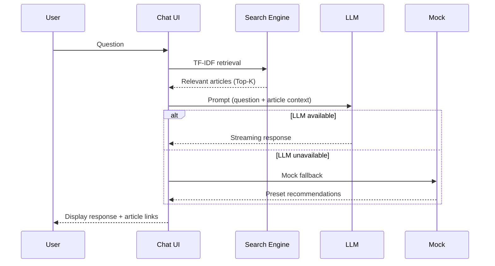

astro-minimax is not just another blog theme. It's a systematic answer to "how to build a modern tech blog." This article documents the thinking behind every key decision.

## Why This Project Exists

### The Problem

The 2024-2025 blog ecosystem faces several core tensions:

1. **Simple vs Feature-Rich** — Minimal themes lack features; feature-rich themes are bloated
2. **Out-of-box vs Customizable** — Templates are easy to start but hard to maintain; NPM packages are flexible but have high configuration barriers
3. **Content Creation vs Technical Maintenance** — Bloggers want to focus on writing, yet spend significant time on engineering
4. **Fragmented AI Integration** — Adding AI features to a blog requires stitching together multiple services

### The Goal

A **minimal-first, infinitely extensible** blog system:

- Content creators: 3 minutes to launch, focus on writing
- Developers: Modular architecture, precise control over every feature
- Neither has to choose between simplicity and power

## Architecture Decisions

### Why Astro

In the 2026 SSG framework landscape, Astro has several unique advantages:

| Dimension | Astro v6 | Next.js | Hugo | Hexo |
|-----------|----------|---------|------|------|
| **JS Output** | Zero JS (except interactive components) | Full React runtime | Zero JS | Minimal JS |
| **Build Speed** | Fast (Vite) | Medium | Extremely fast (Go) | Medium |
| **TypeScript** | Native support | Native support | Not supported | Plugin |
| **Component Model** | Multi-framework Islands | React only | Go templates | EJS/Pug |
| **Content Layer** | Content Layer API | Manual MDX | Built-in | Built-in |
| **Edge Runtime** | Cloudflare Workers | Vercel Edge | Pure static | Pure static |

Key selection factors:
- **Islands Architecture**: Zero JS by default, only loading scripts for interactive components (like AI chat) when needed. Most blog pages are pure static content without JavaScript
- **Content Layer API**: Astro 6's content layer allows loading content from filesystem and validating frontmatter types without extra tooling
- **Edge Runtime Support**: AI chat backend API runs directly on Cloudflare Workers, no separate server needed

### Why Monorepo + 4 Packages

Traditional blog themes are single repositories:

```
typical-theme/
└── src/          # All code mixed together
    ├── layouts/
    ├── components/
    ├── ai/       # AI code coupled with theme code
    └── styles/
```

astro-minimax is split into 4 independent packages:

```
astro-minimax/
├── packages/core/    # Required: layouts, components, routes, visualizations
├── packages/ai/      # Optional: AI chat, RAG
├── packages/notify/  # Optional: notification system
└── packages/cli/     # Recommended: command-line tools
```

**Why this split**:

1. **Install on demand** — Blogs without AI features don't need 20+ dependencies like `ai` and `workers-ai-provider`
2. **Independent updates** — Bugs in the AI package don't affect core theme stability
3. **Composable packaging** — You can install only `@astro-minimax/core`, then add AI, notifications, and CLI capabilities only when you actually need them
4. **Replaceability** — Users can replace `@astro-minimax/ai` with their own AI implementation

**Data**: Full installation of all packages is ~1000+ dependencies; core-only is ~300 dependencies.

### Why Virtual Modules

astro-minimax's core package uses Astro Integration + Vite Virtual Modules:

```typescript
// User's config.ts
export const SITE = { ... };

// Core's integration.ts
resolveId(id) {
  if (id === "virtual:astro-minimax/config") return "\0" + id;
},
load(id) {
  if (id === "\0virtual:astro-minimax/config") {
    return `export const SITE = ${JSON.stringify(userConfig.site)};`;
  }
}
```

**Why not direct imports**:
- Virtual modules let core package components and pages access user config via `import { SITE } from "virtual:astro-minimax/config"` without knowing the user project's file paths
- This is the key technology enabling "user config → core theme" decoupling

### Why Three Integration Methods

1. **CLI Creation** — `npx @astro-minimax/cli init my-blog`
   - Target audience: Those who want quick setup
   - Characteristic: Complete blog in 30 seconds

2. **GitHub Template** — Fork entire monorepo
   - Target audience: Developers who want deep customization
   - Characteristic: Full control over all code

3. **NPM Package** — `pnpm add @astro-minimax/core`
   - Target audience: Existing Astro projects wanting specific features
   - Characteristic: à la carte feature adoption

## AI Decisions

### Why Built-in AI Chat

In 2025-2026, AI is no longer novel. For tech blogs, AI chat solves a real problem:

**Readers' actual needs**:
- "Does this blog have an article about Docker deployment?"
- "What's the core point of this article?"
- "Any recommended getting-started tutorials?"

Traditional search only matches keywords; AI chat can understand intent and recommend relevant content.

### Why RAG Over Pure LLM

Issues with pure LLM calls:
- AI doesn't know your blog's content
- Prone to hallucination (fabricating non-existent article links)
- Can't recommend your specific articles

astro-minimax's RAG approach:



1. **Build time**: CLI tool generates article summaries and key points (`astro-minimax ai process`)
2. **Runtime**: User asks question → TF-IDF searches relevant articles → Concatenates as prompt context → LLM generates response
3. **Result**: AI responses are always based on your blog's actual content with article links attached

### Why TF-IDF Over Embeddings

| Comparison | TF-IDF | Embedding (OpenAI) |
|------------|--------|-------------------|
| **Cost** | Zero (pure computation) | Per-token billing |
| **Latency** | <10ms | 100-500ms |
| **Dependencies** | None | Requires API Key |
| **Effectiveness** | Keyword matching, sufficient for blogs | Semantic understanding, more precise |

For blog-scale content (10-1000 articles), TF-IDF is completely adequate. The saved latency and cost can be invested in more important areas.

### Why Source Priority Protocol

Even with RAG, AI can still:
- Confuse priority of information from different sources
- Treat writing style descriptions as factual evidence
- Fabricate answers when no evidence exists

The Source Priority Protocol (L1-L5) explicitly defines information priority:

```
L1 Blog original content > L2 Author bio > L3 Statistical data > L5 Writing style
```

This ensures AI automatically follows: "If the blog article says A, don't cite other sources saying B."

### Why Mock Fallback

Real-world problems:
- New users haven't configured API keys yet
- API services occasionally unavailable
- Free quota exhausted

If AI chat just errors or doesn't display in these situations, user experience is poor. Mock mode guarantees:
- Always has a response
- Returns preset article recommendations based on keyword matching
- Much better than a blank page

## Search Decisions

### Pagefind vs DocSearch

astro-minimax supports two search solutions:

| Comparison | Pagefind | Algolia DocSearch |
|------------|----------|-------------------|
| **Cost** | Free | Free (open source projects) |
| **Deployment** | Zero config (build-time indexing) | Requires application or self-hosting |
| **Privacy** | 100% local | Data on Algolia servers |
| **Speed** | Fast (static files) | Faster (CDN + caching) |
| **Features** | Basic full-text search | Search suggestions, autocomplete |

Default to Pagefind: zero configuration, zero cost, fully static. DocSearch as an advanced option for users wanting better search experience.

## Notification System Decisions

### Why Separate Package

Notification features seem simple, but separate packaging has reasons:

1. **Non-required dependency** — Blogs without notifications don't install it
2. **Multiple event types** — Comment notifications and AI chat notifications have different templates
3. **Reusability** — Other projects can directly use `@astro-minimax/notify`

### Why Three Channels

- **Telegram**: Best real-time performance, mobile-friendly
- **Email**: Most universal, suitable for backup and archiving
- **Webhook**: Most flexible, can connect to any system (Slack, Discord, Feishu, etc.)

## CLI Tool Decisions

### Why CLI is Needed

Without CLI, users need to:
1. Manually create Markdown files
2. Manually write frontmatter
3. Manually run AI processing scripts
4. Manually check data file status

With CLI:
```bash
astro-minimax post new "Article Title"  # One-command creation
astro-minimax ai process                # One-command processing
astro-minimax data status               # One-command check
astro-minimax ai eval                   # One-command evaluation
```

### Why Not Astro CLI Plugin

Astro's CLI extension points are limited, not supporting custom subcommands. Standalone CLI provides richer functionality without depending on Astro runtime.

## Competitive Analysis

### Comparison with Similar Projects

| Feature | astro-minimax | AstroPaper | Starlight | Nextra |
|---------|---------------|------------|-----------|--------|
| **Framework** | Astro 6 | Astro 4 | Astro | Next.js |
| **AI Chat** | Built-in (RAG + Multi-provider) | None | None | None |
| **Search** | Pagefind + DocSearch | Pagefind | Pagefind | Algolia |
| **Visualization** | Mermaid + Markmap + Rough.js + Excalidraw | None | Mermaid | None |
| **Notifications** | Telegram + Email + Webhook | None | None | None |
| **CLI Tool** | Complete (create + process + eval) | None | Yes | None |
| **Modularity** | 4 independent packages | Monolith | Single package | Single package |
| **i18n** | Chinese/English bilingual | None | Multi-language | Multi-language |
| **Comments** | Waline | None | None | None |

### Core Competitive Advantages

1. **AI-Native** — Not an afterthought plugin, but architecturally integrated from the start
2. **Extreme Modularity** — 4 separate packages, combined as needed, mutually independent
3. **Developer-Friendly** — CLI toolchain, TypeScript strict mode, complete documentation
4. **Chinese Ecosystem** — Optimized for Chinese users (Chinese word segmentation, Waline, WeChat Pay)

## Technical Data

### Performance Metrics (based on example blog)

- Lighthouse Performance: 95+
- First Contentful Paint: <1.5s
- Total Blocking Time: <50ms
- Cumulative Layout Shift: <0.01
- Homepage JS size: 0KB (pure static)
- Article page JS size: ~2KB (View Transitions only)

### Package Sizes

| Package | Install Size | Dependencies |
|---------|--------------|--------------|
| `@astro-minimax/core` | ~80KB (source, with visualization components) | 0 (peer deps) |
| `@astro-minimax/ai` | ~80KB + AI SDK | 4 |
| `@astro-minimax/notify` | ~20KB + grammy | 1 |
| `@astro-minimax/cli` | ~100KB + tsx | 2 |

## Future Direction

### Short-term (v0.8-v1.0)

- Turnstile CAPTCHA
- Conversation memory (cross-session)
- Astro 6 incremental build optimization

### Mid-term (v1.x)

- Semantic search (Embeddings)
- Multimodal support (image understanding)
- AI writing assistance
- PWA offline reading

### Long-term

- Visual editor
- Blog ecosystem marketplace (themes/plugins)

---

This article is a complete record of astro-minimax's design thinking. If you have questions or suggestions about any decision, feel free to discuss in [GitHub Issues](https://github.com/souloss/astro-minimax/issues).
