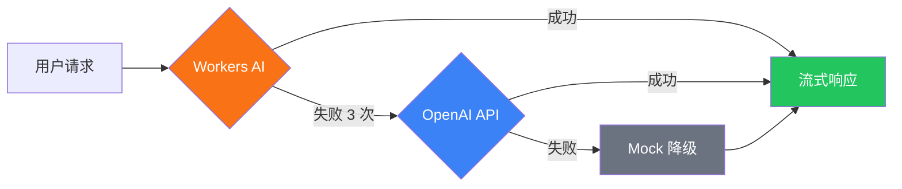

astro-minimax 内置 AI 聊天助手，支持多 Provider 自动故障转移、RAG 检索增强、流式响应和 Mock 降级。本文介绍完整的 AI 配置流程。

## 概览

AI 聊天系统由以下模块组成：

| 模块 | 说明 |
|------|------|
| `@astro-minimax/ai` | AI 核心包：RAG 管线、Provider 管理、聊天 UI |
| `@astro-minimax/cli` | CLI 工具：AI 内容处理、作者画像构建、质量评估 |
| `@astro-minimax/notify` | 通知系统：AI 对话实时通知到 Telegram/Email/Webhook |

## 快速启用

### 1. 启用 AI 功能

在 `src/config.ts` 中：

```typescript
ai: {
  enabled: true,
  mockMode: false,
  apiEndpoint: "/api/chat",
},
```

### 2. 配置 Provider

在 `.env` 中配置 AI Provider：

```bash
# OpenAI 兼容 API（支持 DeepSeek、Moonshot、Qwen 等）
AI_BASE_URL=https://api.openai.com/v1
AI_API_KEY=your-api-key
AI_MODEL=gpt-4o-mini

# 站点信息
SITE_AUTHOR=YourName
SITE_URL=https://your-blog.com
```

### 3. 构建 AI 数据

```bash
astro-minimax ai process       # 生成文章摘要和 SEO 数据
astro-minimax ai profile build  # 构建作者画像
```

### 4. 启动开发服务器

```bash
pnpm run dev
```

AI 聊天按钮会出现在页面右下角。

## Provider 配置详解

### Cloudflare Workers AI

在 Cloudflare Pages 部署时，可使用免费的 Workers AI：

```toml
# wrangler.toml
[ai]
binding = "minimaxAI"
```

Workers AI 作为最高优先级 Provider，不需要 API Key。

### OpenAI 兼容 API

支持任何 OpenAI 兼容的 API 服务：

```bash
AI_BASE_URL=https://api.openai.com/v1
AI_API_KEY=sk-xxx
AI_MODEL=gpt-4o-mini
```

也可以配置不同模型用于不同任务：

```bash
AI_KEYWORD_MODEL=gpt-4o-mini    # 关键词提取模型
AI_EVIDENCE_MODEL=gpt-4o-mini   # 证据分析模型
```

### 故障转移机制



- 连续失败 3 次标记为不健康
- 60 秒后自动尝试恢复
- 所有 Provider 失败时，Mock 保证用户始终收到回复

## AI 工具调用与 Actions

当用户用自然语言提出「切换到深色模式」「打开某篇文章」「跳到某一节」等操作时，模型除了说明步骤外，还可以通过 **工具调用（Tool Calling）** 直接驱动站点行为，减少「只说不做」的体验落差。

### 可用工具一览

当前聊天管线注册了 7 个工具（名称与代码中一致）：

| 工具名 | 作用概要 |
|--------|----------|
| `toggleTheme` | 在浅色 / 深色 / 跟随系统之间切换主题 |
| `navigateToArticle` | 按 slug（及可选语言、章节）跳转到文章页 |
| `scrollToSection` | 在当前页滚动到指定章节并可选高亮 |
| `toggleReadingMode` | 开启或关闭阅读模式，并可调字号等 |
| `highlightText` | 按文本或选择器高亮文中内容 |
| `setPreference` | 写入用户偏好（与站点偏好系统对齐的键值） |
| `searchArticles` | 按关键词检索文章与项目，返回标题、链接与摘要等 |

### 工作原理

- **客户端工具**：`toggleTheme`、`navigateToArticle`、`scrollToSection`、`toggleReadingMode`、`highlightText`、`setPreference` 在服务端声明 schema，由模型生成 tool call；**实际执行在浏览器中完成**（通过主题 `@astro-minimax/core` 的 **ActionExecutor** 将调用映射为 DOM / 路由 / 偏好更新）。
- **服务端工具**：`searchArticles` 带有 `execute` 实现，在 **RAG 请求处理过程中于服务端运行**，直接调用与主检索相同的 `searchArticles` / `searchProjects` 逻辑，把结构化结果返回给模型，便于「先搜再答」或辅助导航。

### Action 系统与跨页串联

站点行为统一由 `packages/core/src/actions/` 负责：**ActionExecutor** 执行具体动作；**URLHandler** 等模块支持通过查询参数（如 `theme`、`section`、`ai_actions` 与队列 token）在 **导航后继续执行** 一串动作，实现跨页面的 action chaining。聊天 UI 在收到客户端工具调用时，会把参数转成上述 Action 并执行。

## Mock 模式

开发时不需要真实 API：

```typescript
ai: {
  enabled: true,
  mockMode: true,  // 开发环境
},
```

Mock 模式返回预定义的文章推荐和外部资源链接，模拟真实 AI 回复。

## AI 安全特性

### 来源分层协议

AI 回答遵循 L1-L5 来源优先级：

- **L1**: 博客原始内容（最高优先级）
- **L2**: 作者简介、项目列表
- **L3**: 结构化事实数据
- **L5**: 语言风格（仅影响表达）

### 隐私保护

自动拒绝回答敏感个人信息：

- 住址、收入、家庭成员、电话、身份信息、年龄

### 意图分类

7 类意图识别，提升搜索相关性：

- setup、config、content、feature、deployment、troubleshooting、general

## 质量评估

### 配置测试集

编辑 `datas/eval/gold-set.json` 定义测试用例：

```json
{
  "cases": [
    {
      "id": "about-001",
      "category": "about",
      "question": "介绍一下你自己",
      "answerMode": "fact",
      "expectedTopics": ["博客", "AI"],
      "forbiddenClaims": [],
      "lang": "zh"
    }
  ]
}
```

### 运行评估

```bash
pnpm run ai:eval                             # 本地测试
pnpm run ai:eval -- --url=https://your.com   # 远程测试
pnpm run ai:eval -- --category=no_answer     # 评估特定类别
pnpm run ai:eval -- --verbose                # 详细输出
```

评估基于 `datas/eval/gold-set.json` 黄金测试集，自动检查：
- 非空响应
- 主题覆盖率
- 禁止声明未出现
- Markdown 链接存在性
- 回答模式匹配

评估报告保存到 `datas/eval/report.json`。

## 扩展系统

扩展系统允许你注入自定义数据到 AI 聊天流程中，增强 AI 的回答能力。

### 扩展类型

| 类型 | 说明 | 用途 |
|------|------|------|
| `searchable` | 可搜索文档 | 添加额外的知识库内容 |
| `facts` | 结构化事实 | 添加验证过的事实数据 |
| `context` | 上下文注入 | 添加自定义 prompt 章节 |
| `voice-style` | 语言风格 | 定义 AI 回答风格模式 |
| `semantic-fallback` | 语义回退 | 查询重写规则 |

### 扩展文件结构

扩展文件放置在 `datas/extensions/` 目录：

```
datas/extensions/
├── travel.json        # 旅行相关扩展
├── social.json        # 社交网络扩展
└── custom-*.json      # 自定义扩展
```

### 扩展文件格式

```json
{
  "$schema": "extension-v1",
  "version": 1,
  "extensions": [
    {
      "id": "blog-travel",
      "type": "voice-style",
      "name": "Travel Voice",
      "description": "旅行话题的风格模式",
      "enabled": true,
      "priority": 80,
      "data": {
        "modes": [
          {
            "id": "travel",
            "name": "Travel Mode",
            "description": "旅行类回答风格",
            "matchKeywords": ["旅行", "旅游", "travel"],
            "traits": [
              "按时间线叙述",
              "会提到具体地名和体验",
              "偶尔加个人感悟"
            ]
          }
        ],
        "defaultMode": "travel",
        "overallTone": "轻松分享"
      }
    },
    {
      "id": "travel-fallback",
      "type": "semantic-fallback",
      "name": "Travel Fallback",
      "enabled": true,
      "priority": 70,
      "data": {
        "rules": [
          {
            "id": "travel-countries",
            "patterns": ["去过.{0,6}(国家|城市)", "都去过"],
            "fallbackQuery": "旅行 游记 海外 目的地",
            "primaryQuery": "旅行",
            "complexity": "complex"
          }
        ]
      }
    }
  ]
}
```

### CLI 命令

```bash
# 查看扩展状态
astro-minimax ai extensions status

# 验证扩展文件
astro-minimax ai extensions validate

# 构建扩展（验证并组织）
astro-minimax ai extensions build --verbose

# 测试加载扩展
astro-minimax ai extensions load
```

### 扩展优先级

扩展通过 `priority` 字段（0-100）控制优先级，数值越高优先级越高。当多个扩展提供相同类型数据时，优先使用高优先级扩展。

### 数据生命周期

```
┌─────────────────────────────────────────────────────────────┐
│ BUILD TIME                                                  │
│  datas/extensions/*.json ──→ CLI validate ──→ Registry      │
└─────────────────────────────────────────────────────────────┘
                              ↓
┌─────────────────────────────────────────────────────────────┐
│ REQUEST TIME                                                │
│  loadExtensions() ──→ resolveVoiceStyleMode()               │
│     ├─ getSemanticFallback(query)                           │
│     └─ mergeSearchDocuments() / mergeFacts()                │
└─────────────────────────────────────────────────────────────┘
```

## 通知集成

AI 对话完成后自动发送通知（fire-and-forget）：

```bash
# .env
NOTIFY_TELEGRAM_BOT_TOKEN=your-bot-token
NOTIFY_TELEGRAM_CHAT_ID=your-chat-id
```

通知内容包含：用户问题、AI 回答摘要、引用文章、Token 用量、各阶段耗时。

详见 [通知系统配置指南](/zh/posts/notification-guide)。

## 环境变量参考

| 变量 | 说明 | 必需 |
|------|------|------|
| `AI_BASE_URL` | OpenAI 兼容 API 地址 | 使用 OpenAI 时必需 |
| `AI_API_KEY` | API 密钥 | 使用 OpenAI 时必需 |
| `AI_MODEL` | 主对话模型 | 否（默认 `gpt-4o-mini`） |
| `AI_KEYWORD_MODEL` | 关键词提取模型 | 否（同主模型） |
| `AI_EVIDENCE_MODEL` | 证据分析模型 | 否（同关键词模型） |
| `SITE_AUTHOR` | 作者名称 | 否 |
| `SITE_URL` | 站点 URL | 否 |

## AI 工具调用（Tool Calling）

AI 助手内置 7 个页面交互工具，可通过对话直接操控当前页面：

| 工具 | 说明 |
|------|------|
| `toggleTheme` | 切换明暗主题 |
| `navigateToArticle` | 导航到指定文章 |
| `scrollToSection` | 滚动到页面章节 |
| `toggleReadingMode` | 切换阅读模式 |
| `highlightText` | 高亮页面文本 |
| `setPreference` | 设置用户偏好 |
| `searchArticles` | 搜索文章（服务端） |

工具无需额外配置，启用 AI 聊天后自动生效。支持 `registerTool()` / `unregisterTool()` API 注册自定义工具。

详见 [AI 工具调用指南](/zh/posts/ai-tool-calling)。

## Extensions 扩展系统

AI 扩展系统（`packages/ai/src/extensions/`）提供自定义上下文段落、语义回退规则等能力：

```bash
astro-minimax ai extensions build      # 构建扩展
astro-minimax ai extensions validate   # 验证扩展
astro-minimax ai extensions status     # 查看扩展状态
```

详见 [AI 模块架构详解](/zh/posts/ai-module-architecture)。

## Fact Registry 事实注册表

AI 从博客内容中提取已验证的事实，注入到提示词中以减少幻觉：

```bash
astro-minimax ai facts build      # 构建事实注册表
astro-minimax ai facts validate   # 验证事实
astro-minimax ai facts status     # 查看状态
```

详见 [AI 模块架构详解](/zh/posts/ai-module-architecture)。

## 混合搜索

AI 搜索系统采用 TF-IDF 评分 + 向量重排序（RRF 融合）的混合搜索策略：

- 段落级索引，从博客内容中提取，供 RAG 使用
- 会话缓存（10 分钟 TTL）支持上下文复用
- 可通过 `SearchStrategy` 接口自定义搜索实现

## 结构化输出

`packages/ai/src/structured-output/` 模块支持基于 Schema 的结构化输出，用于证据分析等需要精确 JSON 格式的场景。

详见 [AI 模块架构详解](/zh/posts/ai-module-architecture)。

## 下一步

- [功能特性总览](/zh/posts/feature-overview) — 了解所有 AI 功能
- [AI 工具调用指南](/zh/posts/ai-tool-calling) — 工具调用与 Action 系统详解
- [AI 模块架构](/zh/posts/ai-module-architecture) — 深入了解 AI 系统架构
- [CLI 工具指南](/zh/posts/cli-guide) — AI 处理命令详解
- [通知系统](/zh/posts/notification-guide) — 配置 AI 对话通知
- [部署指南](/zh/posts/deployment-guide) — Cloudflare Workers AI 部署
