在我最初设计 `@astro-minimax/ai` 时，目标就不是做一个孤立的聊天组件，而是把博客知识包、检索增强、提示词装配、多供应商模型调用和前端交互组织成一套真正可运行的 AI 系统。它既要支撑站点级全局问答，也要支撑文章页的边读边聊，还要在 Cloudflare Pages 这类边缘环境中保持可缓存、可降级、可解释。

这次重新对照当前代码梳理之后，我最强烈的感受不是“某个函数又改名了”，而是整条运行时链路的职责边界比早期版本清楚得多：`initializeMetadata()` 负责把知识包和 chunk 索引装进运行态，`handleChatRequest()` / `runPipeline()` 负责整条请求编排，`retrieveContext()` 负责检索与缓存决策，`assemblePromptRuntime()` 负责把事实、扩展、文章上下文和 chunk 注入拼装成系统提示词，而前端 `ChatPanel.tsx` 则已经从普通聊天 UI 演化成带工具执行能力的浏览器交互终端。

## 架构概览

```markmap
# @astro-minimax/ai 模块架构

## 真实逻辑入口
- 服务端请求入口
  - `packages/ai/src/server/chat-handler.ts`
  - `handleChatRequest()`
- 元数据初始化入口
  - `packages/ai/src/server/metadata-init.ts`
  - `initializeMetadata()`
- UI 挂载入口
  - `packages/ai/src/components/AIChatWidget.astro`
- 客户端交互入口
  - `packages/ai/src/components/ChatPanel.tsx`
- 本地开发入口
  - `packages/ai/src/server/dev-server.ts`

## 请求处理层
- `apps/blog/functions/api/chat.ts`
- `createAiFunctionEnv()`
- `initializeMetadata({ knowledgeBundle }, env)`
- `handleChatRequest()`
- 速率限制 / 请求校验 / 语言与上下文抽取

## 检索增强层
- `retrieveContext()`
- `buildLocalSearchQuery()`
- `resolveSearchInterpretation()`
- `extractSearchKeywords()`
- `searchArticles()` / `searchProjects()`
- `mergeSearchDocuments()` / `shapeArticlesForQuery()`

## 智能分析层
- request interpretation
- evidence analysis
- citation guard
- fact registry
- semantic fallback / voice style

## 提示构建层
- `server/prompt-runtime.ts`
- `buildArticleContextPrompt()`
- `selectRelevantChunks()`
- `buildRuntimeSystemPrompt()`
- `prompt/*` static / semi-static / dynamic

## 模型调用层
- `ProviderManager`
- Workers AI / OpenAI Compatible / Mock
- `streamAnswerWithFallback()`
- `getAllTools()`
- client actions + server tools

## 缓存与回放层
- session search context
- public question search cache
- public question response cache
- chunk injection cache
```

## 一、项目概述与设计理念

### 1.1 项目背景与核心定位

这个模块面对的不是单一聊天窗口，而是两类语义差异很大的对话场景。

第一类是**全局问答模式**。用户站在博客整体层面提问，例如“这个博客用了什么技术栈”“推荐几篇部署相关文章”“有哪些 AI 能力”。这类问题依赖跨文章检索、博客概况、作者上下文以及公共问题缓存。

第二类是**阅读伴侣模式**。用户已经在文章页里，问题通常是“这一节在讲什么”“这一句为什么这么写”“帮我总结当前文章这一部分”。在这种模式下，系统不能只依赖摘要，而必须把当前文章上下文和局部原文段落一起纳入提示词。

从当前代码看，`@astro-minimax/ai` 的真正核心定位可以概括为：**把构建阶段生成的知识包与运行时的检索、装配、生成、缓存和交互能力拼成一条可复用 AI 请求链**。它不是“某个 prompt builder”或“某个搜索模块”单独主导的系统，而是一组分层子系统围绕 `chat-handler.ts` 的总编排协同工作。

### 1.2 设计原则与架构哲学

**供应商无关性** 是第一原则。`ProviderManager` 不把上层业务绑定到某个模型服务，而是通过 provider config、adapter 和健康状态管理实现 Workers AI、OpenAI Compatible 与 Mock fallback 的统一调度。

**构建时与运行时分离** 也非常明确。运行时不扫描 Markdown 原文，而是依赖 `datas/knowledge/runtime/knowledge-bundle.json`。`initializeMetadata()` 把知识包里的文章文档和 passages 初始化到搜索索引与 article chunk 索引，之后检索链路只消费这份运行时资产。

**请求解释优先于盲目检索** 是当前版本最关键的架构思路。`resolveSearchInterpretation()` 会先产出 conversation reuse、topic、answer contract、safety、complexity 等解释结果，再决定 budget、缓存复用、搜索塑形和后续 prompt 约束。

**可降级而不是硬失败** 贯穿整条链路：关键词提取失败会回落到本地 query，evidence analysis 超时可跳过，真实 provider 不可用时可以切到 Mock fallback，响应缓存命中时直接做回放，文章模式下 chunk 注入不足时继续用摘要与 key points 兜底。

### 1.3 核心能力矩阵

| 能力类别 | 当前能力 | 代码位置 | 说明 |
|----------|----------|----------|------|
| 运行时初始化 | 知识包、文章索引、chunk 索引装载 | `server/metadata-init.ts` | 请求前准备运行态知识资产 |
| 查询理解 | follow-up、intent、complexity、answer mode | `query/*`、`intelligence/request-interpretation.ts` | 决定复用上下文与 budget |
| RAG 检索 | 文章检索、项目检索、向量重排、chunk 选择 | `search/*` | 支持文章级和段落级两种粒度 |
| 事实增强 | fact registry 匹配与注入 | `fact-registry/*` | 降低纯生成漂移 |
| 扩展系统 | searchable / facts / context / voice-style / semantic-fallback | `extensions/*` | 让运行时具备可插拔知识和风格 |
| 提示词装配 | evidence、facts、article context、chunks、guard | `server/prompt-runtime.ts` | 真正的 prompt 装配中枢 |
| 多 Provider 生成 | Workers AI / OpenAI / Mock | `provider-manager/*` | 健康追踪与流式故障转移 |
| 工具调用 | server tool + client actions | `tools/action-tools.ts`、`ChatPanel.tsx` | 模型可触发站内搜索与浏览器动作 |
| 多层缓存 | session / global search / response playback / injection cache | `cache/*`、`search/session-cache.ts` | 降成本并提升追问体验 |
| 前端交互 | useChat、状态流、tool output、mock mode | `components/ChatPanel.tsx` | 让 AI 体验可见、可操作、可回放 |

### 1.4 技术栈与依赖关系

当前实现建立在 AI SDK v6、Preact、Astro 与 Cloudflare Pages 组合之上，但 AI SDK 的角色已经不只是 `streamText()`。它同时承担了：

- 服务端的 UI Message Stream 输出
- 前端的 `useChat()` 状态管理
- `DefaultChatTransport` 请求封装
- tool calling 协议
- tool output 回传

应用接入层本身很薄。`apps/blog/functions/api/chat.ts` 只做三件事：

1. `createAiFunctionEnv(context.env)`
2. `initializeMetadata({ knowledgeBundle }, env)`
3. `handleChatRequest({ env, request, waitUntil })`

这意味着真正的 AI 逻辑并没有散落在 blog app 里，而是收束在包内部。

## 二、目录结构与组织规范

### 2.1 顶层目录架构

```text
/packages/ai/src
├── cache/                 # 内存 / KV 缓存、公共问题缓存、响应回放、chunk 注入去重
├── components/            # Preact UI，含 AIChatWidget、AIChatContainer、ChatPanel
├── data/                  # 知识包与 author context 数据访问
├── extensions/            # 扩展 registry、loader、injector
├── fact-registry/         # 事实匹配与 prompt 注入
├── intelligence/          # keyword / evidence / citation / request interpretation
├── middleware/            # 速率限制与客户端 IP 解析
├── prompt/                # static / semi-static / dynamic 三层 prompt builder
├── provider-manager/      # Provider 管理、配置解析、健康追踪、failover
├── providers/             # mock response 等辅助 provider
├── query/                 # follow-up 与 intent 基础逻辑
├── search/                # 文档检索、chunk 检索、向量重排、session cache
├── server/                # chat-handler、prompt-runtime、metadata-init、stream-helpers、dev-server
├── structured-output/     # Zod 驱动的结构化输出能力
├── tools/                 # AI SDK tools 定义与注册
├── types/                 # 全局类型定义
├── utils/                 # i18n、logger、text、url 等基础工具
└── index.ts               # 包级统一导出入口
```

与旧版本相比，最需要纠正的是三点。

第一，`query/` 已经是独立的基础目录，而不是 intelligence 的实现细节。第二，`server/prompt-runtime.ts` 已经成为独立运行时层，不能再把 prompt 责任笼统归给 `prompt/*`。第三，`extensions/*`、`tools/*`、`cache/injection-cache.ts` 都已经进入主流程，不再是边缘能力。

### 2.2 核心目录功能解析

**`src/index.ts` 是公共导出面，但不是唯一运行入口。** 它暴露 provider manager、middleware、cache、search、intelligence、prompt、data、fact-registry、server、structured-output、extensions、tools，适合给包使用者做组合调用。

**`src/server/` 是服务端编排中心。** 其中 `chat-handler.ts` 负责请求处理主链，`prompt-runtime.ts` 负责 prompt 装配，`metadata-init.ts` 负责运行时知识初始化，`stream-helpers.ts` 负责模型输出与缓存回放的流式协议包装，`dev-server.ts` 则用于本地独立调试。

**`src/search/` 同时承载文章级与段落级检索。** `search-api.ts` 提供文章与项目检索接口，`hybrid-search.ts` 负责 chunk 相关评分、相邻段扩展与注入格式化，`vector-reranker.ts` 提供向量重排，`session-cache.ts` 负责会话级搜索上下文复用。

**`src/extensions/` 与 `src/tools/` 已经是主链路组成部分。** 扩展会影响 query fallback、search document merge、fact merge、voice style 与 dynamic layer 注入；工具系统则同时连接服务端工具执行和前端浏览器动作执行。

## 三、系统架构设计

### 3.1 整体架构分层

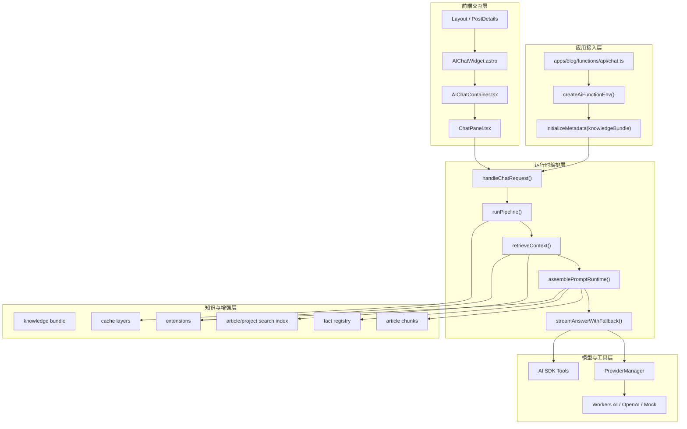

这张图比“表现层 → 服务层 → 核心层”的老式描述更贴近当前代码，因为它把三件关键事实画出来了：

1. `initializeMetadata()` 是显式前置步骤。
2. `prompt-runtime` 是独立运行时装配层，而不是 prompt 目录的别名。
3. 扩展、事实、chunk 注入、缓存与 tools 都已经进入主链路。

### 3.2 真实逻辑入口与职责边界

如果从代码而不是目录命名出发，当前包真正有五类逻辑入口：

| 入口类型 | 文件 / 函数 | 作用 |
|----------|-------------|------|
| 服务端请求入口 | `server/chat-handler.ts` → `handleChatRequest()` | 接收 `/api/chat` 请求并进入 AI 主链路 |
| 元数据初始化入口 | `server/metadata-init.ts` → `initializeMetadata()` | 把知识包初始化成运行态索引与 chunks |
| UI 挂载入口 | `components/AIChatWidget.astro` | 在 Astro 页面中挂载 AI 功能 |
| 客户端交互入口 | `components/ChatPanel.tsx` → `ChatPanel()` | 发送消息、处理工具调用、维护流式状态 |
| 本地开发入口 | `server/dev-server.ts` | 在无 Cloudflare Pages 的本地环境跑完整 AI handler |

这意味着 `src/index.ts` 更像“包级公共 API 面”，而不是运行时业务链真正开始的地方。

## 四、核心模块详解

### 4.1 Provider Manager 模块

`ProviderManager` 是供应商无关设计的中心。它的职责不是“简单按顺序轮询模型”，而是：

- 解析 provider 配置
- 构造 adapter
- 按 weight 排序
- 跟踪失败与恢复
- 在流式调用中做 provider failover
- 所有真实 provider 失效时切到 Mock

#### 优先级与故障转移

| Provider | 默认 weight | 来源 |
|----------|-------------|------|
| Workers AI | 100 | `createWorkersAIConfigFromEnv()` |
| OpenAI Compatible | 90 | `createOpenAIConfigFromEnv()` |
| Mock fallback | 不参与 parse，单独内建 | `ProviderManager` |

当前配置入口有两层：

1. `AI_PROVIDERS` JSON
2. 传统环境变量 `AI_BASE_URL` / `AI_API_KEY` / `AI_MODEL` / `AI_BINDING_NAME` 等

也就是说，provider 优先级不只是模型优先级，还包括配置来源优先级。

#### 健康追踪机制

`ProviderManager.streamText()` 的逻辑是：

1. 遍历当前可用 provider
2. 先检查 `isAvailable()`
3. 成功则 `recordSuccess()`
4. 失败则 `recordFailure()`
5. 若变为 unhealthy，则触发 health change 回调
6. 若全部失败且允许 Mock fallback，则切到 Mock

关键默认值仍然是：

- `unhealthyThreshold = 3`
- `healthRecoveryTTL = 60000`

### 4.2 Search 检索模块

当前 Search 模块已经不再只是“找几篇文章”，而是我用来承接索引初始化、检索执行、结果塑形和 chunk 注入准备的一整套组合系统。

#### 检索架构

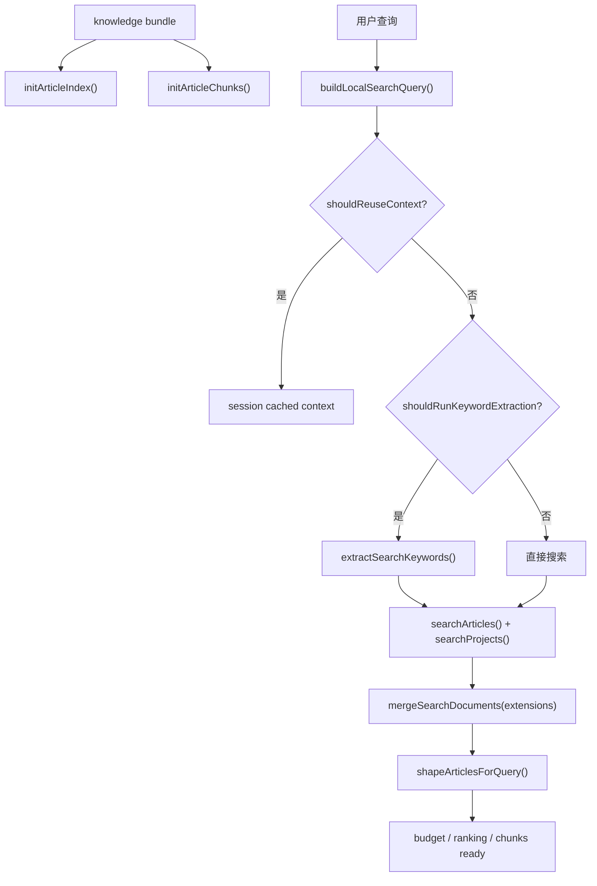

`searchArticles()` 当前仍以字段加权词法检索为主，但后处理已经更完整：

1. `tokenize(query)`
2. `scoreDocument()` / `scoreDocs()`
3. `applyAnchorFilter()`
4. `filterLowRelevance()` 与 `applyPurityFilter()`
5. 根据 query 宽窄决定 article limit
6. 可选 deep content
7. 可选 vector rerank / hybrid / RRF

#### TF-IDF 评分

更准确的描述是：**字段加权词法相关性打底，再由 purity / anchor / category ranking / 向量重排做后处理。**

| 字段 | 角色 |
|------|------|
| `title` | 最高权重，决定强相关召回 |
| `keyPoints` | 补强摘要式知识点 |
| `categories` | 主题类 query 的粗粒度校正 |
| `tags` | 术语和内容标签 |
| `excerpt` | 摘要说明 |
| `content` | 兜底补充 |

#### 深度内容检索与段落检索

`metadata-init.ts` 会把 `knowledgeBundle.passages.passages` 初始化为 `ArticleChunk[]`。在文章模式下，`prompt-runtime.ts` 会优先：

1. 找到当前结果里带 chunks 的文章
2. 如果当前文章不在结果里，用 slug 主动读取当前文章 chunks
3. `selectRelevantChunks()` 选出相关段
4. 短 query 场景下 `expandChunkMatchesWithNeighbors()` 带上前后邻段
5. `injectionCache.filterNewChunks()` 做同 session 去重
6. `formatChunksForInjection()` 生成动态层原文区块

这就是今天“边读边聊”真正成立的基础。

### 4.3 Intelligence 智能分析模块

Intelligence 模块的变化不在“多了几个工具函数”，而在于它已经成为整条链路的解释层。

#### 关键词提取

关键词提取由 `extractSearchKeywords()` 执行，但不是每次都跑。当前只有在值得花额外模型成本时，`shouldRunKeywordExtraction()` 才允许进入关键词提取，否则直接使用 `buildLocalSearchQuery()` 的本地结果。

#### 意图分类与 `query/*` 再导出

当前 query 理解能力位于 `src/query/`：

- `query/followup.ts`
- `query/intent.ts`
- `query/types.ts`

但上层调用通常通过 `intelligence/index.ts` 统一访问。这意味着 `query` 是底层实现目录，而 `intelligence` 才是上层语义边界。

#### 请求解释层

`request-interpretation.ts` 现在会统一产出：

- `conversation.shouldReuseContext`
- `topic.primary`
- `answer.contract`
- `safety.decision`
- `reasoning.complexity`

再由 `resolveInterpretationBudget()` 计算 budget。换句话说，budget 不再是“独立参数”，而是请求解释的结果。

#### 证据分析

证据分析仍由 `analyzeRetrievedEvidence()` 负责，但它已经不是固定步骤，而是 `prompt-runtime.ts` 中一个可选、可超时、可空结果的增强步骤。只有在有真实 provider 且 adapter 存在时，系统才会给它分配独立时间窗口。

#### 引用守卫与回答模式

当前 `resolvePromptGuards()` 会组合：

1. `getCitationGuardPreflight()`
2. `interpretRequest()`
3. `buildUnknownRefusal()`

这使得“隐私问题拒答”不再只是 prompt 约束，而是一个运行时前置守卫分支。

### 4.4 Extensions 扩展系统

扩展系统现在已经深入主链路，我自己也不再把它当作实验功能看待。

#### 扩展类型

| 类型 | 当前作用 |
|------|----------|
| `searchable` | 把额外文档并入检索结果 |
| `facts` | 把额外事实并入 fact registry 命中结果 |
| `context` | 在 dynamic layer 指定位置插入自定义章节 |
| `voice-style` | 根据 query 或分类切换表达风格 |
| `semantic-fallback` | 对原 query 做语义回退或重写 |

#### 扩展加载与生命周期

扩展在首次请求时按需加载：

```typescript
export async function initializeExtensions(basePath?: string): Promise<void> {
  if (extensionsLoaded) return;
  extensionsLoaded = true;
  const { loadExtensions } = await import("../extensions/loader.js");
  await loadExtensions("datas/extensions/*.json", basePath);
}
```

它遵循的是“存在则增强，不存在也不阻塞主流程”的策略。

#### 扩展注入点

扩展在当前系统里主要有四类注入点：

1. `getSemanticFallback()` 改写 query
2. `mergeSearchDocuments()` 合并扩展文档
3. `mergeFacts()` 合并事实
4. `buildDynamicLayer()` 通过 context sections 插入额外上下文

### 4.5 Structured Output 结构化输出

`structured-output/` 当前已经是正式导出能力，但不是聊天主链的固定步骤。更准确的定位是：**一个基于 Zod 的可复用结构化生成基础层**，适合给未来的 evidence analysis、facts extraction 或其他 AI 子任务提供 schema 驱动输出。

因此，维护者理解这一节时应把它视为配套能力，而不是 `chat-handler.ts` 必经步骤。

### 4.6 Prompt 构建器模块

当前 prompt 体系可以理解为“两层叠加”：

1. `prompt/*` 负责 static / semi-static / dynamic 三层内容构建
2. `server/prompt-runtime.ts` 负责把事实、扩展、文章上下文、chunk 注入、安全守卫装配进 builder

#### 静态层

静态层负责身份定义、来源分层、语言与约束。当前 `buildSystemPrompt()` 会把 `voiceStylePrompt` 作为 static 参数之一注入，这说明表达风格虽然来自扩展系统，但最终落在静态层配置里。

#### 半静态层

半静态层来自 `getAuthorContext()`。它提供博客概况、最近文章、作者上下文等稳定但不硬编码的知识块。

## 博客概况

当前半静态层的职责不是“把总文章数写死”，而是让模型理解这是什么博客、作者是谁、内容大致覆盖哪些方向。

## 最新文章

最新文章列表仍然合理，因为它能帮助推荐型问题快速进入语境。但关键不在“恰好列 10 篇”，而在于它属于 author context 提供的半静态知识，而不是每次请求重新扫描内容目录。

#### 动态层

动态层是当前变化最大的部分。除了 articles、projects、evidence、facts 之外，它还包含：

1. extension context sections
2. reading time
3. `chunksSection`
4. `preferInjectedChunks`

当前 `buildDynamicLayer()` 的真实语义是：**当 chunk 已经足够细时，不再重复堆摘要；当 facts 命中时，要形成单独章节；当 extension 满足条件时，要把上下文章节插入正确位置；最后再追加 answer mode hint。**

### 4.7 Stream 流处理模块

流处理模块现在承担的已经不只是“把字一个个推给前端”，而是：

1. 输出 `message-metadata`
2. 输出来源文章
3. 在缓存命中时模拟 thinking / response 回放

这意味着缓存回放也能看起来像真实生成过程，而不是突然返回完整答案。

## 五、完整数据流示例

### 5.1 请求处理全流程

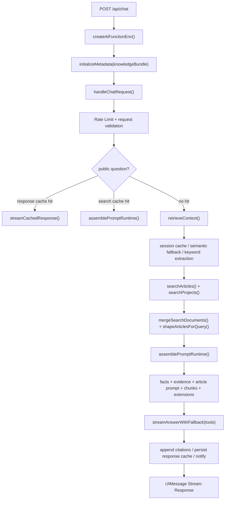

这条链路里最关键的事实有三点：

1. 知识包初始化发生在 API 入口，而不是 `chat-handler.ts` 内部。
2. 公共问题缓存分成搜索缓存与响应缓存两条短路分支。
3. `prompt-runtime` 已经是独立装配节点，而不是“检索后顺手拼一下 prompt”。

### 5.2 场景一：技术问题查询

**用户输入**：`“如何部署到 Cloudflare Pages？”`

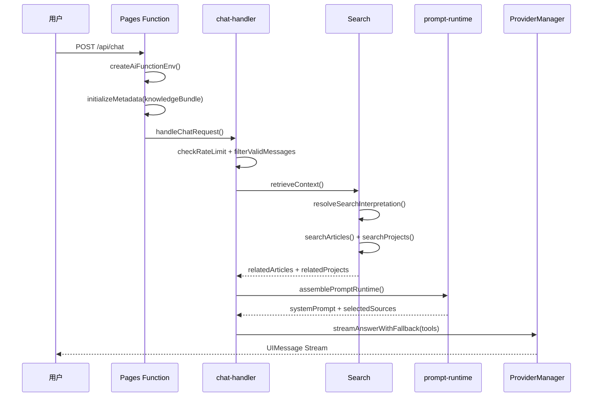

deployment 类 query 会通过 `rankArticlesByCategory()` 提高部署相关文章排序，而不是把一切都压到 prompt 层补救。

### 5.3 场景二：追问复用上下文

**用户输入**：`“配置文件在哪？”`，上一轮正在讨论部署。

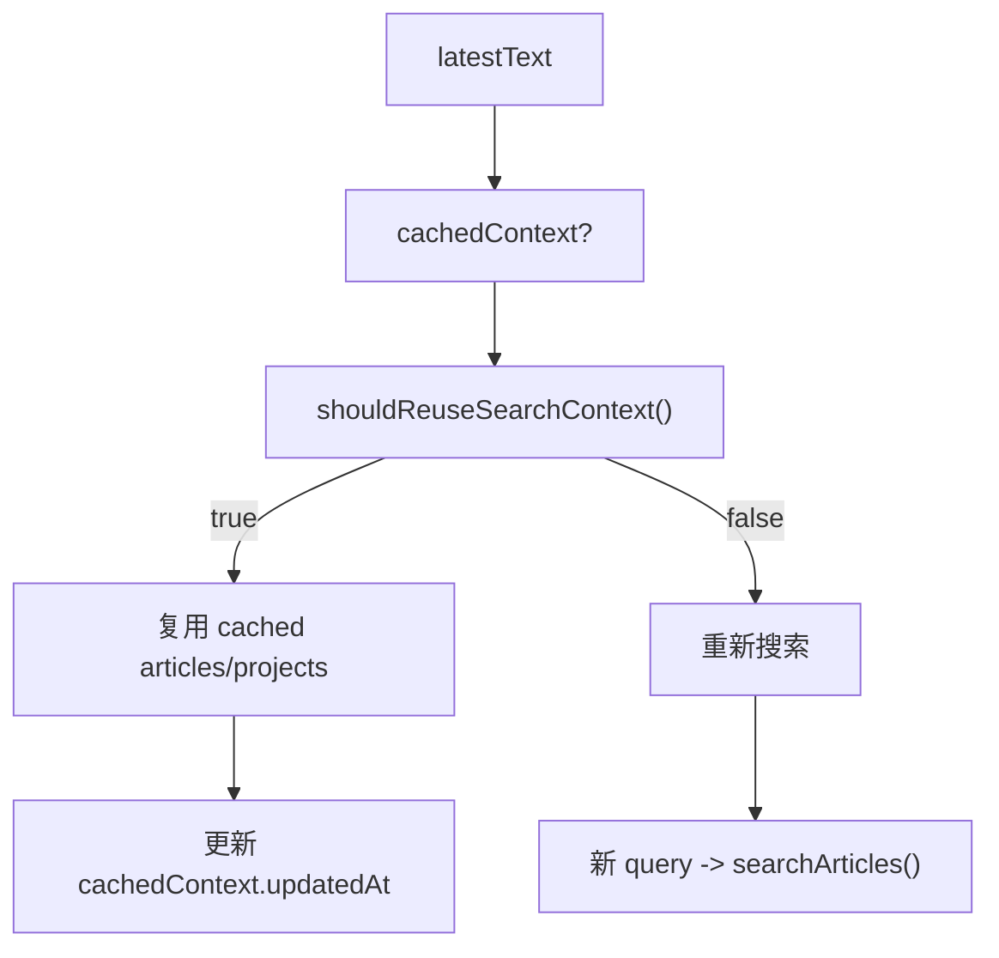

当前复用逻辑会同时考虑缓存存在、TTL、用户轮数、是否像追问、query overlap 和是否出现新重要 token，而不是一个简单的“短句追问”规则。

### 5.4 场景三：隐私问题拦截

**用户输入**：`“你的收入是多少？”`

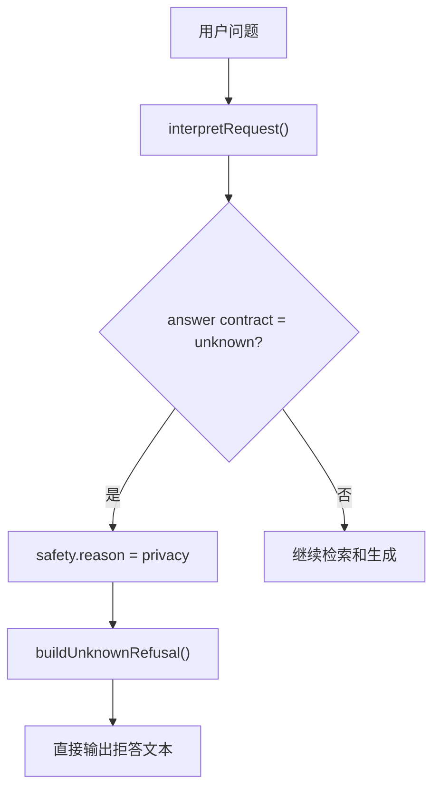

现在的隐私拦截已经是运行时前置分支，而不是只靠 prompt 提醒模型“不要答”。

### 5.5 场景四：供应商故障转移

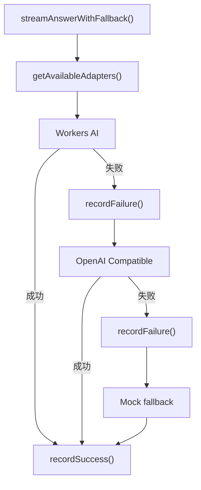

当前同一请求内即可完成流式故障转移，而不只是请求级重试。

### 5.6 TF-IDF 评分详解

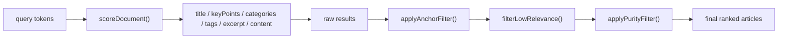

如果要用一句话总结当前评分策略，就是：**先用字段加权词法相关性召回，再用锚点与纯度过滤把结果修干净，最后再由 query 主题塑形排序。**

### 5.7 三层提示词构建流程

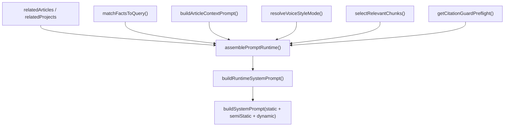

当前 dynamic layer 至少应理解为以下内容的组合：

- related articles
- related projects
- facts section
- evidence section
- extension context sections
- current article chunk injection
- answer mode hint

```markmap
# 来源分层 (Source Layers)

 - L1: 原始博客内容
- 文章标题
- summary / keyPoints
- 当前文章 passages chunks
- 检索得到的相关文章

 - L2: 半静态作者与博客上下文
- author context
- 博客概况
- 最新文章

 - L3: 结构化事实
- fact registry
- 扩展 facts

 - L4: 外部或扩展知识
- searchable extensions
- project context

 - L5: 表达风格
- voice-style extensions
- 只影响说法，不提升事实优先级
```

## 六、使用场景详解

### 6.1 场景一：全局问答流程

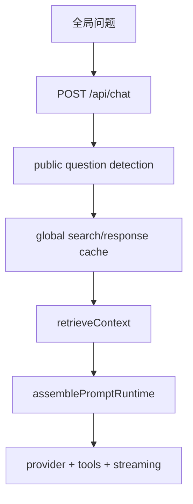

全局问答更依赖公共问题缓存、博客概况、跨文章检索和 facts。它强调的是“站点知识”，不是“当前阅读位置”。

### 6.2 场景二：边读边聊功能

边读边聊这条能力在当前版本里，关键已经从“透传 articleContext”升级成“把 articleContext 与当前文章原文 chunk 一起纳入提示词”。

**上下文感知机制：**

```typescript
export interface ArticleChatContext {
  slug: string;
  title: string;
  categories?: string[];
  summary?: string;
  abstract?: string;
  keyPoints?: string[];
  relatedSlugs?: string[];
}
```

文章模式下，当前运行时会同时做三件事：

1. 前端把 `context: { scope: 'article', article: articleContext }` 发给 API
2. `buildArticleContextPrompt()` 注入当前阅读文章提示块
3. `prompt-runtime.ts` 优先为当前文章挑选并注入相关原文段落 chunk

这比“只透传标题、摘要、要点”的旧实现更像真正的阅读伴侣。

## 七、组件设计详解

### 7.1 AIChatWidget 组件

`AIChatWidget.astro` 依旧是 Astro 侧入口组件，但当前需要明确两点：

1. 它读取的是 `virtual:astro-minimax/config` 中的 `SITE.ai`
2. 它本身不负责聊天逻辑，只负责把 `lang` 和可选 `articleContext` 传给 Preact 容器

### 7.2 AIChatContainer 组件

`AIChatContainer.tsx` 是状态壳层，负责 open / close 与 `window.__aiChatToggle` 暴露。它的价值在于把浮动操作按钮与聊天面板保持弱耦合，而不是承担 transport 或 tool call 逻辑。

### 7.3 ChatPanel 组件

`ChatPanel.tsx` 是当前前端最重的模块，承担：

- 依据 `articleContext` 生成 session id
- 构造 `DefaultChatTransport`
- 在 article/global 两种模式间切换上下文
- 处理 welcome message 与 quick prompts
- 处理 tool calls 并回传结果
- 在 mock mode 下走本地模拟流

#### useChat 配置

```typescript
const transport = new DefaultChatTransport({
  api: config.apiEndpoint ?? '/api/chat',
  prepareSendMessagesRequest: ({ id, messages: msgs }) => ({
    headers: { 'x-session-id': sessionId },
    body: {
      id,
      messages: msgs,
      lang,
      context: articleContext
        ? { scope: 'article', article: articleContext }
        : { scope: 'global' },
    },
  }),
});
```

这里的 `x-session-id` 非常关键，因为 session cache 与 chunk injection dedupe 都依赖这个维度。

#### Tool Calling 前端执行

当前 `ChatPanel.tsx` 已经不只是文本显示 UI，它还是 browser action runtime：

1. 服务端把 tools 提供给模型
2. 模型发起 tool call
3. 前端 `onToolCall` 收到 `toolName` 与 `input`
4. `TOOL_ACTION_MAP` 把它映射成浏览器动作
5. `window.__actionExecutor.execute(action)` 真正执行
6. `addToolOutput()` 把结果回传给模型

### 7.4 流式文本显示优化

当前前端体验优化体现在三个方向：

1. `message-metadata` 让搜索和生成进度可视化
2. source articles 让来源可见
3. `shouldAutoContinueAfterToolCalls` 让查询型工具调用后自动续跑

因此，今天的流式优化不再只是“打字机效果”，而是把搜索、引用、执行动作与继续推理过程变成用户可感知的体验。

## 八、接口契约与数据类型

### 8.1 Chat API 请求格式

```typescript
interface ChatRequestBody {
  context?: {
    scope: 'global' | 'article';
    article?: {
      slug: string;
      title: string;
      categories?: string[];
      summary?: string;
      abstract?: string;
      keyPoints?: string[];
      relatedSlugs?: string[];
    };
  };
  id?: string;
  messages: UIMessage[];
  lang?: string;
}
```

### 8.2 Chat API 响应格式

当前服务端通过 `createUIMessageStream()` 与 `createUIMessageStreamResponse()` 返回 UI Message Stream，而不是手写 SSE 文本。主要可观察事件包括：

- `message-metadata`
- source articles
- text chunk
- finish

如果命中响应缓存，还会按 `thinking` 和 `response` 做模拟回放。

### 8.3 错误码定义

保留错误码表格是合理的，但文档不应再把输入上限写死成某个字面值。更准确的说法是：输入长度受 `CHAT_HANDLER.MAX_INPUT_LENGTH` 约束，而各类错误由 `server/errors.ts` 统一生成并根据 `lang` 返回不同文案。

## 九、配置与环境变量

### 9.1 Provider 配置

当前 provider 配置应分成两层说明。

**第一层：传统环境变量**

| 环境变量 | 说明 |
|----------|------|
| `AI_BASE_URL` | OpenAI 兼容接口地址 |
| `AI_API_KEY` | OpenAI 兼容接口密钥 |
| `AI_MODEL` | 主模型 |
| `AI_KEYWORD_MODEL` | 关键词提取模型，可选 |
| `AI_EVIDENCE_MODEL` | 证据分析模型，可选 |
| `AI_BINDING_NAME` | Workers AI binding 名 |
| `AI_WORKERS_MODEL` | Workers AI 使用模型 |

**第二层：统一 provider JSON**

`AI_PROVIDERS` 支持 JSON 数组配置多个 provider，这是当前版本相对旧文档最大的 provider 配置升级点。

### 9.2 响应缓存配置

当前实际生效的是：

| 环境变量 | 默认值 | 说明 |
|----------|--------|------|
| `AI_CACHE_ENABLED` | `false` | 是否启用响应缓存 |
| `AI_CACHE_TTL` | `3600` | 默认 TTL |
| `AI_CACHE_PLAYBACK_DELAY` | `20` | 响应回放延迟 |
| `AI_CACHE_CHUNK_SIZE` | `15` | 回放字符块大小 |
| `AI_CACHE_THINKING_DELAY` | `5` | thinking 回放延迟 |

### 9.3 速率限制配置

当前行为仍然是三层 IP 级速率限制：

- Burst：10 秒 3 次
- Sustained：60 秒 20 次
- Daily：24 小时 100 次

### 9.4 多环境配置示例

应用接入链路的正确理解是：

1. `apps/blog/src/config.ts` 定义 `SITE.ai`
2. `createAiFunctionEnv()` 调用 `applyAiConfigDefaults({ ...env }, SITE.ai)`
3. `AIChatWidget.astro` 读取 `SITE.ai` 生成前端配置
4. `functions/api/chat.ts` 用环境变量和 knowledge bundle 初始化服务端运行时

换句话说，站点配置和运行时环境变量是两路输入，最终在 app integration 层汇合。

## 十、部署与运维

### 10.1 部署架构

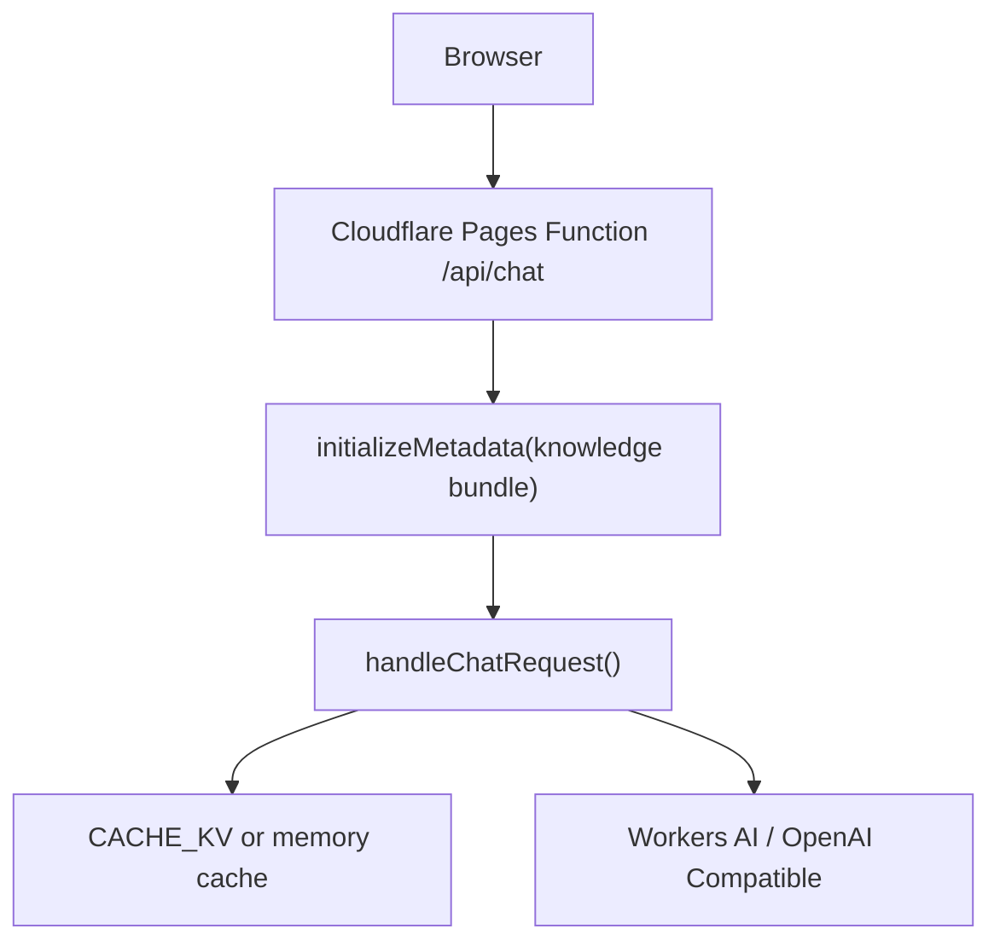

当前部署文档必须明确一点：AI 运行时不只依赖环境变量，还依赖 `datas/knowledge/runtime/knowledge-bundle.json`。如果 runtime knowledge bundle 缺失，系统虽然可能继续运行，但上下文质量会显著下降。

### 10.2 性能基准

相比把性能数字写死，当前更稳妥的说法是：

- 检索与 prompt 组装通常明显快于模型阶段
- 关键词提取与 evidence analysis 各自有独立超时预算
- 生成延迟主要由 provider 与输出长度决定
- 命中响应缓存时，真实模型调用可完全省掉

### 10.3 监控指标

当前最容易观测的指标来源有三类：

1. logger 输出：检索命中数、top articles、chunk selection、cache hit
2. provider 健康状态：失败次数、恢复状态、provider switch
3. 通知系统：phase timing、model、usage、referenced articles

### 10.4 故障排查指南

**问题：文章页 AI 明显答非所问**

优先排查：

1. `articleContext.slug` 是否正确传到 API
2. `knowledge-bundle.json` 是否包含对应文章 passages
3. `initArticleChunks()` 是否已执行
4. `chunkSelection` 日志是否命中当前文章段落

**问题：公共问题总是重新调用模型**

优先排查：

1. `detectPublicQuestion()` 是否命中分类
2. `AI_CACHE_ENABLED` 是否打开
3. `shouldPersistResponseCacheEntry()` 是否因为 source reason 不满足而拒绝写入

**问题：明明配置了 provider 却总走 mock**

优先排查：

1. `AI_PROVIDERS` JSON 是否可解析
2. provider config 是否通过 `validateProviderConfig()`
3. provider 是否已被健康状态标记为 unhealthy

## 十一、超时预算管理

当前总请求超时由 `getTimeoutConfig()` 控制，可通过环境变量覆盖：

| 环境变量 | 默认语义 |
|----------|----------|
| `AI_TIMEOUT_REQUEST` | 整体请求超时 |
| `AI_TIMEOUT_KEYWORD` | 关键词提取超时 |
| `AI_TIMEOUT_EVIDENCE` | 证据分析超时 |
| `AI_TIMEOUT_LLM` | LLM 流式阶段超时 |

当前设计原则仍然是“给各阶段独立预算，再给整条请求一个总上限”。

## 十二、工具调用架构 (Tool Calling)

当前 Tool Calling 在我看来已经从试验性能力升级成完整双端链路。

### 12.1 工具定义

`packages/ai/src/tools/action-tools.ts` 当前内建工具如下：

| 工具名 | 类型 | 执行位置 |
|--------|------|----------|
| `toggleTheme` | 客户端工具 | 浏览器 |
| `navigateToArticle` | 客户端工具 | 浏览器 |
| `scrollToSection` | 客户端工具 | 浏览器 |
| `toggleReadingMode` | 客户端工具 | 浏览器 |
| `highlightText` | 客户端工具 | 浏览器 |
| `setPreference` | 客户端工具 | 浏览器 |
| `searchArticles` | 服务端工具 | AI server |

并且当前不是只暴露静态 `allTools`，还支持：

- `registerTool()`
- `unregisterTool()`
- `getAllTools()`
- `getClientSideTools()`
- `getServerSideTools()`

### 12.2 执行流程

当前主链路的真实流程是：

1. 服务端通过 `getAllTools()` 把当前 tools 交给模型
2. 模型可调用 server tool，例如 `searchArticles`
3. 也可发起 client tool call，交由前端执行
4. 前端用 `addToolOutput()` 回传执行结果
5. `shouldAutoContinueAfterToolCalls` 决定是否自动续跑

### 12.3 动作执行器 (`packages/core/src/actions`)

虽然具体动作执行器位于 core 包，但 AI 文档必须提到它，因为当前前端动作能力靠它真正落地。AI 包负责理解与调度，core 包负责执行浏览器动作，这是一条协作链，而不是单包自洽闭环。

## 十三、速率限制

速率限制位于 `middleware` 层，并在 `handleChatRequest()` 入口尽早执行，因此它属于所有模式共享的保护机制，不区分 global chat 与 article chat。

## 十四、CLI 工具链

### 13.1 事实注册表验证

当前更准确的说法不是“某个孤立的 validate 命令”，而是：CLI 负责生成和管理 AI 运行时知识资产，包括 facts、profile、extensions 状态等。

### 13.2 相关命令

结合当前仓库，可关联的命令包括：

```bash
pnpm run ai:process
pnpm run ai:profile:build
astro-minimax ai facts build
astro-minimax ai extensions status
```

它们的共同目标是把运行时会消费的知识资产预先生成出来，再交给 `initializeMetadata()` 与相关数据加载层使用。

## 十五、总结

当前版本的 `@astro-minimax/ai` 已经不是“RAG + 多 provider”的简单拼装，而是一套围绕知识包运行时初始化、检索增强、prompt-runtime 装配、多层缓存、工具调用与前端交互共同构成的博客 AI 运行时系统。它最值得记住的结论可以浓缩成九点：

1. 真实逻辑入口至少有服务端请求、元数据初始化、UI 挂载、客户端交互和 dev server 五类。
2. `initializeMetadata()` 把知识包转成运行时索引与 chunks，是一切检索能力的前提。
3. `chat-handler.ts` 是总编排器，但不再独自承担所有细节，检索、装配、流式输出都已有专门模块。
4. `prompt-runtime.ts` 已成为真正的提示词装配核心，负责 facts、extensions、article prompt、chunk injection 和 guard。
5. 检索不再只有文章摘要级结果，而包含 paragraph-level chunk 注入路径。
6. 缓存已经扩展为 session search cache、public question search cache、public question response cache 与 injection cache 多层结构。
7. Provider 管理支持 `AI_PROVIDERS` JSON 与传统环境变量两种配置入口，并支持流式故障转移。
8. Tool Calling 已形成服务端工具、前端动作执行和自动续跑的完整闭环。
9. 从架构评价看，它已经相当清晰和工程化，但 `chat-handler.ts` 依然是系统复杂度最集中的位置。

如果从维护者视角只保留一句话，那么今天的 `@astro-minimax/ai`，本质上是一个**以 knowledge bundle 为底座、以 prompt-runtime 为装配中枢、以 ProviderManager 为生成引擎、以多层缓存和工具调用为加速器的博客 AI 运行时系统**。
