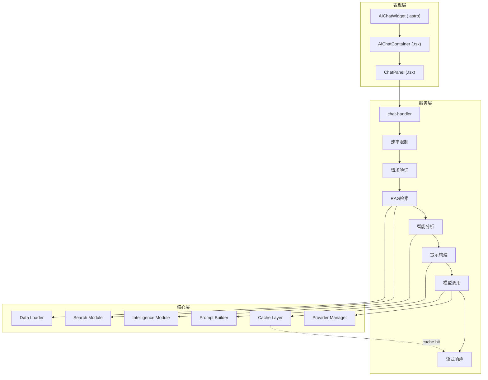
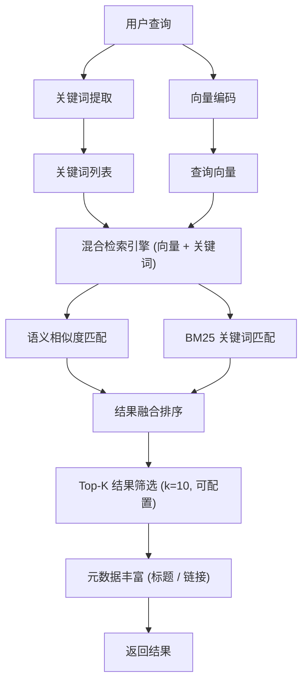
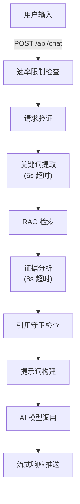
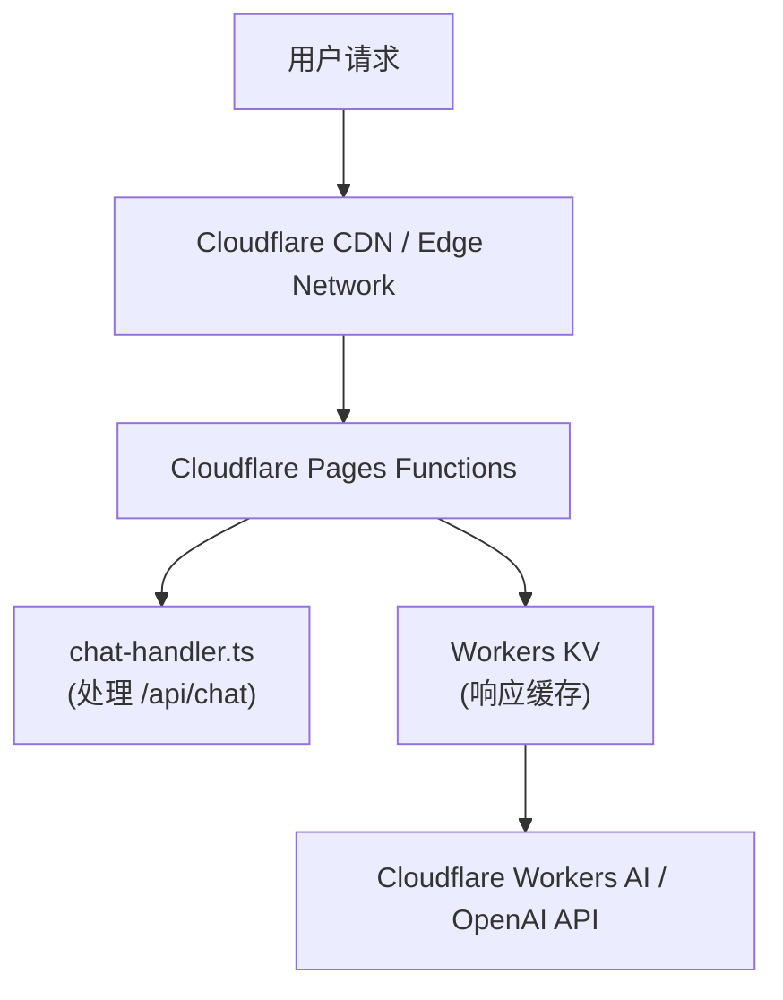
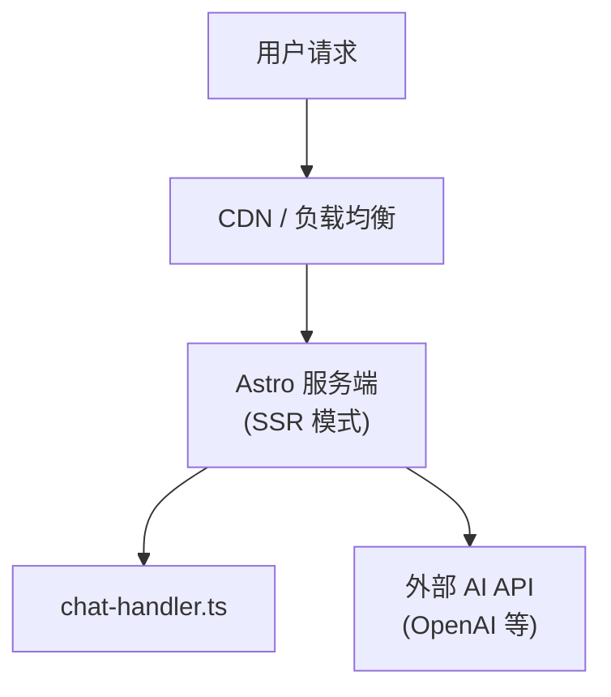

@astro-minimax/ai 是 astro-minimax 博客主题的智能增强模块，定位为供应商无关（Vendor-agnostic）的 AI 集成解决方案。该模块的核心目标是为一站式博客平台提供完整的 RAG（检索增强生成）流水线，同时支持多种 AI 服务供应商的无缝切换与故障转移，确保服务的高可用性和用户体验的连贯性。

## 一、项目概述与设计理念

### 1.1 项目背景与核心定位

该模块服务于两类核心用户交互模式：第一类是**全局对话模式**，用户可以在博客任意页面发起关于博客内容的通用咨询；第二类是**阅读伴侣模式（边读边聊）**，用户在阅读特定文章时可以直接针对当前文章内容与 AI 进行深度交流。这两种模式的底层架构高度复用，但通过上下文隔离实现了差异化的智能服务。

从技术选型角度，该模块采用了当前主流的 AI 应用架构——**流式响应（Streaming）+ 服务端事件推送（SSE）+ RAG 增强**。这一技术组合既满足了用户对即时反馈的体验期待，又确保了 AI 回复的准确性和时效性。模块设计之初就考虑了与 Cloudflare Workers 的深度集成，这使得它天然支持边缘计算场景下的低延迟响应。

### 1.2 设计原则与架构哲学

该模块遵循以下核心设计原则，这些原则贯穿于整个架构设计和代码实现：

**供应商无关性（Vendor Agnosticism）** 是模块设计的首要原则。通过抽象 AI Provider 接口，模块能够同时支持 OpenAI 兼容 API、Cloudflare Workers AI 等多种供应商，而上层业务逻辑完全不感知底层供应商的差异。这种设计允许开发者根据成本、性能、地区可用性等因素灵活切换 AI 供应商，无需修改业务代码。Provider Manager 组件承担了这一抽象层的主要职责，它实现了自动健康追踪、优先级调度和透明故障转移。

**分层解耦（Layered Decoupling）** 体现在模块的清晰分层架构中。从数据流视角看，请求依次经过速率限制、验证、检索、智能分析、提示构建、模型调用和流式响应处理，每个环节都是独立可替换的模块。这种设计使得优化某个环节（如更换更快的嵌入模型）不会影响其他环节的稳定性。

**构建时与运行时分离（Build-time vs Runtime Separation）** 是该模块的重要架构特征。博客的元数据（文章摘要、作者信息、语音画像）是在构建阶段预处理的，这些静态数据被序列化为 JSON 文件供运行时加载。这种设计将昂贵的计算任务（如文档向量化、摘要生成）从用户请求路径中剥离，大大降低了响应延迟。

**优雅降级（Graceful Degradation）** 贯穿于系统的每个层级。当 AI 供应商不可用时，系统自动切换到备用供应商；当所有供应商都失败时，Mock 响应机制确保用户始终能获得有意义的回复；当 RAG 检索超时或无结果时，系统会基于关键词进行本地搜索降级，而非直接返回失败。

### 1.3 核心能力矩阵

该模块提供了完整的人工智能交互能力集：

| 能力类别 | 具体功能 | 技术实现 | 性能指标 |
|----------|----------|----------|----------|
| 对话交互 | 流式文本生成 | SSE + streamText | 首 Token 延迟 < 500ms |
| 上下文感知 | 文章级 RAG 检索 | 内存向量搜索 + 混合检索 | 检索延迟 < 200ms |
| 智能分析 | 关键词提取 | 独立模型调用 | 超时 5s，自动降级 |
| 来源追踪 | 证据分析与引用 | 二次 LLM 调用 | 超时 8s，可跳过 |
| 多供应商 | 自动故障转移 | Provider Manager | 优先级 100→90→0 |
| 降级策略 | Mock 兜底响应 | 本地字符串模板 | 零延迟返回 |
| 隐私保护 | 敏感信息过滤 | Citation Guard | 实时检测拦截 |
| 会话缓存 | 响应缓存回放 | 缓存层 + 流式模拟 | 减少 100% API 调用 |

### 1.4 技术栈与依赖关系

模块的技术选型充分考虑了现代前端开发的特点和边缘计算的需求：

- **AI SDK** 是模块的核心依赖，版本 6.x 提供了 Provider 抽象层和流式响应处理能力。模块通过 AI SDK 的 `streamText` 函数实现了与不同 AI 供应商的无缝对接，同时 `useChat` Hook 为 React/Preact 组件提供了状态管理的便利。

- **运行环境** 支持两种主要模式：Cloudflare Pages Functions 模式和传统 Node.js 模式。Cloudflare 模式下，模块利用 Workers KV 进行响应缓存；Node.js 模式下，缓存功能可能受限或不可用。模块通过环境检测实现了运行时自适应。

- **UI 框架** 采用了 Preact 而非 React，这是出于包体积的考虑。Preact 的兼容性层确保了 `@ai-sdk/react` 的 Hook 可以在 Preact 环境中正常工作。

## 二、目录结构与组织规范

### 2.1 顶层目录架构

```
/packages/ai
├── src/                          # 源代码主目录
│   ├── components/                # UI 组件（Preact）
│   │   ├── ChatPanel.tsx         # 核心聊天界面（865行）
│   │   ├── AIChatContainer.tsx   # 容器组件（状态管理）
│   │   └── AIChatWidget.astro    # Astro 入口点
│   ├── server/                   # 服务端处理逻辑
│   │   ├── chat-handler.ts       # 主请求处理器
│   │   ├── stream-helpers.ts     # 流式响应辅助函数
│   │   ├── errors.ts             # 错误响应工厂
│   │   └── types.ts              # 类型定义
│   ├── provider-manager/         # AI 供应商管理
│   │   ├── manager.ts            # Provider Manager 核心
│   │   ├── openai.ts             # OpenAI 适配器
│   │   ├── workers.ts            # Workers AI 适配器
│   │   └── mock.ts               # Mock 供应商实现
│   ├── search/                   # RAG 检索模块
│   │   ├── search-api.ts         # 搜索 API 入口
│   │   ├── search-index.ts       # 索引构建
│   │   ├── search-utils.ts       # 评分工具
│   │   ├── vector-reranker.ts    # 向量重排序
│   │   └── session-cache.ts      # 会话缓存
│   ├── intelligence/             # 智能分析模块
│   │   ├── keyword-extract.ts    # 关键词提取
│   │   ├── evidence-analysis.ts  # 证据分析
│   │   ├── citation-guard.ts     # 引用守卫
│   │   ├── intent-detect.ts      # 意图检测
│   │   └── citation-appender.ts  # 引用追加器
│   ├── prompt/                   # 提示词工程
│   │   ├── prompt-builder.ts     # 三层提示构建器
│   │   ├── static-layer.ts       # 静态层
│   │   ├── semi-static-layer.ts  # 半静态层
│   │   └── dynamic-layer.ts      # 动态层
│   ├── cache/                    # 缓存模块
│   │   ├── response-cache.ts     # 响应缓存
│   │   ├── global-cache.ts       # 全局缓存
│   │   ├── memory-adapter.ts     # 内存适配器
│   │   └── kv-adapter.ts         # KV 适配器
│   ├── data/                     # 数据加载
│   │   └── metadata-loader.ts    # 元数据加载器
│   └── utils/                    # 工具函数
│       └── i18n.ts               # 国际化
├── package.json                  # 包配置
├── tsconfig.json                 # TypeScript 配置
└── README.md                     # 英文文档
```

### 2.2 核心目录功能解析

**src/components/** 目录采用了原子设计理念组织 UI 组件。最底层是 `ChatPanel.tsx`，这是整个聊天功能的视觉核心，构建于 `@ai-sdk/react` 的 `useChat` Hook 之上。它负责消息的渲染（支持文本、来源引用等不同部件）、错误状态的展示（带重试按钮）、以及状态指示器的显示。`AIChatContainer.tsx` 扮演状态容器的角色，管理聊天气泡的开启/关闭状态，并暴露 `window.__aiChatToggle` 接口供外部调用（如悬浮按钮）实现状态切换。

**src/server/** 目录包含了请求处理的全部逻辑。`chat-handler.ts` 是整个服务端处理流水线的中枢，它编排了速率限制、输入验证、RAG 搜索、智能分析、提示构建、AI 调用、流式响应等全部环节。

**src/provider-manager/** 是实现供应商无关性的核心目录。该目录导出了一个 Provider Manager 实例，支持动态添加/移除供应商、设置优先级权重、自动健康追踪和透明故障转移。`mock.ts` 提供了本地 Mock 响应能力，当所有真实供应商不可用时，系统会切换到 Mock 模式，返回预定义的模板化响应。

**src/search/** 实现了 RAG 检索的核心能力。检索时会使用会话级缓存（`session-cache.ts`），避免在单个对话会话中重复检索相同查询。检索策略采用了混合方式：结合语义向量相似度和关键词匹配，确保结果既相关又全面。

**src/intelligence/** 提供了超越基础检索的智能增强能力。`keyword-extract.ts` 负责从用户查询中提取关键实体和意图词，这些信息用于增强检索效果。`evidence-analysis.ts` 对检索到的文档片段进行二次分析，评估其对当前查询的支持程度。`citation-guard.ts` 是隐私保护组件，负责检测和过滤可能泄露用户个人信息的查询。

**src/prompt/** 实现了三层提示词构建体系。第一层是静态层，包含系统角色定义和通用指令；第二层是半静态层，包含博客特定信息（如技术栈、功能列表）；第三层是动态层，根据当前对话上下文和 RAG 检索结果动态构建。这种分层设计使得大部分提示词内容可以被缓存复用，只有动态层需要实时生成。

## 三、系统架构设计

### 3.1 整体架构分层



## 四、核心模块详解

### 4.1 Provider Manager 模块

Provider Manager 是实现供应商无关性的核心组件，负责管理多个 AI 供应商的生命周期、健康状态和故障转移。

#### 优先级与故障转移

Provider 按权重降序排列，权重越高优先级越高：

| Provider | 权重 | 说明 |
|----------|------|------|
| Workers AI | 100 | 最高优先级，Cloudflare 部署时免费 |
| OpenAI 兼容 | 90 | 备选方案，支持任何 OpenAI 兼容 API |
| Mock | 0 | 最终兜底，保证用户始终收到回复 |

```typescript
// 故障转移逻辑
async streamText(options: StreamTextOptions): Promise<StreamTextResult> {
  for (const provider of this.providers) {
    const isAvailable = await provider.isAvailable();
    if (!isAvailable) continue;

    try {
      const result = await provider.streamText(options);
      provider.recordSuccess();
      return result;
    } catch (error) {
      provider.recordFailure(error);
      // 继续尝试下一个 Provider
    }
  }

  // 所有 Provider 失败，启用 Mock 兜底
  return this.mockAdapter.streamText(options);
}
```

#### 健康追踪机制

每个 Provider 维护独立的健康状态：

```typescript
interface ProviderHealth {
  healthy: boolean;
  consecutiveFailures: number;
  totalRequests: number;
  successfulRequests: number;
  lastError?: string;
  lastErrorTime?: number;
  lastSuccessTime?: number;
}
```

**关键配置：**
- `unhealthyThreshold: 3` — 连续失败 3 次标记为不健康
- `healthRecoveryTTL: 60000` — 60 秒后自动尝试恢复

### 4.2 Search 检索模块

Search 模块负责从博客内容中检索与用户查询相关的文档片段。它是 RAG 流水线的核心组件，直接影响 AI 回复的准确性和相关性。

#### 检索架构



#### TF-IDF 评分

**字段权重：**
```typescript
const FIELD_WEIGHTS = {
  title: 8,      // 标题匹配最重要
  keyPoints: 5,
  categories: 4,
  tags: 3,
  excerpt: 3,
  content: 1,
} as const;
```

#### 深度内容检索

当首条结果得分显著高于第二条时，自动启用深度内容提取：

```typescript
const DEEP_CONTENT_SCORE_THRESHOLD = 8;
const DEEP_CONTENT_MAX_LENGTH = 1500;

const isDeepHit =
  options.enableDeepContent &&
  topScore >= DEEP_CONTENT_SCORE_THRESHOLD &&
  topScore > secondScore * 1.5;  // 首条结果显著领先
```

#### 会话级缓存

检索结果在会话级别缓存，避免重复检索（TTL: 10 分钟）：

```typescript
export function shouldReuseSearchContext(params: {
  latestText: string;
  cachedContext: CachedSearchContext | undefined;
  userTurnCount: number;
  now: number;
}): boolean {
  if (!cachedContext) return false;
  if (userTurnCount <= 1) return false;
  if (now - cachedContext.updatedAt > SESSION_CACHE_TTL_MS) return false;
  if (!isLikelyFollowUp(latestText)) return false;  // 不是追问
  if (!hasQueryOverlap(latestText, cachedContext.query)) return false;
  if (hasNewSignificantTokens(latestText, cachedContext.query)) return false;
  return true;
}
```

### 4.3 Intelligence 智能分析模块

Intelligence 模块提供了超越基础检索的智能增强能力。

#### 关键词提取

使用 LLM 从多轮对话中提取优化搜索关键词（超时 5 秒）：

```typescript
export async function extractSearchKeywords(params: {
  messages: Array<{ role: string; parts?: Array<{ type: string; text?: string }> }>;
  provider: { chatModel: (model: string) => unknown };
  model: string;
  abortSignal?: AbortSignal;
}): Promise<KeywordExtractionResult> {
  const prompt = `你是一个搜索关键词提取助手。分析以下对话，提取最佳搜索关键词。

对话:
${conversationText}

请提取：
1. 主查询词（最重要的1-2个关键词，用空格分隔）
2. 补充查询词（可选的辅助关键词）

仅返回JSON格式：{"query": "主查询词", "primaryQuery": "核心词"}`;
  // ...
}
```

**智能跳过逻辑：**
- 单轮对话不提取
- 消息长度 < 10 字符不提取
- 本地分词结果已足够清晰（≥ 3 tokens）不提取

#### 意图分类

将用户查询分为 7 类意图，优化搜索相关性：

```typescript
type IntentCategory =
  | 'setup'        // 搭建、安装
  | 'config'       // 配置、设置
  | 'content'      // 文章、内容
  | 'feature'      // 功能、特性
  | 'deployment'   // 部署
  | 'troubleshooting' // 问题排查
  | 'general';     // 通用

const INTENT_KEYWORDS: Record<IntentCategory, string[]> = {
  setup: ['搭建', '创建', '安装', 'install', 'setup', 'create', 'init'],
  config: ['配置', '设置', 'config', 'settings', '.env', 'wrangler'],
  content: ['文章', '博客', '写作', 'markdown', 'mdx', '标签', '分类'],
  feature: ['功能', '特性', 'feature', '支持', 'AI', 'RAG', '搜索'],
  deployment: ['部署', 'deploy', 'cloudflare', 'vercel', 'netlify'],
  troubleshooting: ['报错', '错误', 'error', 'bug', '问题', '不工作'],
  general: [],
};
```

#### 证据分析

对检索结果进行二次分析，提取最相关的关键信息（超时 8 秒）：

```typescript
export async function analyzeRetrievedEvidence(params: {
  userQuery: string;
  articles: ArticleContext[];
  projects: ProjectContext[];
  provider: { chatModel: (model: string) => unknown };
  model: string;
  abortSignal?: AbortSignal;
}): Promise<EvidenceAnalysisResult> {
  const prompt = `用户问题：${userQuery}

检索到的相关内容：
${evidenceSummary}

请分析这些内容，提取与用户问题最相关的2-3个关键信息点。格式：
<evidence>
[关键信息点1]
[关键信息点2]
</evidence>`;
  // ...
}
```

#### 引用守卫（Citation Guard）

**隐私保护：** 自动拒绝 6 类敏感个人信息查询

```typescript
const PRIVACY_PATTERNS: PrivacyPattern[] = [
  { regex: /(住址|地址|住在哪|address|where.*live)/iu, key: 'address' },
  { regex: /(收入|工资|薪资|salary|income)/iu, key: 'income' },
  { regex: /(家人|妻子|丈夫|孩子|父母|family)/iu, key: 'family' },
  { regex: /(电话|手机号|phone|mobile)/iu, key: 'phone' },
  { regex: /(身份证|id\s*card|passport)/iu, key: 'id' },
  { regex: /(年龄|多大了|几岁|how old|age)/iu, key: 'age' },
];
```

**幻觉检测：** 流式监控 AI 输出中的伪造链接

```typescript
export function createCitationGuardTransform(params: {
  articles: ArticleContext[];
  projects: ProjectContext[];
}): (stream: ReadableStream<string>) => ReadableStream<string> {
  const validUrls = new Set([
    ...articles.map(a => a.url),
    ...projects.map(p => p.url),
  ]);

  return (stream) => {
    const transform = new TransformStream({
      transform(chunk, controller) {
        // 检测 Markdown 链接格式
        const linkPattern = /\[([^\]]+)\]\(([^)]+)\)/g;
        
        // 移除不在白名单中的伪造 URL
        const rewritten = chunk.replace(linkPattern, (match, text, url) => {
          if (url.startsWith('http') && !validUrls.has(url)) {
            return text;  // 保留文字，移除链接
          }
          return match;
        });
        
        controller.enqueue(rewritten);
      },
    });

    return stream.pipeThrough(transform);
  };
}
```

### 4.4 Prompt 构建器模块

Prompt 构建器实现了三层提示词构建体系，这是系统智能表现的关键组件。

#### 静态层

几乎不变的系统指令，包含身份定义、回答格式、约束条件：

```typescript
const PROMPTS = {
  zh: {
    identity: (authorName) => `你是 ${authorName} 的博客 AI 助手...`,
    responsibilities: [
      '基于博客内容回答问题，**主动推荐相关文章**',
      '当话题涉及具体技术时，同时推荐高质量外部资源',
      '使用中文回答',
    ],
    constraints: [
      '只引用检索结果中实际存在的文章，不编造链接',
      '所有链接必须使用 Markdown 格式 [显示文字](URL)',
      '不回答与博客完全无关的私人问题',
    ],
    sourceLayers: [
      'L1 原始博客内容（最高优先级）',
      'L2 策划数据：作者简介、项目列表',
      'L3 结构化事实：标签统计、分类聚合',
      'L4 外部验证来源（需标注引用）',
      'L5 语言风格（仅影响表达）',
    ],
  },
};
```

#### 半静态层

博客特定信息，可在构建时预处理：

```typescript
export function buildSemiStaticLayer(config: SemiStaticLayerConfig): string {
  const { posts } = config.authorContext;
  
  return `
## 博客概况
- 共有 ${posts.length} 篇文章
- 主要分类：${getCategories(posts).join('、')}

## 最新文章
${getRecentPosts(posts).map(p => 
  `- [${p.title}](${p.url}) (${p.date}) — ${p.summary.slice(0, 60)}`
).join('\n')}
`;
}
```

#### 动态层

根据当前查询和检索结果实时生成：

```typescript
export function buildDynamicLayer(config: DynamicLayerConfig): string {
  const { userQuery, articles, projects, evidenceSection } = config;
  
  const lines = ['## 与当前问题相关的内容'];
  
  // 相关文章
  if (articles.length) {
    lines.push('### 相关文章');
    for (const article of articles.slice(0, 8)) {
      lines.push(`**[${article.title}](${article.url})**`);
      if (article.summary) lines.push(`摘要：${article.summary.slice(0, 120)}`);
      if (article.keyPoints.length) {
        lines.push(`要点：${article.keyPoints.slice(0, 3).join('；')}`);
      }
    }
  }
  
  lines.push(`---`);
  lines.push(`基于以上内容回答用户关于「${userQuery}」的问题。`);
  
  return lines.join('\n');
}
```

### 4.5 Stream 流处理模块

Stream 模块提供了流式响应的处理工具，包括标准响应处理、Mock 模拟和缓存回放。

#### 标准流式响应处理

```typescript
interface StreamMessage {
  type: "text-start" | "text-delta" | "text-end" | "source" | "finish";
  data: string | object;
}
```

#### 缓存回放：模拟流式输出

缓存回放时，系统模拟真实的流式输出效果：

```typescript
export function createResponsePlaybackGenerator(
  cached: CachedAIResponse,
  config: ResponseCacheConfig,
): AsyncGenerator<PlaybackChunk> {
  return (async function* () {
    // 先回放思考内容
    if (cached.thinking) {
      for (const chunk of splitChunks(cached.thinking, config.chunkSize)) {
        yield { type: 'thinking', text: chunk };
        await sleep(config.thinkingPlaybackDelayMs);
      }
    }
    
    // 再回放主内容
    for (const chunk of splitChunks(cached.response, config.chunkSize)) {
      yield { type: 'response', text: chunk };
      await sleep(config.playbackDelayMs);
    }
  })();
}
```

## 五、使用场景详解

### 5.1 场景一：全局问答流程



### 5.2 场景二：边读边聊功能

这是针对文章阅读场景的增强功能，用户在阅读某篇文章时，可以针对该文章内容发起对话。

**上下文感知机制：**

```typescript
// 在文章页面，AIChatWidget 接收 articleContext
const articleContext = {
  scope: "article",
  article: {
    slug: "how-to-configure-astro-minimax-theme",
    title: "如何配置 astro-minimax 主题",
    summary: "本文介绍 astro-minimax 主题的配置方法...",
    keyPoints: ["基础配置", "环境变量", "主题定制"],
    categories: ["教程", "配置"],
  },
};

// 文章上下文提示词注入
const articlePrompt = `
[当前阅读文章]
用户正在阅读：《${articleContext.title}》
摘要：${articleContext.summary}
核心要点：${articleContext.keyPoints.join('；')}
分类：${articleContext.categories.join('、')}

你正在陪用户阅读这篇文章。优先围绕这篇文章的内容回答问题。
`;
```

## 六、组件设计详解

### 6.1 AIChatWidget 组件

AIChatWidget.astro 是模块的 Astro 入口点，负责初始化聊天 UI 并将其挂载到页面。

```astro
---
import { SITE } from "virtual:astro-minimax/config";
import AIChatContainer from "./AIChatContainer.js";
import type { ArticleChatContext } from "../server/types.js";

interface Props {
  lang?: string;
  articleContext?: ArticleChatContext;
}

const { lang = SITE.lang ?? "zh", articleContext } = Astro.props;
const aiEnabled = SITE.ai?.enabled ?? false;

const aiConfig = {
  enabled: aiEnabled,
  mockMode: SITE.ai?.mockMode ?? true,
  apiEndpoint: SITE.ai?.apiEndpoint || "/api/chat",
  welcomeMessage: SITE.ai?.welcomeMessage,
  placeholder: SITE.ai?.placeholder,
  lang,
};
---

{aiEnabled && (
  <AIChatContainer
    client:only="preact"
    config={aiConfig}
    articleContext={articleContext}
  />
)}
```

**客户端加载策略：** 使用 `client:only="preact"` 指令意味着组件会在页面主要内容和交互准备完成后才开始加载。这确保了聊天组件不会阻塞页面的首次加载，对性能影响最小化。

### 6.2 AIChatContainer 组件

AIChatContainer 是状态容器组件，管理聊天气泡的开启/关闭状态，并暴露全局控制接口。

```typescript
export default function AIChatContainer({ config, articleContext }: Props) {
  const [open, setOpen] = useState(false);

  const handleToggle = useCallback(() => setOpen(prev => !prev), []);
  const handleClose = useCallback(() => setOpen(false), []);

  if (typeof window !== 'undefined') {
    (window as any).__aiChatToggle = handleToggle;
  }

  return (
    <ChatPanel
      open={open}
      onClose={handleClose}
      config={config}
      articleContext={articleContext}
    />
  );
}
```

### 6.3 ChatPanel 组件

ChatPanel 是核心聊天 UI 组件，基于 `@ai-sdk/react` 的 `useChat` Hook 构建。

#### useChat 配置

```typescript
const transport = useMemo(() => new DefaultChatTransport({
  api: config.apiEndpoint ?? '/api/chat',
  prepareSendMessagesRequest: ({ id, messages: msgs }) => ({
    headers: { 'x-session-id': sessionId },
    body: {
      id, 
      messages: msgs,
      lang,
      context: articleContext
        ? { scope: 'article' as const, article: articleContext }
        : { scope: 'global' as const },
    },
  }),
}), [config.apiEndpoint, sessionId, articleContext, lang]);

const {
  messages,
  sendMessage,
  setMessages,
  regenerate,
  status,
  error,
} = useChat({
  transport,
  onError: (err) => console.error('[ChatPanel] Chat error:', err.message),
});
```

#### 打字机效果

```typescript
function useTypewriter(fullText: string, isStreaming: boolean): string {
  const [displayedLength, setDisplayedLength] = useState(0);
  
  useEffect(() => {
    if (!isStreaming) return;
    
    const animate = () => {
      setDisplayedLength(prev => {
        const targetLength = fullText.length;
        const behind = targetLength - prev;
        // 落后越多，追得越快
        const speed = behind > 20 ? Math.min(behind, 5) : 1;
        return Math.min(prev + speed, targetLength);
      });
      animationRef.current = requestAnimationFrame(animate);
    };
    
    animationRef.current = requestAnimationFrame(animate);
    return () => cancelAnimationFrame(animationRef.current!);
  }, [isStreaming, fullText]);
  
  return fullText.slice(0, displayedLength);
}
```

### 6.4 流式文本显示优化

**自动滚动策略：** 消息列表应自动滚动到底部（保持最新消息可见），但如果用户主动向上滚动，应暂停自动滚动。

**Markdown 渲染：** 支持丰富的 Markdown 语法：
- 内联元素：链接、加粗、代码
- 块级元素：段落、代码块、引用、列表

## 七、接口契约与数据类型

### 7.1 Chat API 请求格式

**请求端点：** `POST /api/chat`

```typescript
interface ChatRequest {
  context?: {
    scope: "global" | "article";
    article?: {
      slug: string;
      title: string;
      summary?: string;
      keyPoints?: string[];
      categories?: string[];
    };
  };
  id?: string;       // 会话 ID
  messages: Array<{
    role: "user" | "assistant" | "system";
    content: string;
  }>;
}
```

### 7.2 Chat API 响应格式

**成功响应：** 使用 Server-Sent Events (SSE) 协议

```typescript
// 消息类型
interface TextStartMessage { type: "text-start"; }
interface TextDeltaMessage { type: "text-delta"; data: string; }
interface TextEndMessage { type: "text-end"; }
interface ThinkingStartMessage { type: "reasoning-start"; }
interface ThinkingDeltaMessage { type: "reasoning-delta"; data: string; }
interface SourceMessage { type: "source-url"; url: string; title: string; }
interface MetadataMessage { type: "message-metadata"; messageMetadata: ChatStatusData; }
interface FinishMessage { type: "finish"; finishReason: string; }

// 错误响应
interface ChatErrorResponse {
  error: string;
  code: string;
  retryable: boolean;
  retryAfter?: number;
}
```

### 7.3 错误码定义

| 错误码 | HTTP 状态 | 说明 | 可重试 |
|--------|-----------|------|--------|
| `METHOD_NOT_ALLOWED` | 405 | 无效 HTTP 方法 | 否 |
| `INVALID_REQUEST` | 400 | 请求格式错误 | 否 |
| `INPUT_TOO_LONG` | 400 | 输入超过 500 字符 | 否 |
| `RATE_LIMITED` | 429 | 速率限制触发 | 是 |
| `TIMEOUT` | 504 | 请求超时 | 是 |
| `PROVIDER_UNAVAILABLE` | 503 | 所有 Provider 不可用 | 是 |
| `INTERNAL_ERROR` | 500 | 内部错误 | 是 |

## 八、配置与环境变量

### 8.1 Provider 配置

| 环境变量 | 必需 | 说明 |
|----------|------|------|
| `AI_BASE_URL` | OpenAI 时必需 | API 地址 |
| `AI_API_KEY` | OpenAI 时必需 | API 密钥 |
| `AI_MODEL` | 否 | 主模型（默认 `gpt-4o-mini`） |
| `AI_KEYWORD_MODEL` | 否 | 关键词提取模型 |
| `AI_EVIDENCE_MODEL` | 否 | 证据分析模型 |
| `AI_BINDING_NAME` | Workers 时 | AI 绑定名（默认 `minimaxAI`） |
| `AI_WORKERS_MODEL` | 否 | Workers 模型（默认 `@cf/zai-org/glm-4.7-flash`） |

### 8.2 响应缓存配置

| 环境变量 | 默认值 | 说明 |
|----------|--------|------|
| `AI_RESPONSE_CACHE_ENABLED` | `false` | 是否启用缓存 |
| `AI_RESPONSE_CACHE_TTL` | `3600` | 缓存 TTL（秒） |
| `AI_RESPONSE_CACHE_PLAYBACK_DELAY` | `20` | 回放延迟（毫秒） |
| `AI_RESPONSE_CACHE_CHUNK_SIZE` | `15` | 每块字符数 |
| `AI_RESPONSE_CACHE_THINKING_DELAY` | `5` | 思考内容回放延迟 |

### 8.3 速率限制配置

| 环境变量 | 默认值 | 说明 |
|----------|--------|------|
| `CHAT_RATE_LIMIT_BURST_MAX` | `3` | 突发限制最大请求数 |
| `CHAT_RATE_LIMIT_BURST_WINDOW_MS` | `10000` | 突发限制时间窗口 |
| `CHAT_RATE_LIMIT_SUSTAINED_MAX` | `20` | 持续限制最大请求数 |
| `CHAT_RATE_LIMIT_SUSTAINED_WINDOW_MS` | `60000` | 持续限制时间窗口 |
| `CHAT_RATE_LIMIT_DAILY_MAX` | `100` | 每日限制最大请求数 |
| `CHAT_RATE_LIMIT_DAILY_WINDOW_MS` | `86400000` | 每日限制时间窗口 |

### 8.4 多环境配置示例

**开发环境（Mock 模式）：**
```bash
# .env.development
AI_RESPONSE_CACHE_ENABLED=true
```

```typescript
// astro.config.mjs
export default defineConfig({
  SITE: {
    ai: {
      enabled: true,
      mockMode: true,
    }
  }
});
```

**生产环境（OpenAI）：**
```bash
# .env.production
AI_BASE_URL=https://api.openai.com/v1
AI_API_KEY=sk-...
AI_MODEL=gpt-4o-mini
SITE_AUTHOR=博客作者
SITE_URL=https://example.com
AI_RESPONSE_CACHE_ENABLED=true
```

**生产环境（Cloudflare Workers）：**
```bash
# .env.production
AI_BINDING_NAME=AI
AI_WORKERS_MODEL=@cf/zai-org/glm-4.7-flash
SITE_AUTHOR=博客作者
SITE_URL=https://example.com
```

## 九、部署与运维

### 9.1 部署架构

**Cloudflare Pages 模式（推荐）：**



这种架构的优势在于边缘计算带来的低延迟，AI 请求可以从距离用户最近的边缘节点发起。

**传统 Node.js 模式：**



### 9.2 性能基准

| 操作阶段 | 平均延迟 | P99 延迟 | 备注 |
|----------|----------|----------|------|
| 速率限制检查 | < 1ms | < 5ms | 内存操作 |
| 请求验证 | < 2ms | < 10ms | JSON 解析 |
| 关键词提取 | 200-800ms | 5000ms | 取决于模型和网络 |
| RAG 检索 | 50-150ms | 300ms | 内存索引 |
| 证据分析 | 300-1000ms | 8000ms | 可跳过 |
| 提示词构建 | < 10ms | < 50ms | 字符串拼接 |
| AI 流式响应 | 500-3000ms | 30000ms | 取决于模型和回复长度 |
| 端到端（跳过智能分析） | 600-4000ms | 35000ms | 完整流程 |

### 9.3 监控指标

```typescript
const MONITORING_METRICS = {
  // 请求级指标
  "chat_request_total": "请求总数",
  "chat_request_duration_seconds": "请求处理耗时",
  "chat_request_status": "请求状态分布",
  
  // AI 调用指标
  "ai_provider_call_total": "AI 调用总数（按供应商分组）",
  "ai_provider_latency_seconds": "AI 响应延迟",
  "ai_provider_errors_total": "AI 调用错误数",
  
  // RAG 指标
  "rag_retrieval_total": "检索调用总数",
  "rag_retrieval_latency_seconds": "检索延迟",
  "rag_retrieval_hit_rate": "检索命中率",
  
  // 缓存指标
  "cache_hit_total": "缓存命中数",
  "cache_miss_total": "缓存未命中数",
  "cache_playback_total": "缓存回放数",
};
```

### 9.4 故障排查指南

**问题：聊天功能无响应**

排查步骤：
1. 检查浏览器控制台是否有 JavaScript 错误
2. 检查网络请求是否发出（DevTools Network 面板）
3. 检查 `/api/chat` 端点是否返回正确响应
4. 检查服务端日志中的错误信息
5. 验证环境变量配置是否正确

**问题：AI 回复质量差或答非所问**

排查步骤：
1. 检查 RAG 检索是否返回了相关内容（查看 source 消息）
2. 检查日志中的检索结果评分
3. 如果涉及最新内容，验证元数据是否已更新
4. 考虑调整检索的 topK 参数或相关性阈值

**问题：响应速度慢**

排查步骤：
1. 检查网络延迟（特别是 AI API 响应时间）
2. 检查是否触发了降级策略（Mock 模式）
3. 检查是否有大量并发请求（速率限制）
4. 考虑启用响应缓存减少 API 调用

**问题：间歇性返回 Mock 响应**

这表明 AI 供应商不可用，应：
1. 检查 API 密钥是否有效
2. 检查 API 配额是否用尽
3. 查看服务商状态页面
4. 考虑增加备用供应商

## 十、超时预算管理

单个请求的总超时为 45 秒，各阶段分配如下：

| 阶段 | 超时 | 失败行为 |
|------|------|----------|
| 关键词提取 | 5s | 降级使用本地分词 |
| 证据分析 | 8s | 跳过此阶段 |
| LLM 流式 | 30s | 切换下一 Provider，最终 Mock |
| 其他开销 | 2s | — |

```typescript
// 主请求超时控制
const REQUEST_TIMEOUT_MS = 45_000;
const requestAbort = new AbortController();
const requestTimer = setTimeout(() => requestAbort.abort(), REQUEST_TIMEOUT_MS);

try {
  return await runPipeline({ ...params, requestAbort });
} catch (err) {
  if (requestAbort.signal.aborted) return errors.timeout(lang);
  return errors.internal(undefined, lang);
} finally {
  clearTimeout(requestTimer);
}
```

## 十一、速率限制

三层 IP 级速率限制：

| 层级 | 时间窗口 | 最大请求数 | 说明 |
|------|----------|-----------|------|
| Burst | 10 秒 | 3 次 | 防止短时间刷屏 |
| Sustained | 60 秒 | 20 次 | 正常使用上限 |
| Daily | 24 小时 | 100 次 | 单日总上限 |

## 十二、总结

@astro-minimax/ai 模块通过以下设计实现了高可用、高质量的 AI 聊天体验：

1. **供应商无关** — 多 Provider 支持与自动故障转移
2. **智能增强** — 关键词提取、意图分类、证据分析
3. **幻觉防护** — 引用守卫、隐私保护、来源分层
4. **性能优化** — 三层提示词、会话缓存、响应缓存
5. **用户体验** — 流式响应、打字机效果、边读边聊
6. **健壮性与容错** — 多供应商支持、自动故障转移、超时预算管理
7. **模块化与可扩展性** — 清晰的分层架构和模块边界

完整的 API 文档和更多示例，请参考 [API 参考](/zh/posts/ai-api-reference)。