我一直不太喜欢把一个 AI 模块写成"聊天框 + 一点 prompt + 一个 API key"的样子。对我来说，`@astro-minimax/ai` 从一开始要解决的就不是"把模型接上去"，而是怎么把博客内容、知识资产、检索、提示词装配、模型调用、缓存和前端交互整理成一条真正能长期维护的运行链。

这篇文章不是在讲某个抽象设计图，而是我重新对照当前仓库之后，对这套系统现在到底长成什么样的一次完整复盘。重点不在"理想上能做什么"，而在"现在代码里真实已经怎么工作"。

## 架构概览

先看一张总图：

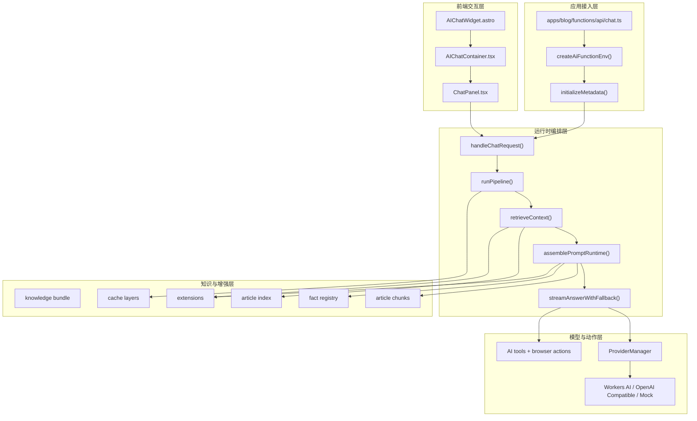

再用一张思维导图把各层能力展开：

```markmap
# @astro-minimax/ai 模块架构

## 请求处理层
- 速率限制
  - IP 级三窗口检查
  - Burst / Sustained / Daily
- 请求验证
  - 消息长度 ≤ 500
  - 历史消息 ≤ 20 条
- 缓存检测
  - 响应缓存 (public Q)
  - 搜索缓存 (public Q)
  - 会话缓存 (follow-up)

## 检索增强层
- 搜索管道
  - tokenize → scoreDocument → filterLowRelevance
  - applyAnchorFilter → applyPurityFilter
  - 可选 vector rerank / RRF
- 意图检测
  - 7 类意图分类
  - 文章重排
- 证据预算
  - simple / moderate / complex
  - 按答案模式二次调整
- Chunk 注入
  - selectRelevantChunks
  - expandChunkMatchesWithNeighbors
  - injectionCache 去重

## 智能分析层
- 关键词提取
  - 超时: 5s
  - 降级: 本地 tokenize
- 证据分析
  - 超时: 8s
  - 降级: 跳过
- 引用守卫
  - 隐私保护 (6 类模式)
  - URL 验证 (协议 + 域名 + XSS)
- 答案模式
  - fact / count / list
  - opinion / recommendation / unknown

## 提示构建层
- 静态层 (Static)
  - 身份定义
  - 约束条件
  - 来源分层 (L1-L5)
  - 回答模式指导
  - 预输出检查
- 半静态层 (Semi-Static)
  - 作者上下文
  - 博客概览
  - 最新文章
- 动态层 (Dynamic)
  - 相关文章 + 证据分析
  - 事实匹配 + chunk 注入
  - 扩展上下文 + 回答模式提示

## 模型调用层
- Provider Manager
  - Workers AI (weight: 100)
  - OpenAI Compatible (weight: 90)
  - Mock (weight: 0)
- 健康追踪
  - 失败阈值: 3
  - 恢复 TTL: 60s
- 故障转移
  - 同一请求内自动切换
  - Mock 兜底

## 工具调用层
- 6 个客户端工具
  - toggleTheme / navigateToArticle
  - scrollToSection / toggleReadingMode
  - highlightText / setPreference
- 1 个服务端工具
  - searchArticles
- 双端执行链路
  - ChatPanel → ActionExecutor → addToolOutput
```

如果只记一句话，我现在会把它描述成：

> `@astro-minimax/ai` 本质上是一套以 **knowledge bundle** 为底座、以 **chat-handler** 为总编排器、以 **prompt-runtime** 为装配中枢、以 **ProviderManager** 为生成引擎、以 **缓存与工具调用** 为加速层的博客 AI 运行时系统。

## 一、这套系统到底在解决什么问题

当前这套 AI 运行时，主要面对两类语义差别很大的对话。

第一类是**站点级全局问答**。用户会问技术栈、功能、部署方式、推荐文章，这类问题更依赖跨文章检索、作者上下文和公共问题缓存。

第二类是**文章页边读边聊**。用户已经在读某篇文章，问题往往是"这一节在讲什么""前面那句为什么这么写""帮我总结当前这部分"。这种场景如果只靠摘要，很容易答偏。当前版本真正把这件事做扎实的地方在于：除了 article context，运行时还会优先挑当前文章的原文 chunk 注入到 prompt 里。

把代码重新看一遍之后，我觉得当前版本最关键的几件事是：

- **构建时与运行时分离**：运行时不直接扫 Markdown，而是依赖 `datas/knowledge/runtime/knowledge-bundle.json` 这类预先生成好的知识资产。
- **请求解释先于检索**：系统不是拿到问题就盲搜，而是先做请求解释，再决定预算、是否复用上下文、回答模式和后续 prompt 约束。
- **能降级就别硬失败**：关键词提取失败可以回到本地 query，证据分析超时可以跳过，provider 不可用时可以降到 Mock，缓存命中时可以直接回放。
- **前端不是纯展示层**：`ChatPanel.tsx` 不只是显示流式文字，它还承担了 tool call 接收、动作映射和结果回传。只是实际执行浏览器动作的那只手，放在了 core 包的 `ActionExecutor` 里。

这四条原则对应的，其实是一个更完整的系统能力矩阵：

| 能力类别 | 具体功能 | 技术实现 | 降级策略 |
|----------|----------|----------|----------|
| 对话交互 | 流式文本生成 | SSE + streamText | Mock 兜底 |
| 上下文感知 | 文章级 RAG 检索 | 字段加权词法 + chunk 注入 | 本地 query |
| 智能分析 | 关键词提取 | 独立模型调用 | 本地 tokenize |
| 来源追踪 | 证据分析与引用 | 二次 LLM 调用 (8s) | 跳过 |
| 多供应商 | 自动故障转移 | ProviderManager | Mock |
| 隐私保护 | 敏感信息过滤 | CitationGuard + 6 类模式 | 直接拒答 |
| 会话缓存 | 上下文复用 | session-cache (TTL 10min) | 新搜索 |
| 公共缓存 | 响应回放 | response-cache + 模拟流 | 重新生成 |
| 动态预算 | 证据数量自适应 | EvidenceBudget | 默认 moderate |
| 回答模式 | 格式自动检测 | AnswerMode (7 种) | general |
| 阅读时间 | 文章时长展示 | Dynamic Layer | — |
| 动作执行 | 浏览器交互 | ToolCalling + ActionExecutor | — |

技术栈方面，当前核心依赖关系很清楚：AI SDK v6 提供 `streamText` / `useChat` / `tool()` 等基础能力；运行时兼容 Cloudflare Pages Functions 和 Node.js 两种模式；UI 层用 Preact（通过 `preact/compat` 兼容 `@ai-sdk/react`）。

## 二、应用接入层其实很薄

我很喜欢当前 app 接入这一层的薄度，因为它把"站点环境"与"AI 逻辑"分得比较干净。

`apps/blog/functions/api/chat.ts` 当前只有三步：

```ts
const env = createAiFunctionEnv(context.env);

initializeMetadata({ knowledgeBundle }, env);
return handleChatRequest({
  env,
  request: context.request,
  waitUntil: context.waitUntil,
});
```

这里面：

1. `createAiFunctionEnv()` 把 Cloudflare env 和 `SITE.ai` 默认配置合并起来，产出一个统一的 env 对象。
2. `initializeMetadata()` 把知识包初始化进运行态索引和 chunks。
3. `handleChatRequest()` 进入真正的 AI 主链路。

也就是说，blog app 提供的是**适配层**，不是业务核心。真正的检索、分析、prompt 装配、provider failover、缓存与通知，都收在 `@astro-minimax/ai` 包里。这种设计使得换一个宿主应用——比如从 Cloudflare Pages 换到 Vercel——只需要重写适配层，AI 包本身不用动。

## 三、目录结构：哪些目录真正在主流程里

当前 `packages/ai/src` 大致可以这样理解：

```text
/packages/ai/src
├── cache/                 # 响应缓存、全局缓存、注入去重等
├── components/            # Preact 聊天 UI
├── data/                  # knowledge bundle / author context 数据访问
├── extensions/            # searchable / facts / context / voice-style / semantic-fallback
├── fact-registry/         # 结构化事实匹配
├── intelligence/          # 请求解释、证据分析、引用守卫
├── middleware/            # rate limit / client IP
├── prompt/                # static / semi-static / dynamic prompt builder
├── provider-manager/      # provider config / adapter / health / failover
├── providers/             # mock provider 等辅助实现
├── query/                 # follow-up / intent 等基础 query 逻辑
├── search/                # article search / chunk search / rerank / session cache
├── server/                # chat-handler / prompt-runtime / metadata-init / stream-helpers
├── structured-output/     # Zod 驱动的结构化生成能力
├── tools/                 # AI SDK tools 定义与注册
├── utils/                 # i18n / logger / text / url
└── index.ts               # 包级导出面
```

这里最重要的变化，不是多了几个目录，而是几件事情的位置终于稳定了：

**`server/`** 现在是整条运行链的核心：`chat-handler.ts` 做总编排，`prompt-runtime.ts` 做装配，`metadata-init.ts` 做初始化，`stream-helpers.ts` 做流式输出。这四个文件基本覆盖了服务端 80% 的逻辑复杂度。

**`intelligence/`** 把所有"理解请求"的能力收在一起：关键词提取、证据分析、引用守卫、回答模式检测、证据预算、请求解释。它们不直接做检索，而是决定检索怎么跑、结果怎么用。

**`search/`** 纯粹负责召回和排序：`search-api.ts` 是入口，`scoring.ts` 做 TF-IDF 加权评分，`search-index.ts` 做索引构建，`vector-reranker.ts` 做可选的向量重排，`hybrid-search.ts` 做 chunk 级搜索，`session-cache.ts` 做会话缓存。

**`prompt/`** 只负责三层提示词的内容构建。真正把检索结果、facts、chunks、extensions 拼进这三层的逻辑，在 `server/prompt-runtime.ts` 里。

**`extensions/`** 提供了五种扩展类型（searchable、facts、context、voice-style、semantic-fallback），它们的注册表、加载器和注入器都在这个目录里。

**`cache/`** 现在包含四种缓存：全局搜索缓存（`global-cache.ts`）、响应缓存（`response-cache.ts`）、注入去重缓存（`injection-cache.ts`）和通用适配器。这比"系统有缓存"这个笼统说法精确得多。

**`tools/`** 使用 AI SDK 的 `tool()` 函数定义了 7 个工具，其中 6 个客户端工具 + 1 个服务端工具。

`query/` 不再只是随手塞在 intelligence 里的小工具，而是独立出来的 follow-up 检测、意图分类等基础 query 逻辑。

## 四、真实逻辑入口在哪里

如果从"代码怎么开始跑"这个角度看，当前真正的入口至少有五类：

| 入口类型 | 文件 / 函数 | 作用 |
|----------|-------------|------|
| 服务端请求入口 | `server/chat-handler.ts` → `handleChatRequest()` | 接收 `/api/chat` 请求并启动主链 |
| 元数据初始化入口 | `server/metadata-init.ts` → `initializeMetadata()` | 把知识包转成运行态索引和 chunks |
| UI 挂载入口 | `components/AIChatWidget.astro` | 把 AI 能力挂到 Astro 页面 |
| 客户端交互入口 | `components/ChatPanel.tsx` | 发送消息、处理工具调用、维护流式状态 |
| 本地开发入口 | `server/dev-server.ts` | 在本地独立跑完整 handler |

这也是为什么我一直不把 `src/index.ts` 当作"运行入口"看。它更像包级公共 API 面，不是整条业务链真正开始的地方。

## 五、服务端主链：`chat-handler.ts` 在做什么

`chat-handler.ts` 现在依然是系统复杂度最集中的位置，但它的角色已经更像一个**编排器**，而不是一个把所有活都写死的巨型函数。

主链大致可以概括成：

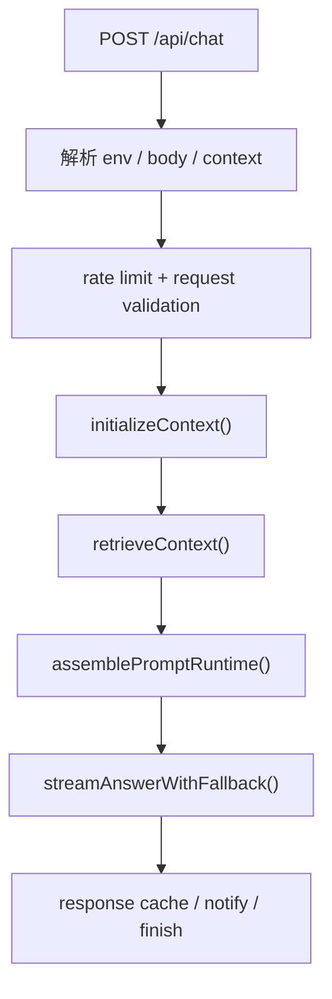

拆开看，它主要做这些事：处理 `OPTIONS` / `POST`、做 IP 级速率限制、解析消息体和语言、限制历史消息数量（`MAX_HISTORY_MESSAGES: 20`）与输入长度（`MAX_INPUT_LENGTH: 500`）、初始化 provider manager / cache / extensions / session key、决定是否命中公共问题缓存、检索上下文、装配系统提示词、走多 provider 流式输出，以及根据情况写缓存、补充来源和发通知。

这条链里我现在最认可的一点，是职责开始分散得比较合理了：检索、prompt runtime、stream handling、provider failover 都已经各有边界，不再全部糊在一个 handler 里。

下面这张完整的请求处理流图，能更清晰地展示各阶段之间的衔接：

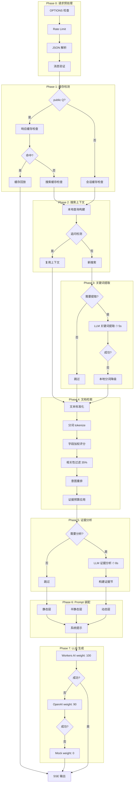

## 六、知识包初始化：为什么 `initializeMetadata()` 是显式前置步骤

当前版本里，`initializeMetadata()` 是一个非常关键的节点，因为它把"构建时产物"变成了"运行时可检索的数据结构"。

它做的核心事情有三件：

```ts
// packages/ai/src/server/metadata-init.ts（简化）

preloadKnowledgeBundle(config.knowledgeBundle);

const articleDocs: SearchDocument[] = knowledgeBundle.corpus.documents.map(
  (doc) => ({
    id: doc.id,
    title: doc.title,
    url: safeJoinUrl(siteUrl, doc.url ?? `/${doc.id}`),
    excerpt: doc.summary,
    content: doc.keyPoints.join(" "),
    categories: [doc.category].filter(Boolean),
    tags: doc.tags ?? [],
    keyPoints: doc.keyPoints ?? [],
    readingTime: doc.readingTime,
  })
);

initArticleIndex(articleDocs);
initProjectIndex([]);

const chunksData: Record<string, ArticleChunk[]> = /* passages → Map */;
initArticleChunks(chunksData);
```

也就是说，运行时真正消费的不是 Markdown 原文目录，而是这类已经预处理好的结构化资产。注意几个关键映射：`content` 字段用的是 `keyPoints.join(" ")` 而不是正文（正文太长，不适合做索引字段）；`readingTime` 是从构建时直接带过来的，运行时不需要再算。

这里要特别说一句：**当前示例博客运行时主要初始化的是文章索引。** 虽然 `searchProjects()` 这套接口在架构上存在，但 `initializeMetadata()` 目前实际调用的是 `initArticleIndex(articleDocs)` 和 `initProjectIndex([])`。所以如果从"能力设计"上说，项目检索是支持的；如果从"当前 app 已经实际装载的内容"来说，文章检索才是主角，project index 仍然更像保留好的扩展位。

初始化还有一层幂等保护：同一个 bundle 引用 + 同一个 siteUrl 只会初始化一次，后续调用直接 return。这在 Cloudflare 的 warm worker 复用场景下很重要。

## 七、检索层：现在已经不只是"搜几篇相关文章"

`searchArticles()` 当前的检索思路，我觉得更准确的说法不是"纯 TF-IDF"，而是：**字段加权的词法相关性召回打底，再叠加 anchor filter、purity filter、topic rerank，以及可选的向量重排 / hybrid。**

它当前大致会经历这些步骤：

1. `tokenize(query)` — 分词
2. `scoreDocument()` / `scoreDocs()` — 字段加权评分
3. `applyAnchorFilter()` — 代码锚点过滤
4. `filterLowRelevance()` — 低相关过滤（35% 阈值）
5. `applyPurityFilter()` — 纯度过滤
6. 根据 query 宽窄调整结果数
7. 可选 deep content — 首条结果远超第二名时拉取深度内容
8. 可选 vector rerank / hybrid / RRF

所以原先那种"一句话把它概括成 TF-IDF 搜索"的说法，现在已经不够用了。

### 字段权重与 IDF

`scoring.ts` 里定义了各字段权重：

```ts
// packages/ai/src/search/scoring.ts
const FIELD_WEIGHTS = {
  title: 8,       // 标题最重要
  keyPoints: 5,   // 关键点次之
  categories: 4,  // 分类匹配
  tags: 3,        // 标签匹配
  excerpt: 3,     // 摘要匹配
  content: 1,     // 正文权重最低
} as const;
```

| 字段 | 权重 | 说明 |
|------|------|------|
| `title` | 8 | 标题匹配即高度相关 |
| `keyPoints` | 5 | 关键点次之 |
| `categories` | 4 | 分类匹配 |
| `tags` | 3 | 标签匹配 |
| `excerpt` | 3 | 摘要匹配 |
| `content` | 1 | 正文最低，作补充 |

评分时还会叠加 IDF 权重（逆文档频率），罕见词的权重更高：

```
IDF(term) = log(N / (df + 1)) + 1
```

其中 N 是文档总数，df 是包含该词的文档数。最终的匹配得分 = 字段权重 × IDF。这就意味着，一个出现在标题里的罕见词，可以贡献 8 × 3.1 ≈ 24.8 分；而一个出现在正文里的常见词，只有 1 × 1.2 ≈ 1.2 分。

下面这张图展示了一个具体查询的 TF-IDF 评分过程：

```mermaid
flowchart LR
    subgraph 输入
        Q["查询: AI 学习教程"]
        D["文档: title + keyPoints + content"]
    end

    subgraph 分词
        Q --> Q1["tokenize"]
        Q1 --> Q2["ai 学习 教程"]
    end

    subgraph IDF
        Q2 --> IDF["getIDFWeight"]
        IDF --> W1["idf ai = 1.2 常见"]
        IDF --> W2["idf 学习 = 2.5 中等"]
        IDF --> W3["idf 教程 = 3.1 罕见"]
    end

    subgraph 加权评分
        W1 --> S1["title 含 ai: 8x1.2 = 9.6"]
        W3 --> S2["title 含教程: 8x3.1 = 24.8"]
        W2 --> S3["keyPoints 含学习: 5x2.5 = 12.5"]
        W1 --> S4["content 含 ai: 1x1.2 = 1.2"]
        W2 --> S5["content 含学习: 1x2.5 = 2.5"]
    end

    subgraph 总分
        SUM["score = 50.6"]
    end

    S1 --> SUM
    S2 --> SUM
    S3 --> SUM
    S4 --> SUM
    S5 --> SUM
```

### 深度内容检索

当首条结果得分显著高于第二条时，会自动拉取更长的内容：

```ts
// packages/ai/src/constants.ts
export const SEARCH = {
  DEEP_CONTENT_SCORE_THRESHOLD: 8,
  DEEP_CONTENT_MAX_LENGTH: 1500,
} as const;
```

条件是 `topScore >= 8 && topScore > secondScore * 1.5`——只有在第一名遥遥领先时才值得做深度提取。

### 会话级搜索缓存

检索结果在会话级别缓存，支持追问时复用上下文：

```ts
// 追问复用条件
export function shouldReuseSearchContext(params: {
  latestText: string;
  cachedContext: CachedSearchContext | undefined;
  userTurnCount: number;
  now: number;
}): boolean {
  if (!cachedContext) return false;
  if (userTurnCount <= 1) return false;
  if (now - cachedContext.updatedAt > SESSION_CACHE_TTL) return false; // TTL: 10min
  if (!isLikelyFollowUp(latestText)) return false;
  if (!hasQueryOverlap(latestText, cachedContext.query)) return false;
  if (hasNewSignificantTokens(latestText, cachedContext.query)) return false;
  return true;
}
```

只有全部条件满足——有缓存、多轮对话、没过期、是追问、有 query 重叠、没有新的重要 token——才复用。否则走新搜索。

### Chunk 注入管道

真正让"边读边聊"成立的，不是 article context 这几个字段本身，而是当前文章原文 chunk 被真正拉进了 prompt。在文章模式下，`prompt-runtime.ts` 会执行以下管道：

1. 优先找带 chunks 的文章
2. 如果当前文章没出现在搜索结果里，按 slug 主动取 chunks
3. 用 `selectRelevantChunks()` 选段
4. 短 query 时用 `expandChunkMatchesWithNeighbors()` 带上前后邻段
5. 当前文章的 chunks 优先排前面
6. 用 `injectionCache` 做 session 级去重
7. 格式化成 `chunksSection` 注入 dynamic layer

```ts
// packages/ai/src/constants.ts
export const CHUNK_INJECTION = {
  MAX_TOKENS: 1500,
  MIN_CHUNK_SCORE: 0.2,
  MAX_CHUNKS_PER_ARTICLE: 2,
} as const;
```

当前文章模式下 `MAX_CHUNKS_PER_ARTICLE` 会翻倍（×2），因为需要更多当前文章的段落来支撑精确回答。

## 八、请求解释层：为什么我现在更看重它

我后来看这套链路，越来越觉得真正决定回答质量的，不只是搜索召回，而是**先把问题理解成什么类型**。

当前与此相关的几块能力包括：`buildLocalSearchQuery()`、`shouldRunKeywordExtraction()`、`extractSearchKeywords()`、`resolveSearchInterpretation()` 和 `interpretRequest()`。

`interpretRequest()` 会产出一组很关键的中间判断：

```ts
// packages/ai/src/intelligence/request-interpretation.ts
export interface RequestInterpretation {
  conversation: {
    shouldReuseContext: boolean;  // 是否复用 session 搜索上下文
  };
  topic: {
    primary: QueryIntentCategory; // 7 类意图之一
  };
  answer: {
    contract: AnswerMode;         // 7 种回答模式之一
  };
  safety: {
    decision: SafetyDecision;     // allow / constrain / refuse
    reason?: SafetyReason;        // privacy / policy / ...
  };
  reasoning: {
    complexity: QueryComplexity;  // simple / moderate / complex
  };
}
```

这些判断后面会继续影响是否复用 session search context、budget 怎么算、结果怎么塑形、prompt 里怎么约束回答格式，以及是否要提前拒答。所以我现在不太把这部分看成"几个小工具函数"，而更愿意把它叫作整条链的**解释层**。

### 复杂度分类

```ts
function classifyQueryComplexity(text: string): QueryComplexity {
  const trimmed = text.trim();
  if (!trimmed || trimmed.length <= 10) return 'simple';
  if (trimmed.length > 80) return 'complex';
  const tokenCount = trimmed.split(/\s+/).filter(Boolean).length;
  if (tokenCount <= 1) return 'simple';
  if (tokenCount >= 5) return 'complex';
  return 'moderate';
}
```

### 关键词提取：什么时候跑 LLM，什么时候跳过

关键词提取不是每次都跑，而是有明确的条件控制：

```ts
// packages/ai/src/intelligence/keyword-extract.ts
export function shouldRunKeywordExtraction(params: {
  messageCount: number;
  localQuery: string;
  latestText: string;
}): boolean {
  if (messageCount < 3) return false;        // 前两轮不提取
  if (latestText.length < 10) return false;   // 太短不提取
  const tokens = tokenize(localQuery || latestText);
  if (tokens.length >= 3) return false;       // 本地分词已经够清晰
  return true;
}
```

只有多轮对话（≥ 3 条消息）、文本不太短（≥ 10 字）、本地分词结果不够好（< 3 tokens）时，才会花 5s 超时预算去跑一次 LLM 关键词提取。失败则降级到本地 tokenize。

### 答案模式检测

`resolveAnswerMode()` 根据查询中的关键词模式，决定回答的格式期望：

```ts
// packages/ai/src/intelligence/citation-guard.ts
export function resolveAnswerMode(query: string): AnswerMode {
  const q = query.toLowerCase();
  if (hasPrivacyIntent(query)) return 'unknown';
  if (/几次|多少|几篇|数量|count|how many/u.test(q)) return 'count';
  if (/哪些|哪几个|列表|列举|list|what are/u.test(q)) return 'list';
  if (/怎么看|怎么想|看法|观点|opinion|think about/u.test(q)) return 'opinion';
  if (/推荐|建议|suggest|recommend/u.test(q)) return 'recommendation';
  if (/是什么|什么是|介绍|解释|what is|explain/u.test(q)) return 'fact';
  if (/有没有|是否|是不是|真的吗|does|is there/u.test(q)) return 'fact';
  return 'general';
}
```

| 模式 | 触发词 | 回答风格 |
|------|--------|----------|
| `fact` | 是什么、什么是 | 先给结论，再补依据 |
| `count` | 多少、几篇、数量 | 第一句先说数字 |
| `list` | 哪些、哪几个、列表 | 直接列出 2-6 项 |
| `opinion` | 怎么看、观点、看法 | "我觉得" + 2-3 个观点 |
| `recommendation` | 推荐、建议 | 2-4 个推荐项 + 理由 |
| `unknown` | 隐私类查询 | 第一句含"未公开"，1-2 句收尾 |
| `general` | 默认 | 常规回答 |

### 动态证据预算

根据复杂度和答案模式，系统会动态调整检索资源：

```ts
const BUDGET_PRESETS: Record<QueryComplexity, EvidenceBudget> = {
  simple: {
    maxArticles: 4,
    summaryMaxLength: 48,
    keyPointsMaxCount: 2,
    enableDeepContent: false,
    analysisMaxTokens: 200,
  },
  moderate: {
    maxArticles: 6,
    summaryMaxLength: 56,
    keyPointsMaxCount: 3,
    enableDeepContent: true,
    analysisMaxTokens: 360,
  },
  complex: {
    maxArticles: 8,
    summaryMaxLength: 64,
    keyPointsMaxCount: 4,
    enableDeepContent: true,
    analysisMaxTokens: 500,
  },
};
```

预算还会根据答案模式进一步调整：count 模式减少文章数、list 模式增加文章数、opinion 模式减少分析 token 等。

## 九、Prompt Runtime：现在真正的装配中枢是谁

如果说 `chat-handler.ts` 是总编排器，那么当前真正负责"把回答材料装起来"的中枢，就是 `server/prompt-runtime.ts`。

我现在更愿意把 prompt 体系分成两层来看：

1. `prompt/*` 负责构建 static / semi-static / dynamic 三层**内容**。
2. `prompt-runtime.ts` 负责把检索结果、facts、扩展、当前文章上下文、chunk 注入和 guard **拼进**这三层 builder。

这个区别很重要。因为今天的 prompt 系统，已经不能简单理解成"几个 prompt template 文件"。真正决定最终系统提示词长什么样的，是运行时装配过程。

`assemblePromptRuntime()` 做的事非常重：

1. 如果有真实 provider，运行证据分析（带 8s 超时）
2. 解析 prompt guards（隐私拒答、引用预检）
3. 匹配事实注册表（facts），合并扩展 facts
4. 解析语音风格模式（voice-style）
5. 处理 chunk 注入（selectRelevantChunks → expandChunkMatchesWithNeighbors → injectionCache 去重 → formatChunksForInjection）
6. 调用 `buildRuntimeSystemPrompt()` 把所有内容装进三层 builder

三层提示词的内容分别是：

**静态层**（几乎不变）：身份定义、回答格式、约束条件、来源分层（L1-L5）、回答模式指导、预输出检查。

**半静态层**（构建时固定）：作者上下文（author-context.json）、博客概况（文章数、分类、最新文章列表）。

**动态层**（每次请求生成）：相关文章、相关项目、证据分析结果、事实匹配结果、chunk 注入、扩展上下文、回答模式提示。

下面是三层构建流程的可视化：

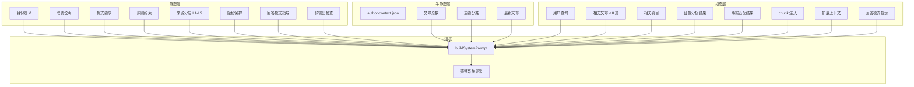

### 来源分层（Source Layers）

静态层里有一组 L1-L5 的来源优先级定义：

```markmap
# 来源分层 Source Layers

## L1: 原始博客内容
- 标题、摘要、要点、正文节选
- 最高优先级
- 必须来自相关文章部分

## L2: 策划数据
- 作者简介
- 项目列表
- 博客概况

## L3: 结构化事实
- 标签统计
- 分类聚合
- 推导数据

## L4: 外部验证来源
- 官方文档
- GitHub 仓库
- 需标注引用

## L5: 语言风格
- 仅影响表达方式
- 不作为事实依据
```

我觉得动态层现在最有价值的一点，是终于开始真正避免"重复灌水"。当 chunk 已经足够细时，就少重复摘要；当 facts 命中时，单独成节；当扩展匹配时，把上下文章节插到正确位置；最后再追加 answer mode hint。这比"把所有上下文都塞进 prompt 里"成熟得多。

## 十-A、扩展系统：可插拔的知识与风格

扩展系统现在已经深入主链路，我自己也不再把它当作实验功能看待。当前 `extensions/` 目录包含五个核心文件：`types.ts`（接口定义）、`registry.ts`（注册表）、`loader.ts`（加载器）和 `injector.ts`（注入器）。它们遵循的是"存在则增强，不存在也不阻塞主流程"的策略。

### 五种扩展类型

| 类型 | 数据接口 | 用途 |
|------|----------|------|
| `searchable` | `SearchableData` — documents + 可选 reranking | 注入额外的可搜索文档 |
| `facts` | `FactsData` — facts + categories | 注入验证过的结构化事实 |
| `context` | `ContextData` — sectionTitle + content + position | 在 dynamic layer 指定位置插入自定义上下文章节 |
| `voice-style` | `VoiceStyleData` — modes + defaultMode + overallTone | 根据 query 或分类切换表达风格 |
| `semantic-fallback` | `SemanticFallbackData` — rules + patterns | 对原 query 做模式匹配的语义回退或重写 |

### 扩展注册表

`ExtensionRegistry` 是单例实现，提供注册、查询和加载能力：

```ts
// packages/ai/src/extensions/types.ts
interface Extension<T extends ExtensionData = ExtensionData> {
  id: string;
  type: ExtensionType;
  name: string;
  description?: string;
  enabled?: boolean;
  priority: number;
  data: T;
}

interface ExtensionRegistryInterface {
  register<T extends ExtensionData>(extension: Extension<T>): void;
  unregister(id: string): void;
  get<T extends ExtensionData>(id: string): Extension<T> | undefined;
  getAll(): Extension[];
  getByType(type: ExtensionType): Extension[];
  getLoadedExtensions(): LoadedExtensions;
}
```

加载后的扩展会被组织成 `LoadedExtensions` 结构：

```ts
interface LoadedExtensions {
  searchable: Map<string, SearchableData>;
  facts: Map<string, FactsData>;
  context: ContextData[];
  voiceStyle: VoiceStyleData | null;    // 多个扩展合并，取最高优先级
  semanticFallback: SemanticFallbackRule[];  // 编译好的 RegExp
}
```

注意 `voiceStyle` 是 `VoiceStyleData | null` 而不是 `Map`，这是因为多个 voice-style 扩展会按 `priority` 合并，只保留最高优先级的那个。

### 扩展加载

扩展在首次请求时按需加载：

```ts
// packages/ai/src/server/metadata-init.ts
export async function initializeExtensions(basePath?: string): Promise<void> {
  if (extensionsLoaded) return;
  extensionsLoaded = true;
  const { loadExtensions } = await import("../extensions/loader.js");
  await loadExtensions("datas/extensions/*.json", basePath);
}
```

幂等保护 + glob 模式加载，这意味着扩展文件不存在也不会报错，只是静默跳过。

### 注入器函数

`injector.ts` 提供了四个核心注入函数，这些函数在主链路中被直接调用：

```ts
// 根据查询和分类匹配语音风格模式
resolveVoiceStyleMode(query, categories, extensions): VoiceStyleMode | null

// 构建语音风格 prompt 片段
buildVoiceStylePrompt(mode, extensions): string

// 获取语义回退规则匹配
getSemanticFallback(query, extensions): { query, primaryQuery?, complexity? } | null

// 合并扩展搜索文档到基础搜索结果
mergeSearchDocuments(baseDocuments, extensions): ArticleContext[]

// 合并扩展事实到基础事实列表
mergeFacts(baseFacts, extensions): Fact[]
```

`getSemanticFallback()` 的实现比较有意思——它支持捕获组替换。如果 fallbackQuery 包含 `$1`、`$2` 之类的占位符，会用正则匹配的结果来替换：

```ts
function replaceCaptureGroups(template: string, match: RegExpMatchArray): string {
  return template.replace(/\$(\d+)/g, (_, groupIndex: string) => {
    const index = parseInt(groupIndex, 10);
    return match[index] ?? '';
  });
}
```

这意味着可以定义像 `"部署 $1 到 $2"` 这样的规则，匹配 `"部署 Next.js 到 Vercel"` 后，自动重写为 `"Next.js Vercel 部署"`。

### context 扩展的位置控制

`context` 类型扩展支持 `position` 字段，可以精确控制注入位置：

```ts
type ContextPosition = 'before-articles' | 'after-articles' | 'before-facts' | 'after-facts';
```

同时支持 `matchCondition` 来控制何时生效：

```ts
interface MatchCondition {
  queryPatterns?: RegExp[];   // 匹配查询文本
  categories?: string[];     // 匹配文章分类
  tags?: string[];           // 匹配标签
}
```

只有当 `matchCondition` 全部满足（或未设置）时，上下文章节才会被注入到 dynamic layer。`content` 字段还支持函数形式，接收 `PromptContext` 参数动态生成内容。

## 十-B、结构化输出：Zod 驱动的类型安全生成

`structured-output/` 提供了基于 Zod schema 的结构化生成能力。它不是聊天主链的固定步骤，而是一个可复用的基础层，适合给 evidence analysis、facts extraction 或其他需要 schema 驱动输出的 AI 子任务使用。

### 核心接口

```ts
// packages/ai/src/structured-output/types.ts
interface StructuredOutputConfig<T> {
  schema: z.ZodSchema<T>;
  schemaName?: string;
  schemaDescription?: string;
  fallbackParser?: (rawText: string) => T | null;
  repairStrategy?: 'strict' | 'lenient' | 'none';
  timeoutMs?: number;
  maxOutputTokens?: number;
  temperature?: number;
}

interface StructuredOutputResult<T> {
  data: T | null;
  success: boolean;
  status: StructuredOutputStatus;
  fallbackUsed: boolean;
  rawText?: string;
  error?: string;
  usage?: TokenUsageStats;
}
```

### generateStructured 函数

`generateStructured<T>() 是核心入口，它的执行策略是多层降级：

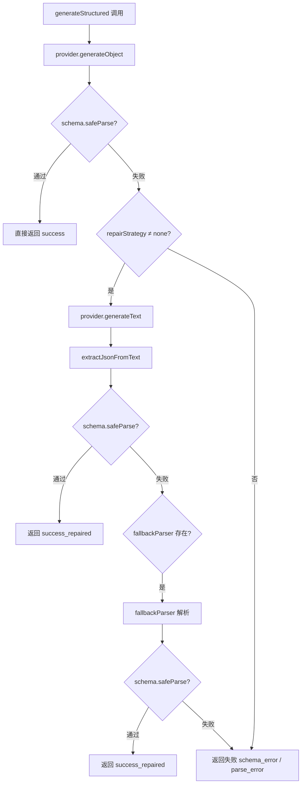

也就是说，它先尝试 `generateObject`（如果 provider 支持），再尝试 `generateText` + JSON 提取 + schema 验证，最后尝试自定义 `fallbackParser`。三级降级确保即使在不完美的 provider 环境下也能产出结构化数据。

当前内建的 schema 是 `EvidenceAnalysisSchema`，用于 evidence analysis 阶段：

```ts
// packages/ai/src/structured-output/schemas/evidence.ts
export const EvidenceAnalysisSchema = z.object({
  questionType: z.enum(['fact', 'list', 'count', 'timeline',
                          'recommendation', 'opinion', 'mixed', 'unknown']),
  directAnswer: z.string(),
  entities: z.array(z.object({
    name: z.string(),
    relation: z.string(),
    status: z.string(),
    count: z.number().int().positive().optional(),
    countMode: z.enum(['exact', 'at_least', 'unknown']).optional(),
    note: z.string().optional(),
    evidenceUrls: z.array(z.string()),
  })).max(6),
  keyFindings: z.array(z.object({
    claim: z.string(),
    confidence: z.enum(['high', 'medium', 'low']),
    evidenceUrls: z.array(z.string()),
  })).max(4),
  uncertainties: z.array(z.string()).max(6),
  recommendedUrls: z.array(z.string()).max(3),
});
```

这个 schema 本质上是让 evidence analysis 阶段从非结构化的 LLM 输出，转成结构化的分析结果——直接回答、实体列表、关键发现、不确定性和推荐链接。有了这层 schema 校验，后续流程对分析结果的消费可以更有信心。

## 十-C、流式输出：现在发出的已经不只是文字

`stream-helpers.ts` 这一层，现在也早就不是"把 token 往外吐"这么简单了。

当前流里真正能观察到的内容，主要包括：

- `message-metadata` — 告诉前端当前处理状态（检索中 / 生成中 / 完成）
- `source-url` — 展示来源文章链接
- `data-source-snippet` — 展示来源摘要片段
- `text-start` — 正文开始标记
- `text-delta` — 正文增量文本
- `text-end` — 正文结束标记
- `finish` — 收尾事件

这些事件对应的类型定义大致如下：

```ts
interface TextStartMessage { type: "text-start" }
interface TextDeltaMessage { type: "text-delta"; data: string }
interface TextEndMessage { type: "text-end" }
interface SourceMessage { type: "source-url"; url: string; title: string }
interface SnippetMessage { type: "data-source-snippet"; snippet: string }
interface MetadataMessage { type: "message-metadata"; messageMetadata: ChatStatusData }
interface FinishMessage { type: "finish"; finishReason: string }
```

其中，`message-metadata` 用来告诉前端现在是在检索（progress: 40）、生成（progress: 60）、降级（progress: 80）还是完成（progress: 100）。这一点我想特地说清楚，是因为很多文档会写成很泛的"source articles""text chunks"，从用户理解上没问题，但从协议层面就不够精确了。如果是面向维护者写文档，最好还是直接用当前代码里的事件名。

### 响应缓存回放

响应缓存命中时，现在也不是"一下子把整段答案吐出来"，而是会按两个阶段模拟回放：`thinking` 和 `response`。

```ts
// packages/ai/src/cache/response-cache.ts
export const DEFAULT_RESPONSE_CACHE_CONFIG: ResponseCacheConfig = {
  enabled: false,
  defaultTtl: 3600,
  playbackDelayMs: 20,
  chunkSize: 15,
  thinkingPlaybackDelayMs: 5,
};
```

| 配置项 | 环境变量 | 默认值 | 说明 |
|--------|----------|--------|------|
| `enabled` | `AI_CACHE_ENABLED` | `false` | 是否启用 |
| `defaultTtl` | `AI_CACHE_TTL` | `3600` | 缓存 TTL（秒） |
| `playbackDelayMs` | `AI_CACHE_PLAYBACK_DELAY` | `20` | 回放块间延迟（ms） |
| `chunkSize` | `AI_CACHE_CHUNK_SIZE` | `15` | 每块字符数 |
| `thinkingPlaybackDelayMs` | `AI_CACHE_THINKING_DELAY` | `5` | thinking 回放延迟（ms） |

这套回放对用户体验的意义，其实比"是否更真实"还大一点。它至少保证缓存命中时的交互节奏，不会和正常生成完全断层。

## 十一、Provider Manager：把模型调用从业务里剥开

`ProviderManager` 现在已经很像一个独立的小调度层了。它做的事并不是简单的"有 A 就先试 A，失败再试 B"，而是把 provider config 解析、adapter 构造、配置校验、可用 provider 筛选、health 状态跟踪、failover 和 mock fallback 都收了进去。

### 配置解析优先级

当前 provider 配置最好这样理解：

- **第一层：`AI_PROVIDERS` JSON**。如果存在且能正确解析，会优先采用这一组 provider 配置。
- **第二层：传统环境变量**。如果没有可用的 `AI_PROVIDERS`，才回退到 `AI_BASE_URL`、`AI_API_KEY`、`AI_MODEL`、`AI_KEYWORD_MODEL`、`AI_EVIDENCE_MODEL`、`AI_BINDING_NAME`、`AI_WORKERS_MODEL` 这类变量。

这里我想特地纠正一个很容易说顺嘴但不够准确的说法：这不叫"配置来源也参与 provider 优先级排序"。更准确的说法应该是：**provider 配置的解析入口有优先级；进入运行态之后，实际 provider 调用顺序由 `weight` 决定。** 这两个层次最好不要混在一起说。

### 运行态 failover

按当前默认配置逻辑，Workers AI 的默认 `weight` 是 100，OpenAI Compatible 是 90（`DEFAULT_WEIGHT - 10`），Mock 是内建 fallback，不参与普通 provider parse。当前同一请求内就可以完成 failover，不需要等下一个请求再切。

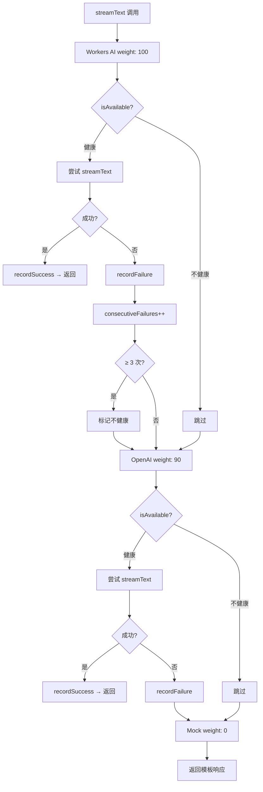

### 健康追踪

每个 provider 维护独立的健康状态：

```ts
interface ProviderHealth {
  healthy: boolean;
  consecutiveFailures: number;
  totalRequests: number;
  successfulRequests: number;
  lastError?: string;
  lastErrorTime?: number;
  lastSuccessTime?: number;
  lastChecked: number;
}
```

关键配置（来自 `constants.ts`）：

- `HEALTH.UNHEALTHY_THRESHOLD = 3` — 连续失败 3 次标记不健康
- `HEALTH.RECOVERY_TTL = 60000` — 60 秒后自动尝试恢复

健康恢复机制：provider 被标记为不健康后，经过 60 秒冷却，下次请求时会尝试恢复（`isInRecovery` → 成功后 `markAsRecovered`）。这意味着一个临时故障的 provider 不会永远被跳过。

## 十二、工具调用：从"能调工具"到"真正能完成动作"

当前 Tool Calling 已经不是"模型能输出一个 tool name"这么浅的一层，而是形成了一条真正闭环的双端链路。

### 7 个内建工具

`packages/ai/src/tools/action-tools.ts` 里，当前内建的 7 个工具是：

| 工具名 | 类型 | 执行位置 | 功能 |
|--------|------|----------|------|
| `toggleTheme` | 客户端工具 | 浏览器 | 切换 light / dark / system |
| `navigateToArticle` | 客户端工具 | 浏览器 | 按 slug 跳转文章 |
| `scrollToSection` | 客户端工具 | 浏览器 | 滚动到指定章节 |
| `toggleReadingMode` | 客户端工具 | 浏览器 | 切换阅读模式 |
| `highlightText` | 客户端工具 | 浏览器 | 高亮文章中的文本 |
| `setPreference` | 客户端工具 | 浏览器 | 设置用户偏好 |
| `searchArticles` | 服务端工具 | AI server | 搜索文章 + 项目 |

每个工具用 AI SDK 的 `tool()` 函数 + Zod schema 定义，`searchArticles` 具有 `execute` 函数（服务端执行），其余 6 个只有 schema（由浏览器端 `ActionExecutor` 处理）。

### 执行流程

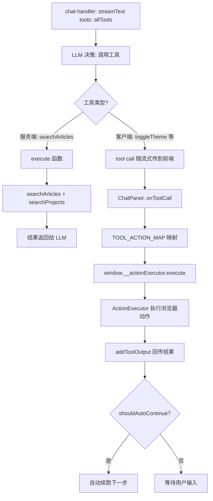

这里也有一个需要说细一点的地方：`searchArticles` 的服务端执行逻辑会复用主检索那套 `searchArticles()` / `searchProjects()`；但在当前示例博客里，实际主要还是 article corpus 在发挥作用，project search 这条接口是有的，只是当前 app 默认没有把独立 project index 装起来。

我特别喜欢这一点：AI 包负责理解和调度，core 包负责实际执行浏览器动作。两边的边界非常清楚。

### TOOL_ACTION_MAP：工具名到浏览器动作的映射

`ChatPanel.tsx` 里的 `TOOL_ACTION_MAP` 是客户端工具的真正入口。它把模型返回的工具调用参数，翻译成 `ActionExecutor` 能理解的动作对象：

```ts
// packages/ai/src/components/ChatPanel.tsx
const TOOL_ACTION_MAP: Record<
  string,
  (input: Record<string, unknown>) => { type: string; payload: Record<string, unknown> }
> = {
  toggleTheme: (i) => ({ type: 'toggle-theme', payload: { theme: i.theme } }),
  navigateToArticle: (i) => ({
    type: 'navigate',
    payload: {
      slug: i.slug,
      lang: (i.lang as string) || 'zh',
      then: i.sectionId
        ? [{ type: 'scroll-to-section', payload: { sectionId: i.sectionId } }]
        : undefined,
    },
  }),
  scrollToSection: (i) => ({
    type: 'scroll-to-section',
    payload: {
      sectionId: i.sectionId,
      highlight: i.highlight ?? true,
      behavior: i.behavior ?? 'smooth',
    },
  }),
  toggleReadingMode: (i) => ({
    type: 'toggle-reading-mode',
    payload: {
      enabled: i.enabled,
      settings: {
        ...(i.fontSize ? { fontSize: i.fontSize } : {}),
        ...(i.fontFamily ? { fontFamily: i.fontFamily } : {}),
      },
    },
  }),
  highlightText: (i) => ({
    type: 'highlight-text',
    payload: {
      text: i.text,
      selector: i.selector,
      style: i.style ?? 'accent',
      duration: i.duration ?? 3000,
      scrollIntoView: i.scrollIntoView ?? false,
    },
  }),
  setPreference: (i) => ({ type: 'set-preference', payload: { key: i.key, value: i.value } }),
};
```

这里有几个值得单独拎出来说的细节：

**`navigateToArticle` 的跨页动作链**：注意 `payload` 里有个 `then` 字段。当模型同时指定了 `sectionId` 时，它不会只跳转到文章页就结束，而是会生成一个后续动作（`scroll-to-section`），由 `ActionExecutor` 在页面加载完成后继续执行。这是一个轻量级的跨页动作队列——不需要什么消息总线或全局 store，就是一个 `then` 数组。

**`scrollToSection` 的双模式**：`behavior` 支持 `smooth`（平滑滚动）和 `instant`（瞬移）两种模式，`highlight` 控制滚到位之后是否还要做高亮。这意味着模型可以根据用户意图决定是"带你看过去"还是"直接跳过去"，以及"要不要帮你标出来"。

**`highlightText` 的生命周期**：`duration` 默认 3000ms（3 秒后自动消失），设 `0` 则永久保持。`style` 支持 `accent` / `warning` / `info` / `success` 四种视觉风格，让不同类型的高亮有视觉区分。`scrollIntoView` 则控制是否在元素不在视口内时自动滚动过去。

**`toggleReadingMode` 的字体定制**：这个工具允许模型在开启阅读模式的同时设置 `fontSize`（sm/md/lg/xl）和 `fontFamily`，说明它不只是个开关，而是把阅读体验的一部分控制权交给了 AI。

### 自动续跑决策

工具执行完成后，`shouldAutoContinueAfterToolCalls()` 会决定模型是否需要自动进行下一步。比如 `navigateToArticle` 之后通常不需要续跑（已经跳转了），但 `highlightText` 之后可能还需要模型补一句描述。这个决策逻辑让工具调用链不会"卡住"，也不会盲目空转。

## 十三、前端组件：为什么 `ChatPanel.tsx` 已经是重模块

### AIChatWidget.astro

`AIChatWidget.astro` 是 Astro 侧入口，但职责其实很克制：读取配置、处理语言与上下文、挂载到页面。它自己不负责聊天主逻辑，这个边界当前保持得不错。

```astro
---
import { SITE } from "virtual:astro-minimax/config";
import AIChatContainer from "./AIChatContainer.js";

interface Props {
  lang?: string;
  articleContext?: ArticleChatContext;
}

const { lang = SITE.lang ?? "zh", articleContext } = Astro.props;
const aiEnabled = SITE.ai?.enabled ?? false;

const aiConfig = {
  enabled: aiEnabled,
  mockMode: SITE.ai?.mockMode ?? true,
  apiEndpoint: SITE.ai?.apiEndpoint || "/api/chat",
  welcomeMessage: SITE.ai?.welcomeMessage,
  placeholder: SITE.ai?.placeholder,
  lang,
};
---

{aiEnabled && (
  <AIChatContainer
    client:only="preact"
    config={aiConfig}
    articleContext={articleContext}
  />
)}
```

使用 `client:only="preact"` 意味着组件不会在服务端渲染，不会阻塞页面首次加载。

### AIChatContainer.tsx

`AIChatContainer.tsx` 更像状态壳层，负责面板开关、浮动按钮状态和 `window.__aiChatToggle` 之类的全局挂载。它的价值在于把 UI 容器和聊天逻辑隔开，而不是自己去接 transport 或 tool call。

### ChatPanel.tsx

真正的重活基本都落在 `ChatPanel.tsx` 这里：根据 article/global 模式准备 context、生成 session id、构造 `DefaultChatTransport`、管理 welcome message / quick prompts、接收 tool calls、调用浏览器动作执行器、回传 tool output、mock mode 下做本地模拟流，以及处理自动续跑。如果只从组件复杂度来评价，`ChatPanel.tsx` 现在就是前端这一侧最重的模块。

`useChat` 的配置大致如下：

```ts
const transport = useMemo(() => new DefaultChatTransport({
  api: config.apiEndpoint ?? '/api/chat',
  prepareSendMessagesRequest: ({ id, messages: msgs }) => ({
    headers: { 'x-session-id': sessionId },
    body: {
      id,
      messages: msgs,
      lang,
      context: articleContext
        ? { scope: 'article' as const, article: articleContext }
        : { scope: 'global' as const },
    },
  }),
}), [config.apiEndpoint, sessionId, articleContext, lang]);

const {
  messages,
  sendMessage,
  setMessages,
  regenerate,
  status,
  error,
} = useChat({
  transport,
  onError: (err) => console.error('[ChatPanel] Chat error:', err.message),
});
```

当模型发起 tool call 时，前端会通过 `TOOL_ACTION_MAP` 把工具名映射成站点动作，最终由 `window.__actionExecutor.execute(action)` 在浏览器里执行，然后通过 `addToolOutput()` 把结果回传给模型。`shouldAutoContinueAfterToolCalls` 决定是否自动续跑下一步。

### 流式渲染：`useTypewriter` 打字机效果

`ChatPanel.tsx` 本身不做文本渲染——真正负责"文字一个个冒出来"这种感觉的，是 `MessageBubble.tsx` 里的 `useTypewriter` hook。

```ts
// packages/ai/src/components/MessageBubble.tsx
const TYPEWRITER_SPEED_MS = 25;   // 每帧间隔
const TYPEWRITER_BATCH_SIZE = 1;  // 基础步进

export function useTypewriter(fullText: string, isStreaming: boolean): string {
  const [displayedLength, setDisplayedLength] = useState(0);
  const animationRef = useRef<number | null>(null);

  // 核心动画循环
  useEffect(() => {
    if (!isStreaming) return;

    let lastTime = performance.now();
    const animate = (currentTime: number) => {
      const elapsed = currentTime - lastTime;

      if (elapsed >= TYPEWRITER_SPEED_MS) {
        setDisplayedLength(prev => {
          const targetLength = fullText.length;
          if (prev >= targetLength) return prev;
          const behind = targetLength - prev;
          // 落后太多时加速追赶（最多 5 个字符/帧）
          const speed = behind > 20 ? Math.min(behind, 5) : TYPEWRITER_BATCH_SIZE;
          return Math.min(prev + speed, targetLength);
        });
        lastTime = currentTime;
      }

      animationRef.current = requestAnimationFrame(animate);
    };

    animationRef.current = requestAnimationFrame(animate);
    return () => {
      if (animationRef.current) cancelAnimationFrame(animationRef.current);
    };
  }, [isStreaming, fullText]);
  // ...
}
```

这个 hook 有几个比较巧的设计：

**自适应追赶**：当渲染进度落后全文长度超过 20 个字符时，会自动提速到每帧 5 个字符。这意味着如果模型突然吐了一大段（比如代码块），用户不会等太久才看到内容跟上。

**代码块边界保护**：在裁切显示文本时，`useTypewriter` 会检查切点附近是否有 ` ``` ` 围栏。如果在切点前 2 个字符到切点后 3 个字符之间发现了围栏开始标记，它会扩展到围栏语言标识行的末尾。这避免了代码块语法在渲染过程中出现断裂。

**流结束即全量**：`isStreaming` 变为 `false` 时，立即把 `displayedLength` 设为 `fullText.length`，同时取消 `requestAnimationFrame`。这保证流结束时不会留下一截空白。

**`MessageBubble` 双通道渲染**：`useTypewriter` 实际上在 `AssistantMessage` 组件里被调用了两次——一次给正文文本，一次给 reasoning（推理过程）。两个通道独立控制渲染进度，意味着推理过程可以比正文慢一拍，形成"先想后说"的视觉节奏。

```ts
// packages/ai/src/components/MessageBubble.tsx
const displayedText = useTypewriter(effectiveText, isStreaming ?? false);
const reasoningDisplayed = useTypewriter(reasoningFullText, isStreaming ?? false);
```

这套打字机效果不依赖 CSS animation 或 `setInterval`，纯粹用 `requestAnimationFrame` 驱动，在帧率稳定性上比定时器方案好很多，而且不需要在组件卸载时手动清理 `setInterval` 的返回值。

## 十四、缓存：这条链已经不止一种缓存了

我现在不太会再笼统地说"系统有缓存"，因为当前缓存明显已经分层了。至少有下面四类：

### 1. Session Search Context Cache

支持追问时的上下文复用。TTL 600 秒（10 分钟）。

条件：多轮对话 + 是追问 + 有 query 重叠 + 没有新的重要 token。

### 2. Global Search Cache

对公共问题的检索结果做缓存，按问题类型设定不同 TTL：

| 问题类型 | TTL | 说明 |
|----------|-----|------|
| `tech`（技术栈） | 86400s (24h) | 技术栈不会频繁变 |
| `recommend`（推荐） | 1800s (30min) | 推荐可以稍短 |
| `build`（搭建） | 86400s (24h) | 搭建方式比较稳定 |
| `summary`（总结） | 14400s (4h) | 文章内容可能更新 |
| `author`（作者） | 86400s (24h) | 作者信息稳定 |
| `about`（关于） | 86400s (24h) | 关于信息稳定 |

### 3. Response Cache

对整段 AI 回答做缓存，并支持两段式模拟回放（thinking + response）。

```ts
// packages/ai/src/cache/response-cache.ts
export const DEFAULT_RESPONSE_CACHE_CONFIG: ResponseCacheConfig = {
  enabled: false,         // AI_CACHE_ENABLED
  defaultTtl: 3600,       // AI_CACHE_TTL
  playbackDelayMs: 20,    // AI_CACHE_PLAYBACK_DELAY
  chunkSize: 15,          // AI_CACHE_CHUNK_SIZE
  thinkingPlaybackDelayMs: 5, // AI_CACHE_THINKING_DELAY
};
```

只有被 `detectPublicQuestion()` 识别为公共问题的请求，才会写入响应缓存。

### 4. Injection Cache

避免同一个 session 里重复把相同 chunks 一直塞进 prompt。

```ts
// packages/ai/src/cache/injection-cache.ts
const DEFAULT_TTL = 10 * 60 * 1000; // 10 分钟
const MAX_CACHE_SIZE = 100;          // 最多 100 个 session

class InjectionCacheManager {
  filterNewChunks(sessionId, chunks) { /* 过滤已注入的 chunk */ }
  markAsInjected(sessionId, chunkIds) { /* 标记已注入 */ }
}
```

从体验上看，这几层缓存解决的是不同问题：session cache 是为了追问更顺，global cache 是为了重复公共问题更省，response cache 是为了整段回答更快，injection cache 是为了 prompt 更干净。放在一起才看得出现在这条链路的成熟度。

## 十五、接口契约：请求与响应到底长什么样

### 请求格式

当前请求体的核心结构是：

```ts
interface ChatRequestBody {
  context?: {
    scope: 'global' | 'article';
    article?: {
      slug: string;
      title: string;
      categories?: string[];
      summary?: string;
      abstract?: string;
      keyPoints?: string[];
      relatedSlugs?: string[];
    };
  };
  id?: string;
  messages: UIMessage[];
  lang?: string;
}
```

这一层没有太多花哨的东西，重点在于 article mode 不是只传一个 slug，而是可以把文章上下文一起带过去。`scope` 字段决定了服务端是走全局检索路径还是文章陪读路径。

### 响应格式

当前服务端返回的是 UI Message Stream，而不是手写 SSE 字符串。主要事件类型：`message-metadata`、`source-url`、`data-source-snippet`、`text-start`、`text-delta`、`text-end` 和 `finish`。如果命中响应缓存，还会按 `thinking` / `response` 两段做模拟回放。

### 错误码

| 错误码 | HTTP 状态 | 说明 | 可重试 |
|--------|-----------|------|--------|
| `METHOD_NOT_ALLOWED` | 405 | 无效 HTTP 方法 | 否 |
| `INVALID_REQUEST` | 400 | 请求格式错误 | 否 |
| `INPUT_TOO_LONG` | 400 | 输入超过 500 字符 | 否 |
| `RATE_LIMITED` | 429 | 速率限制触发 | 是 |
| `TIMEOUT` | 504 | 请求超时 | 是 |
| `PROVIDER_UNAVAILABLE` | 503 | 所有 Provider 不可用 | 是 |
| `INTERNAL_ERROR` | 500 | 内部错误 | 是 |

## 十六、环境变量与多环境配置

常规 provider 配置变量包括：

| 环境变量 | 必需 | 说明 |
|----------|------|------|
| `AI_BASE_URL` | OpenAI 时 | 兼容接口地址 |
| `AI_API_KEY` | OpenAI 时 | 接口密钥 |
| `AI_MODEL` | 推荐 | 主模型 |
| `AI_KEYWORD_MODEL` | 可选 | 关键词提取模型 |
| `AI_EVIDENCE_MODEL` | 可选 | 证据分析模型 |
| `AI_BINDING_NAME` | Workers 时 | Workers AI binding 名 |
| `AI_WORKERS_MODEL` | Workers 时 | Workers AI 模型 |

如果需要一次性声明多 provider，则可以用 `AI_PROVIDERS`（JSON 格式）。

响应缓存变量：

| 环境变量 | 默认值 | 说明 |
|----------|--------|------|
| `AI_CACHE_ENABLED` | `false` | 是否启用响应缓存 |
| `AI_CACHE_TTL` | `3600` | 默认 TTL |
| `AI_CACHE_PLAYBACK_DELAY` | `20` | 回放延迟 |
| `AI_CACHE_CHUNK_SIZE` | `15` | 回放字符块大小 |
| `AI_CACHE_THINKING_DELAY` | `5` | thinking 回放延迟 |

当前超时预算由 `getTimeoutConfig()` 统一读取：`AI_TIMEOUT_REQUEST`、`AI_TIMEOUT_KEYWORD`、`AI_TIMEOUT_EVIDENCE` 和 `AI_TIMEOUT_LLM`。设计思路还是那句老话：各阶段有自己的预算，但整条请求也有总上限。

| 阶段 | 默认超时 | 失败行为 |
|------|----------|----------|
| 关键词提取 | 5s | 降级使用本地分词 |
| 证据分析 | 8s | 跳过此阶段 |
| LLM 流式 | 30s | 切换下一 Provider，最终 Mock |
| 请求总超时 | 45s | 返回 timeout 错误 |

app 配置和 env 的汇合点也很清楚：`apps/blog/src/config.ts` 里定义 `SITE.ai`，`createAiFunctionEnv()` 调用 `applyAiConfigDefaults({ ...env }, SITE.ai)`，前端组件从站点配置读取 API endpoint / mock mode 等参数，functions API 则用 env + knowledge bundle 初始化服务端运行时。站点配置和运行时环境变量并不是互斥关系，而是两路输入，最后在 app integration 层汇合。

## 十七、场景演练

这一节用几个典型场景展示数据如何在各模块间流转。

### 场景一：技术问题查询

**用户输入**：`"如何部署到 Cloudflare Pages?"`

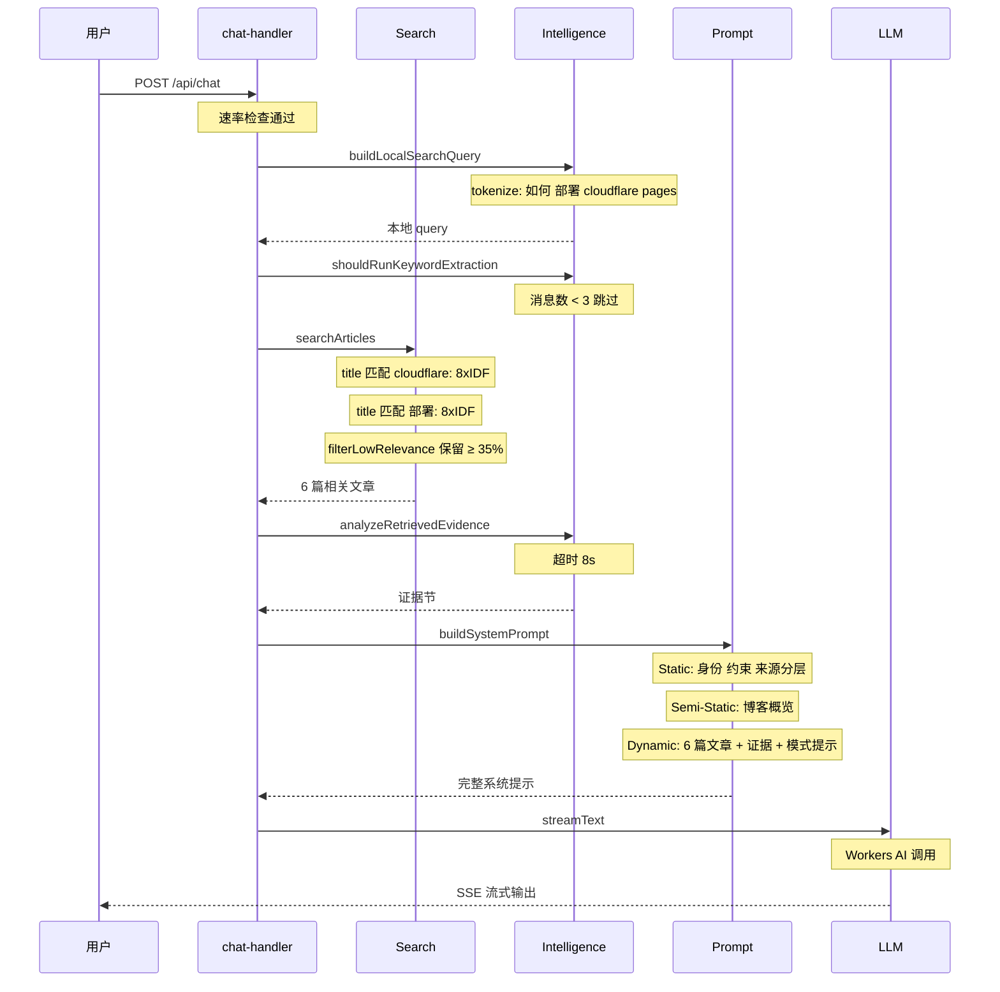

### 场景二：追问复用上下文

**用户输入**：`"配置文件在哪？"`（上一轮讨论部署）

系统会做追问检测：长度 ≤ 48、是短句、和上轮有 query 重叠。如果满足条件且没有新的重要 token，直接复用上一轮的搜索结果，跳过检索阶段。

### 场景三：隐私问题拦截

**用户输入**：`"你的收入是多少？"`

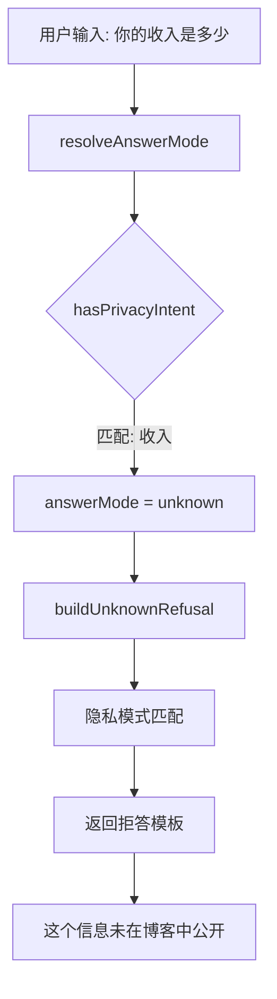

隐私检测使用 6 类精确的中文正则模式：

```ts
// packages/ai/src/intelligence/citation-guard.ts
const PRIVACY_PATTERNS = [
  /具体住在哪|哪个小区|门牌号|家庭住址|具体地址|住址信息/u,
  /赚多少钱|月收入|年收入|工资多少|薪资多少|收入多少/u,
  /老婆叫什么|妻子叫什么|丈夫叫什么|孩子叫什么|父母叫什么|家人姓名/u,
  /手机号码|电话号码|联系方式|微信号|QQ号/u,
  /身份证号|护照号|证件号/u,
  /你多大了|你几岁|年龄多大|今年多大|今年几岁/u,
];
```

这些模式都使用了 `/u` 标志和精确的中文短语，避免了误匹配（比如 "age" 不会匹配到 "Pages"）。

### 场景四：Provider 故障转移

Workers AI 挂了 → `consecutiveFailures` 累加到 3 → 标记不健康 → 自动切到 OpenAI → 如果 OpenAI 也挂 → Mock 兜底。60 秒后，被标记不健康的 provider 会进入恢复尝试阶段。

## 十八、部署、运维与排查

### 部署架构

当前系统支持两种部署模式。推荐的是 Cloudflare Pages 模式，因为它能把 AI 请求送到离用户最近的边缘节点，同时直接使用 Workers AI binding，不需要额外配置 API key。

**Cloudflare Pages 模式（推荐）：**

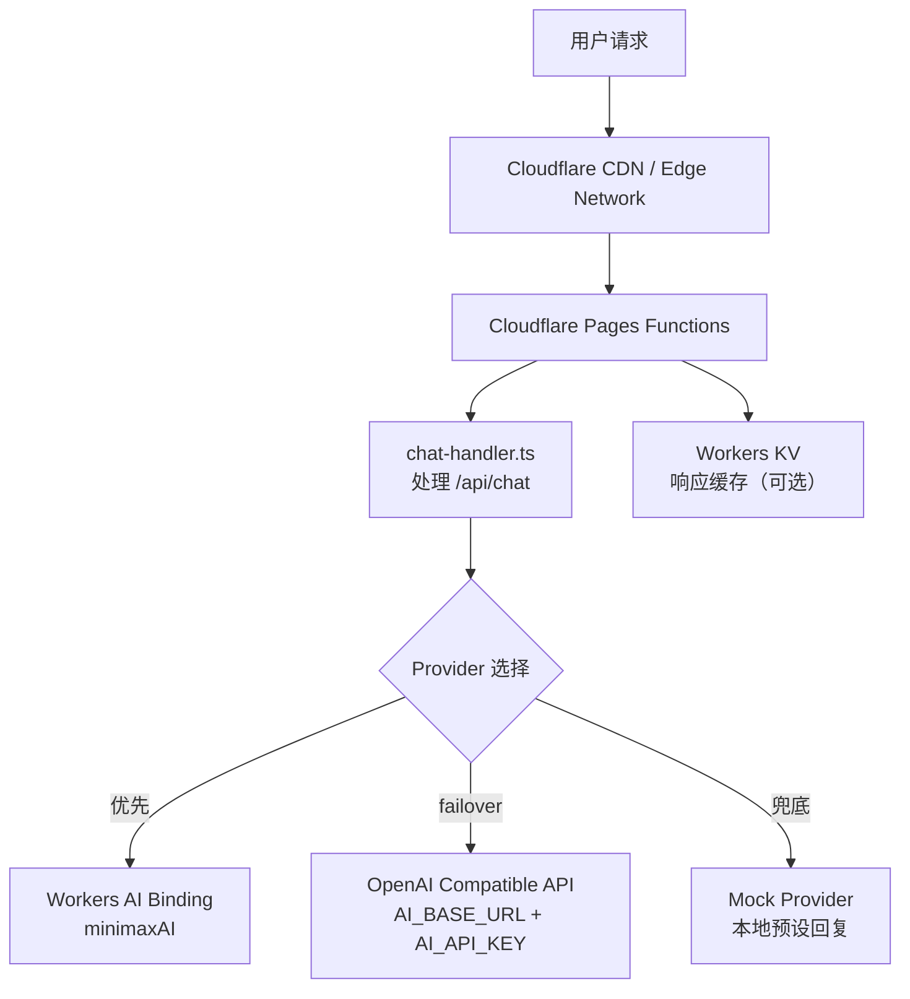

这种架构的优势在于：

- **边缘计算低延迟**：AI 请求从距离用户最近的边缘节点发起，省掉了中心化服务器的额外跳转
- **Workers AI 直连**：通过 binding 调用，不需要经过外部 API，既快又省了 key 管理
- **KV 缓存就近读取**：如果开启了 `AI_CACHE_ENABLED`，响应缓存存在 Workers KV 里，也是就近命中
- **环境变量管理集中**：`wrangler.toml` + Cloudflare Dashboard 统一管理所有变量

**传统 Node.js / Vercel 模式：**

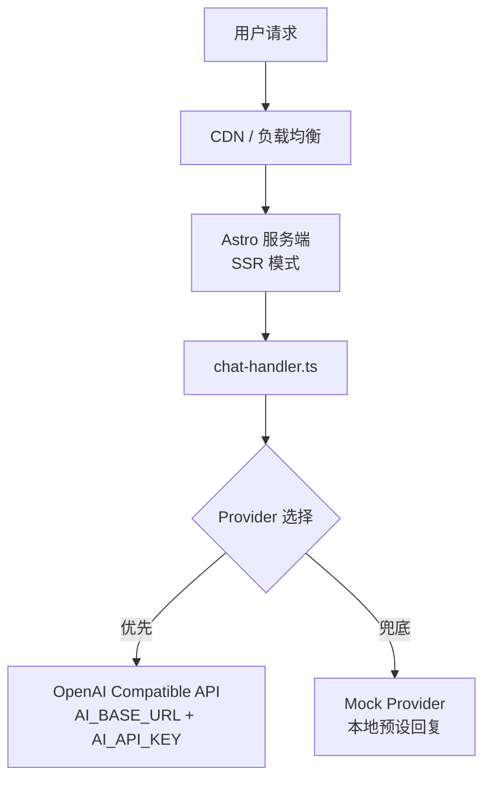

这种模式下没有 Workers AI binding 可用，所以 provider 优先级会自动降级到 OpenAI Compatible → Mock。`ProviderManager` 的配置解析会根据环境变量是否存在来决定可用 provider 列表，不需要手动切换部署模式。

### 部署前检查清单

如果只配好了环境变量，但没把 `knowledge-bundle` 这一类运行时资产准备好，系统未必会直接挂，但回答质量会明显掉下去。这是当前部署文档里最容易被忽略的一点。

部署之前我通常确认这些：

| 检查项 | 怎么确认 | 影响范围 |
|--------|----------|----------|
| `knowledge-bundle.json` 已生成 | `pnpm run ai:process` 是否跑过 | 检索、chunks、摘要全部缺失 |
| `AI_BASE_URL` / `AI_API_KEY` 已设置（非 Workers 模式） | 环境变量检查 | 会直接 fallback 到 mock |
| Workers AI binding `minimaxAI` 已绑定（Workers 模式） | `wrangler.toml` 配置 | Workers AI provider 不可用 |
| `SITE_URL` 和 `SITE_AUTHOR` 已设置 | 环境变量检查 | prompt 里缺少站点和作者信息 |
| `AI_CACHE_ENABLED=true`（生产建议开启） | 环境变量检查 | 公共问题每次都重新调用模型 |

### 观测与排查

对现在这套系统来说，最有用的观测点大概有三类：日志层（检索命中数、top articles、chunk selection、cache hit）、provider 健康层（失败次数、恢复状态、provider switch）和通知层（phase timing、model、usage、referenced articles）。这些信息放在一起，基本能把一次请求发生了什么拼出来。

排查时我通常会先看这些：

- **文章页答非所问**：`articleContext.slug` 有没有正确传进 API、knowledge bundle 里有没有这篇文章的 passages、`initArticleChunks()` 是否执行、chunk selection 日志有没有命中当前文章段落。
- **公共问题总是重新调模型**：`detectPublicQuestion()` 是否命中分类、`AI_CACHE_ENABLED` 是否打开、response cache 的写入条件是否被挡住了。
- **明明配了 provider 还是老掉到 mock**：`AI_PROVIDERS` 是否能正确解析、provider config 是否通过校验、provider 是否已被标记 unhealthy。
- **跳转或高亮动作不生效**：`window.__actionExecutor` 是否已挂载（检查 `AIChatContainer.tsx` 的 `useEffect`）、tool call 是否被 `TOOL_ACTION_MAP` 正确映射、浏览器控制台是否有 CSP 阻塞。

## 十九、最后怎么概括当前版本

如果一定要浓缩成几条我自己最认可的结论，那大概是这些：

1. `initializeMetadata()` 把构建产物变成了运行态索引与 chunks，这是整条链的起点。
2. `chat-handler.ts` 仍然是总编排器，但不再一把抓所有实现细节。
3. `prompt-runtime.ts` 已经成为真正的装配中枢，而不是 prompt 目录的附庸。
4. 检索系统已经不再只是"搜几篇摘要"，而是包含字段加权评分、chunk 注入、解释驱动和后处理排序。
5. Provider 管理已经形成了配置解析、健康追踪、failover 与 mock fallback 的完整闭环。
6. Tool Calling 现在不是展示性的能力，而是能真正驱动站点动作的完整双端链路。
7. 缓存已经分层：session、public search、response playback、injection dedupe 各自解决不同问题。
8. 当前示例博客里真正已经跑得最扎实的，是 article corpus、article chunks、prompt runtime、provider failover 和前端动作链；像 project search 这样的接口虽然已经留好，但运行态默认并不是这条链的主角。

如果站在维护者视角只保留一句话，我现在会这么写：

> 今天的 `@astro-minimax/ai`，已经不是一个"聊天组件附带一点检索"的包了，而是一套围绕博客知识资产、请求解释、prompt runtime、多 provider 生成、缓存和前端动作协作搭起来的 AI 运行时系统。
