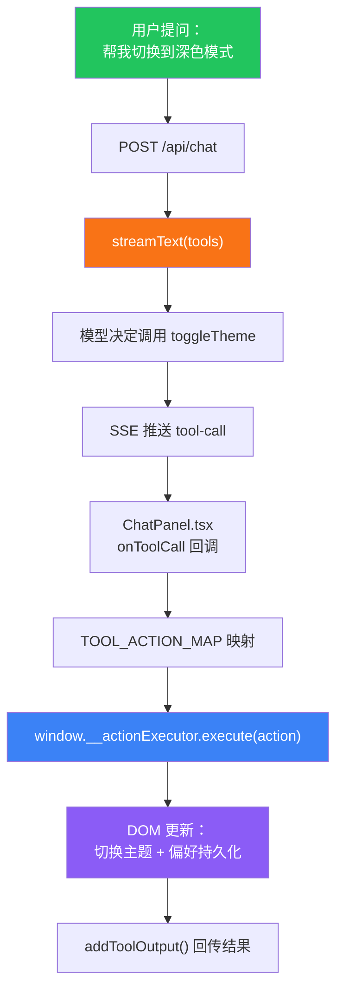

astro-minimax 的 AI 聊天不只是文字对话。当你说「切换到深色模式」或「打开架构那篇文章」，模型不会只给你一段操作说明，而是直接帮你完成操作。这套能力的核心是 Tool Calling 和客户端 Action 系统。

## Tool Calling 是什么

Tool Calling 让 AI 模型在对话中决定调用预定义的工具函数，而不是只输出文本。在 astro-minimax 里，这意味着 AI 可以和页面交互：切换主题、导航文章、高亮文字、调整偏好。

传统聊天机器人只能「说」。加了 Tool Calling 的聊天助手可以「做」。用户不需要手动找设置面板或搜索框，直接用自然语言就行。

## 7 个内置工具

`@astro-minimax/ai` 通过 `packages/ai/src/tools/action-tools.ts` 注册了 7 个工具，分为两类：

### 客户端工具（6 个）

这些工具在服务端声明 schema，模型生成调用指令，但实际执行发生在浏览器中。

| 工具名 | 作用 | 关键参数 |
|--------|------|----------|
| `toggleTheme` | 在浅色 / 深色 / 跟随系统之间切换主题 | `theme`: "light" / "dark" / "system" |
| `navigateToArticle` | 按 slug 跳转到文章页，可选跳到某个章节 | `slug`, `sectionId`(可选), `lang`(可选) |
| `scrollToSection` | 在当前页滚动到指定章节并高亮 | `sectionId`, `highlight`(默认 true), `behavior` |
| `toggleReadingMode` | 开启或关闭阅读模式，可调字号和字体 | `enabled`, `fontSize`, `fontFamily` |
| `highlightText` | 按文本内容或 CSS 选择器高亮页面元素 | `text` / `selector`, `style`, `duration`(默认 3000ms) |
| `setPreference` | 写入用户偏好（与偏好系统对齐的键值） | `key`, `value` |

### 服务端工具（1 个）

| 工具名 | 作用 | 关键参数 |
|--------|------|----------|
| `searchArticles` | 按关键词检索文章与项目，返回标题、链接与摘要 | `query`, `limit`(默认 5), `includeProjects` |

`searchArticles` 自带 `execute` 实现，在 RAG 请求处理过程中于服务端运行。它直接调用 `searchArticles()` / `searchProjects()` 检索逻辑，把结构化结果返回给模型，方便「先搜再答」或辅助导航。

## 客户端 Action 系统

6 个客户端工具的实际执行不在 AI 包里，而在 `@astro-minimax/core` 的 Action 系统中。三个核心模块组成了这条管线。

### ActionExecutor

`packages/core/src/actions/executor.ts` 是所有动作的实际执行者。它处理 6 种 action type：

- `scroll-to-section`: 查找目标元素（支持 `getElementById`、`data-section-id`、模糊匹配），平滑滚动并可选高亮
- `highlight-text`: 通过 TreeWalker 遍历文本节点匹配内容，或使用 CSS 选择器定位元素
- `toggle-theme`: 写入偏好并通过 `window.theme` API 反映到 DOM
- `toggle-reading-mode`: 切换 `reading-mode` CSS 类，可同步更新字号和字体偏好
- `set-preference`: 通过 `updatePreferences()` 写入偏好系统的键值（支持点号分隔的嵌套路径如 `reading.fontSize`）
- `navigate`: 构建目标 URL，支持 View Transitions 动画，可在导航后追加后续动作

`ActionExecutor` 通过 `window.__actionExecutor` 暴露给前端。

### ActionQueue

`packages/core/src/actions/queue.ts` 基于 `sessionStorage` 实现跨页面的动作队列。当 AI 需要导航到另一篇文章并继续执行动作时（比如「打开架构文章并跳到第三节」），流程是这样的：

1. `ActionExecutor.navigate()` 把后续动作打包
2. `ActionQueue.enqueue()` 存入 sessionStorage，返回一个 token
3. token 附加到 URL 的 `ai_actions` 查询参数
4. 新页面加载后，`URLHandler` 取出并执行队列中的动作

队列有过期机制（默认 60 秒），过期自动清理，防止脏数据残留。

### URLHandler

`packages/core/src/actions/url-handler.ts` 负责从 URL 查询参数解析并执行动作。它识别三个参数：

- `theme`: 直接切换主题
- `section`: 滚动到指定章节
- `ai_actions`: 从 ActionQueue 取出复杂动作序列

`URLHandler` 在页面加载和 Astro 页面切换（`astro:page-load` 事件）时自动执行。执行完毕后会从 URL 中清除这些参数，保持 URL 干净。

## 架构：从请求到页面

整条链路从用户提问到页面变化，大致经历这些步骤：



关键设计点：AI 包负责理解和调度，core 包负责实际执行浏览器动作。两边的边界很清晰。

### ChatPanel 中的映射

`ChatPanel.tsx` 里的 `TOOL_ACTION_MAP` 把模型生成的 tool call 转换成 core 包认识的 action 格式。比如：

- `toggleTheme` tool call 的 `{ theme: "dark" }` 变成 `{ type: "toggle-theme", payload: { theme: "dark" } }`
- `navigateToArticle` tool call 的 `{ slug: "ai-module-architecture", sectionId: "三系统架构设计" }` 变成 `{ type: "navigate", payload: { slug: "ai-module-architecture", lang: "zh", then: [{ type: "scroll-to-section", ... }] } }`

映射完成后，`executor.execute(action)` 在浏览器中执行实际操作，`addToolOutput()` 把执行结果回传给模型，模型可以据此继续对话。

## 自动续跑机制

`searchArticles` 是唯一触发自动续跑的工具。当这个工具执行完毕后，`shouldAutoContinueAfterToolCalls()` 检测到最后一条消息包含已完成的 `searchArticles` tool part，就会自动触发下一轮对话。

这意味着模型先搜索，拿到结果后不需要用户再点发送，就能继续生成回答。体验上就是：「帮我找一下关于部署的文章」，AI 先搜索，然后直接展示搜索结果并给出推荐，一气呵成。

其他客户端工具（切换主题、导航等）不会触发自动续跑，因为它们的执行结果已经直接反映在页面上了，不需要模型再说什么。

## Tool Registry API

`@astro-minimax/ai` 提供了 `registerTool()` / `unregisterTool()` 用于注册自定义工具：

```typescript
import { registerTool, unregisterTool } from "@astro-minimax/ai/tools";
import { tool } from "ai";
import { z } from "zod";

// 注册自定义工具
registerTool("myCustomAction", tool({
  description: "Do something custom",
  inputSchema: z.object({
    param: z.string().describe("Some parameter"),
  }),
}));

// 取消注册
unregisterTool("myCustomAction");
```

注册后，`getAllTools()` 返回的工具列表会合并内置工具和自定义工具。`getClientSideTools()` 会把没有 `execute` 实现的自定义工具识别为客户端工具；`getServerSideTools()` 则识别带 `execute` 实现的工具为服务端工具。

自定义客户端工具需要在 `ChatPanel.tsx` 的 `TOOL_ACTION_MAP` 中添加对应的映射，才能在浏览器中正确执行。

## 对话示例

几个实际的对话场景，展示工具如何被触发：

**场景 1：切换主题**

> 用户：太亮了，帮我切到深色模式
>
> AI：（调用 `toggleTheme`，页面主题切换为深色）已帮你切换到深色模式。

**场景 2：导航并跳转章节**

> 用户：带我看一下架构那篇文章的检索层部分
>
> AI：（调用 `navigateToArticle`，slug 为 ai-module-architecture，sectionId 为检索层）正在为你打开架构文章并跳转到检索层。

**场景 3：搜索 + 自动续跑**

> 用户：有没有关于部署的文章？
>
> AI：（调用 `searchArticles`，自动续跑）找到了几篇相关文章：[部署指南](...)、[Cloudflare Workers AI 部署](...)。

**场景 4：高亮文本**

> 用户：帮我标出这篇文章里关于安全的部分
>
> AI：（调用 `highlightText`，text 为"安全"）已为你高亮了文中关于安全的内容。

## 相关文档

- [AI 聊天功能配置指南](/zh/posts/ai-guide): 完整 AI 配置流程，包含 Provider 设置和 Mock 模式
- [@astro-minimax/ai 模块技术架构详解](/zh/posts/ai-module-architecture): 深入 AI 模块内部架构，包含 RAG 管线和缓存机制
- [功能特性总览](/zh/posts/feature-overview): 所有 AI 功能一览
