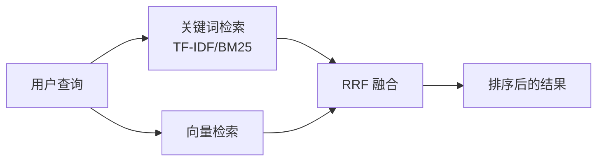

astro-minimax 内置两种搜索方案，覆盖不同的使用场景。[Pagefind](https://pagefind.app/) 是默认的静态搜索引擎，零配置即可使用；[Algolia DocSearch](https://docsearch.algolia.com/) 提供云端搜索，适合需要毫秒级响应和搜索分析的站点。

本文介绍两种搜索方案的特点、配置方法，以及与 AI 搜索系统的关系。

## 两种搜索方案对比

| 特性 | Pagefind | Algolia DocSearch |
|------|----------|-------------------|
| 搜索类型 | 静态全文搜索 | 云端搜索 |
| 索引生成 | 构建时自动生成 | Algolia 云端维护 |
| 外部服务 | 不需要 | 需要 Algolia 账号 |
| 中文分词 | 支持 | 支持 |
| 响应速度 | 毫秒级（本地） | 毫秒级（云端） |
| 搜索分析 | 无 | 支持 |
| 配置难度 | 零配置 | 需申请 + 配置 |
| 索引存储位置 | `dist/pagefind/` | Algolia 服务器 |

## Pagefind（默认）

Pagefind 是 astro-minimax 的默认搜索引擎。它是一个完全静态的搜索方案，构建时自动为所有博客文章生成索引文件，用户在浏览器端完成搜索，不需要任何后端服务。

### 核心特点

- **零配置**: 不需要在 `config.ts` 中添加任何搜索配置，开箱即用
- **构建时索引**: 每次运行 `pnpm run build` 时自动生成搜索索引
- **中文分词**: 原生支持中文分词，搜索体验流畅
- **结果高亮**: 搜索结果中会高亮匹配的关键词
- **高级过滤**: 支持按分类、语言、标签等维度过滤搜索结果
- **无外部依赖**: 索引文件存储在 `dist/pagefind/` 目录，随站点一起部署

### 使用方式

确保 `config.ts` 中 `features.search` 未被禁用即可：

```js file=src/config.ts
features: {
  search: true,  // 默认开启，可省略
},
```

构建后，Header 中的搜索按钮会自动加载 Pagefind 搜索界面。

## Algolia DocSearch

如果你的站点需要更强的搜索能力（比如搜索分析、搜索建议、自动补全），可以切换到 Algolia DocSearch。

### 前提条件

使用 DocSearch 需要先获取 Algolia 凭证：

1. 开源文档站点可以[免费申请 DocSearch](https://docsearch.algolia.com/apply/)
2. 其他站点可以自建 Algolia 索引

### 配置方法

在 `src/config.ts` 的 `SITE` 对象中添加 `search` 配置：

```typescript file=src/config.ts
export const SITE = {
  // ...其他配置

  search: {
    provider: 'docsearch',
    docsearch: {
      appId: 'YOUR_APP_ID',
      apiKey: 'YOUR_SEARCH_API_KEY',
      indexName: 'YOUR_INDEX_NAME',
      placeholder: '搜索文档...',
    },
  },
};
```

### DocSearch 特性

- **快捷键**: 按 `Ctrl+K`（macOS 上是 `Cmd+K`）快速打开搜索框
- **搜索建议**: 输入时实时展示匹配结果
- **自动补全**: 基于搜索历史和热门内容提供补全建议
- **搜索分析**: 在 Algolia Dashboard 中查看搜索统计数据

配置完成后，Header 中的 Pagefind 搜索入口会被 DocSearch 组件替换。DocSearch 组件位于 `packages/core/src/components/search/DocSearch.astro`，会自动加载 Algolia 的 CSS 和 JS 资源，并根据站点的明暗主题自动适配配色。

## 切换搜索方案

切换搜索方案只需修改 `config.ts` 中的配置：

```typescript file=src/config.ts
// 使用 Pagefind（默认，可省略整个 search 配置）
search: {
  provider: 'pagefind',
}

// 或者使用 DocSearch
search: {
  provider: 'docsearch',
  docsearch: {
    appId: 'YOUR_APP_ID',
    apiKey: 'YOUR_SEARCH_API_KEY',
    indexName: 'YOUR_INDEX_NAME',
    placeholder: '搜索文档...',
  },
}
```

不配置 `search` 字段时，默认使用 Pagefind。

## 搜索配置参考

| 选项 | 说明 |
|------|------|
| `search.provider` | 搜索方案：`'pagefind'`（默认）或 `'docsearch'` |
| `search.docsearch.appId` | Algolia Application ID |
| `search.docsearch.apiKey` | Algolia Search-Only API Key |
| `search.docsearch.indexName` | Algolia 索引名称 |
| `search.docsearch.placeholder` | 搜索框占位文本 |

完整的类型定义见 `packages/core/src/types.ts` 中的 `SearchConfig` 和 `DocSearchConfig` 接口。

## AI 搜索系统（进阶）

除了面向用户的 UI 搜索（Pagefind / DocSearch），astro-minimax 的 AI 聊天功能还内置了一套独立的搜索系统，用于 RAG（Retrieval-Augmented Generation）检索增强。这套系统位于 `packages/ai/src/search/`，和 UI 搜索是两套独立的机制。

### 混合检索架构

AI 搜索采用混合检索（Hybrid Search）策略，结合了两种检索方式：

- **TF-IDF / BM25 关键词检索**: 基于词频统计的文本匹配，适合精确关键词查询
- **向量重排序（Vector Reranking）**: 使用语义向量对初步检索结果进行二次排序，提升相关性

两种检索结果通过 Reciprocal Rank Fusion (RRF) 算法融合，取长补短：



### 会话缓存

搜索结果会被缓存在内存中，缓存有效期为 10 分钟（600 秒）。同一会话内的连续对话可以复用之前的搜索上下文，避免重复检索，提升响应速度。

缓存通过 `x-session-id` 请求头标识，每个会话最多缓存 400 条记录。

### 与 UI 搜索的区别

| 维度 | UI 搜索（Pagefind/DocSearch） | AI 搜索（RAG） |
|------|-------------------------------|----------------|
| 用途 | 用户主动搜索文章 | AI 聊天的知识检索 |
| 触发方式 | 点击搜索框 / 快捷键 | 发送聊天消息 |
| 索引位置 | 静态文件 / Algolia 云端 | 运行时内存 |
| 检索粒度 | 文章级别 | 段落级别（Chunk） |
| 配置位置 | `SITE.search` | 自动加载，无需配置 |

## 常见问题

### Pagefind 搜索结果为空？

确保运行过 `pnpm run build`。Pagefind 的索引在构建时生成，开发模式下搜索功能可能不完整。

### DocSearch 样式和主题不一致？

DocSearch 组件已经适配了 astro-minimax 的明暗主题。如果仍然有样式问题，检查是否有自定义 CSS 覆盖了 DocSearch 的 CSS 变量。

### 可以同时使用两种搜索吗？

不可以。`search.provider` 只能设为 `'pagefind'` 或 `'docsearch'`，二选一。

### AI 搜索可以替代 UI 搜索吗？

两者定位不同。UI 搜索适合快速查找特定文章，AI 搜索适合对话式问答。建议保持 UI 搜索开启，配合 AI 聊天获得更好的体验。

## 下一步

- 了解所有功能特性：[功能特性总览](/zh/posts/feature-overview/)
- 完整配置参考：[如何配置 astro-minimax 主题](/zh/posts/how-to-configure-astro-minimax-theme/)
