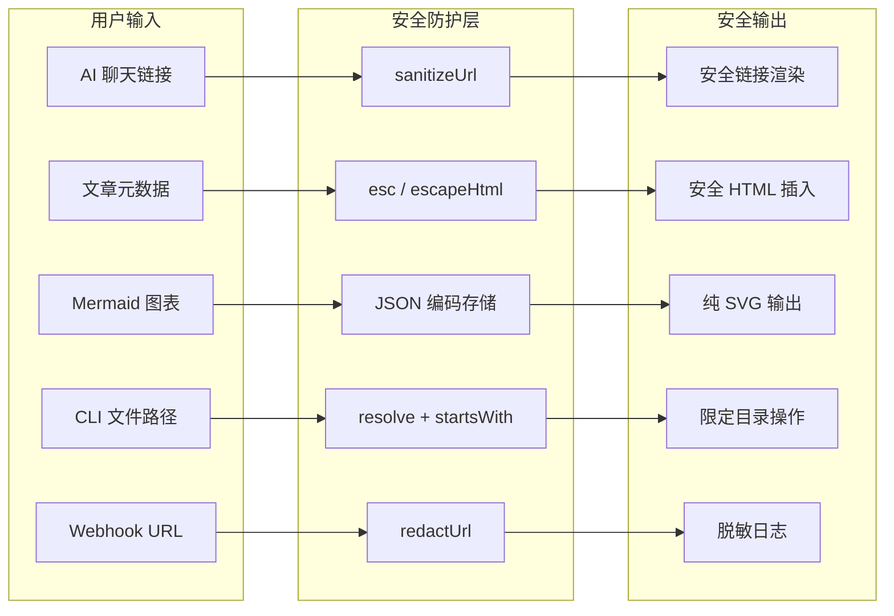

astro-minimax 从 v0.9.2 起持续加固安全防护。这些防护不是一个单独的安全模块，而是分散在各个包里的一系列防御措施，覆盖前端渲染、AI 聊天、CLI 工具和通知系统。

这篇文章把这些措施梳理清楚：哪里做了防护、怎么配置、你需要注意什么。



## URL 净化（sanitizeUrl）

AI 模型生成的链接是不可信的。模型可能在回复中输出 `javascript:alert(1)` 或 `data:text/html,<script>...</script>` 这样的危险 URL。`sanitizeUrl()` 就是用来过滤这些协议的。

`@astro-minimax/notify` 在 `packages/notify/src/utils.ts` 中提供了统一的净化函数：

```typescript
const SAFE_URL_RE = /^https?:\/\//i;

export function sanitizeUrl(url: string): string {
  return SAFE_URL_RE.test(url) ? url : '#';
}
```

只有 `http://` 和 `https://` 开头的 URL 才会被保留。`javascript:`、`data:`、`vbscript:` 等其他协议一律替换为 `#`。

### AI 聊天中的净化

`@astro-minimax/ai` 的 RichText 组件（`packages/ai/src/components/RichText.tsx`）有自己的一版净化逻辑，适配聊天场景的特殊需求：

```typescript
const SAFE_URL_RE = /^(?:https?|mailto):/i;

function sanitizeUrl(url: string): string {
  if (SAFE_URL_RE.test(url) || url.startsWith('/') || url.startsWith('#')) return url;
  return '#';
}
```

聊天场景额外允许 `mailto:` 协议、相对路径（`/` 开头）和页内锚点（`#` 开头）。所有 AI 模型输出的链接在渲染前都会经过这层过滤。

### 通知模板中的净化

评论通知和 AI 对话通知中的所有外部链接（文章 URL、网站链接）都经过 `sanitizeUrl()` 处理。通知模板里，URL 净化和 HTML 转义配合使用：

```typescript
// ai-chat.ts 中的引用文章链接
lines.push(`  · <a href="${sanitizeUrl(article.url)}">${escapeHtml(article.title)}</a>`);
```

URL 经过净化，显示文本经过转义，双重防护。

## Mermaid 安全配置

Mermaid 图表在 `packages/core/src/components/viz/Mermaid.astro` 中渲染。当前配置使用 `securityLevel: "loose"` 模式：

```typescript
mermaid.initialize({
  startOnLoad: false,
  securityLevel: "loose",
  theme: "base",
  themeVariables: getMermaidConfig(isDark),
});
```

选择 `loose` 而不是 `strict`，是因为博客场景需要图表内的交互能力（click 事件、外部链接跳转）。`strict` 模式会禁用这些功能。安全防护由其他层面保障：

- 图表代码通过 JSON 编码存储在 `<script type="application/json">` 标签中，浏览器不会将其当作脚本执行
- 渲染使用 `mermaid.render()` API，输出为纯 SVG
- 懒加载通过 IntersectionObserver 实现，不在视口内的图表不会被渲染

如果你接受用户提交的 Mermaid 代码（比如开放评论中的图表），需要额外审查。astro-minimax 的评论系统使用第三方服务（Waline），不受此影响。

## XSS 防护

### PostsContainer 的 HTML 转义

`packages/core/src/components/ui/PostsContainer.astro` 使用客户端渲染文章列表。文章元数据（标题、描述、分类、标签）本质上是用户可控内容。如果有人在文章 frontmatter 的 title 字段里写 `<script>alert(1)</script>`，不转义就会触发 XSS。

`esc()` 函数解决这个问题：

```typescript
const esc = (s) => String(s)
  .replace(/&/g, '&amp;')
  .replace(/</g, '&lt;')
  .replace(/>/g, '&gt;')
  .replace(/"/g, '&quot;');
```

标题、描述、分类名、标签名在生成卡片 HTML 时全部使用 `esc()` 包裹，防止通过文章元数据注入 HTML 或脚本。

### ActionExecutor 的 ID 净化

`packages/core/src/actions/executor.ts` 处理 `scrollToSection` 时对 section ID 做净化：

```typescript
const sanitizedId = CSS.escape
  ? CSS.escape(sectionId)
  : sectionId.replace(/[^\w\u4e00-\u9fff-]/g, "");
```

使用 `CSS.escape()`（有降级方案）确保 section ID 不能被用于 CSS 选择器注入。元素查找使用 `getElementById` 和 `data-section-id` 属性匹配，不直接拼接选择器字符串。

### URLHandler 的参数验证

`packages/core/src/actions/url-handler.ts` 对 URL 参数做了白名单校验：

```typescript
// theme 只接受三个合法值
if (theme && ['light', 'dark', 'system'].includes(theme)) { ... }

// section 只允许安全字符
if (section && /^[\w\u4e00-\u9fff-]+$/.test(section)) { ... }
```

theme 参数必须是指定值之一，section 参数只允许字母、数字、下划线、中文字符和连字符，防止通过 URL 参数注入。

## CLI 路径遍历防护

`@astro-minimax/cli` 的 `extensions validate` 命令处理用户指定的文件路径时，需要确保路径不会逃逸出项目目录。恶意用户可能通过 `../../etc/passwd` 这样的路径读取系统文件。

防护逻辑在 `packages/cli/src/commands/ai/extensions.ts` 中：

```typescript
const resolved = resolve(extensionsDir, specificFile);
if (!resolved.startsWith(resolve(extensionsDir))) {
  console.log("\n" + EMOJI.error + " Invalid file path: must be within extensions directory\n");
  process.exit(1);
}
```

`resolve()` 会消除路径中的 `..` 和符号链接，返回绝对路径。然后检查规范化后的路径是否以 extensions 目录开头。如果不在范围内，直接拒绝。

其他 CLI 文件操作也使用 `resolve()` 规范化路径，所有读写操作都基于规范化后的绝对路径执行。CLI 还会检查当前目录是否为有效的博客目录，跳过以 `_` 开头的内部目录。

## Webhook 日志脱敏

Webhook 通知的 URL 可能包含敏感的查询参数，比如 `?key=your-api-key-here`。如果这些参数被完整写入日志，就可能造成凭证泄露。

`@astro-minimax/notify` 的 Webhook provider（`packages/notify/src/providers/webhook.ts`）在记录日志时脱敏 URL：

```typescript
function redactUrl(rawUrl: string): string {
  try {
    const u = new URL(rawUrl);
    return `${u.origin}${u.pathname}`;
  } catch {
    return "<invalid-url>";
  }
}
```

`redactUrl()` 只保留 URL 的 origin 和 pathname，去掉所有查询参数。无论请求成功还是失败，日志中记录的都是脱敏后的 URL：

```typescript
// 成功
logger?.info("Webhook notification sent", {
  url: redactUrl(url),
  duration,
});

// 失败
logger?.error("Webhook send failed", error, {
  url: redactUrl(url),
  status: response.status,
});
```

## CORS 配置

AI 聊天 API 默认允许所有来源（`Access-Control-Allow-Origin: *`），适合本地开发。但在生产环境中，这会让任何网站都能调用你的 API。

v0.9.2 引入了可配置的 CORS 支持。定义在 `packages/ai/src/server/errors.ts`：

```typescript
let _allowedOrigin = '*';

export function setCorsOrigin(origin: string): void {
  _allowedOrigin = origin;
}
```

`chat-handler.ts` 在初始化时读取环境变量并设置：

```typescript
if (env.CORS_ORIGIN) setCorsOrigin(env.CORS_ORIGIN as string);
```

CORS 头应用在所有 API 响应和 preflight 请求上：

```typescript
function corsHeaders(): HeadersInit {
  return {
    'Content-Type': 'application/json',
    'Access-Control-Allow-Origin': _allowedOrigin,
  };
}

export function corsPreflightResponse(): Response {
  return new Response(null, {
    headers: {
      'Access-Control-Allow-Origin': _allowedOrigin,
      'Access-Control-Allow-Methods': 'POST, OPTIONS',
      'Access-Control-Allow-Headers': 'Content-Type, x-session-id',
    },
  });
}
```

生产环境通过环境变量指定你的博客域名：

```bash
# Cloudflare Pages 环境变量
CORS_ORIGIN=https://your-blog.com
```

详细的 CORS 配置步骤请参考 [Cloudflare 环境变量配置指南](/zh/posts/cloudflare-env-vars)。

## 共享安全工具

`packages/notify/src/utils.ts` 导出两个安全工具函数，被多个包复用：

### escapeHtml

```typescript
export function escapeHtml(text: unknown): string {
  if (text === null || text === undefined) return '';
  const str = typeof text === 'string' ? text : String(text);
  return str
    .replace(/&/g, '&amp;')
    .replace(/</g, '&lt;')
    .replace(/>/g, '&gt;')
    .replace(/"/g, '&quot;')
    .replace(/'/g, '&#039;');
}
```

转义 5 种 HTML 特殊字符：`&`、`<`、`>`、`"`、`'`。在评论通知模板（`comment.ts`）和 AI 对话通知模板（`ai-chat.ts`）中，所有动态内容（评论者名称、评论内容、文章标题、引用文章标题）都经过 `escapeHtml()` 处理。

### sanitizeUrl

上面已经详细介绍过。`sanitizeUrl()` 和 `escapeHtml()` 在通知模板中配合使用，URL 经过净化，显示文本经过转义。

## 安全最佳实践

以下是部署 astro-minimax 时建议采取的安全措施：

### 1. 配置 CORS_ORIGIN

生产环境务必设置 `CORS_ORIGIN` 环境变量，指定你的博客域名。不要在生产环境使用默认的 `*`。配置方法参考 [Cloudflare 环境变量配置指南](/zh/posts/cloudflare-env-vars)。

### 2. 使用 HTTPS

确保你的博客通过 HTTPS 提供服务。HTTPS 保护用户数据传输安全，也让 `sanitizeUrl()` 的 `https://` 白名单有意义。如果博客本身是 HTTP，净化函数会把所有内部链接替换为 `#`。

### 3. 保护 API Key

以下环境变量不应暴露到前端或提交到 Git：

- `AI_API_KEY`
- `NOTIFY_TELEGRAM_BOT_TOKEN`
- `NOTIFY_RESEND_API_KEY`
- `NOTIFY_WEBHOOK_URL`

使用 `.env` 文件（并加入 `.gitignore`）或部署平台的 Secrets 管理功能。环境变量的具体配置参考 [部署指南](/zh/posts/deployment-guide) 和 [通知系统配置指南](/zh/posts/notification-guide)。

### 4. 定期更新依赖

```bash
pnpm update
```

astro-minimax 依赖的 AI SDK、Astro、Tailwind 等包都在活跃维护。安全补丁会通过依赖更新传递。

### 5. 检查 Webhook URL

如果使用 Webhook 通知，确保 `NOTIFY_WEBHOOK_URL` 指向你控制的服务端点。Webhook provider 会在日志中记录请求，但已通过 `redactUrl()` 脱敏查询参数。

## 相关文档

- [AI 聊天功能配置指南](/zh/posts/ai-guide): AI 系统配置，包含 CORS 设置
- [通知系统配置指南](/zh/posts/notification-guide): 通知系统配置，包含 Webhook 安全
- [部署指南](/zh/posts/deployment-guide): 部署流程，包含环境变量配置
- [Cloudflare 环境变量配置指南](/zh/posts/cloudflare-env-vars): 环境变量详细配置
